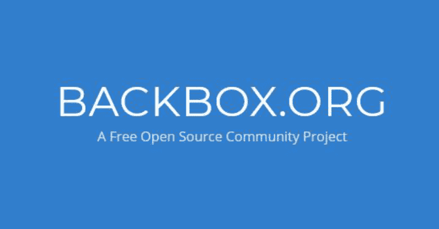

# BackBox Linux 6.0–基于 Ubuntu 的 Linux 分发渗透测试和安全评估

> 原文：<https://kalilinuxtutorials.com/backbox-linux-penetration-security/>

**BackBox** 是基于 Ubuntu 的 Linux 发行版。它被开发用于执行渗透测试和安全评估。

设计快速，易于使用，并提供一个最小但完整的桌面环境，由于其自己的软件仓库，总是更新到最常用和最知名的道德黑客工具的最新稳定版本。

环顾四周，希望你能找到问题的答案。如果你遇到了一个问题，其他人可能也遇到了，通过社区，这些问题将会得到解答。

**也可阅读-[ghost fuscator:Python 密码保护的混淆器](https://kalilinuxtutorials.com/ghostfuscator/)**

**最新消息**

*   更新的 Linux 内核 4.18
*   更新的桌面环境
*   更新的黑客工具
*   更新了支持 UEFI 的 ISO 混合

**系统要求**

*   32 位或 64 位处理器
*   1024 MB 系统内存(RAM)
*   用于安装的 10 GB 磁盘空间
*   支持 800×600 分辨率的显卡
*   DVD-ROM 驱动器或 USB 端口(3 GB)

**热门下载 BackBox Linux**

**获取 ISO 镜像**

BackBox Linux 可以从它的[官方下载页面](https://backbox.org/downloads)轻松下载。虽然直接下载和种子下载都可用，但通常建议使用后者。

**验证 ISO 镜像**

在[下载](https://wiki.backbox.org/downloading-backbox-linux#getting_the_iso_image)ISO 镜像后，需要一个验证步骤，以排除下载过程中任何潜在的文件损坏。这种验证是通过计算下载文件的 sha256 摘要(md5 现在很弱)并将其与[下载页面](https://backbox.org/downloads)中文件的 sha256 值进行比较来完成的。这就像打开一个终端并运行:

sha 256 sum/path/to/back box/ISO/image

如果从上述命令的输出中获得的字符串与下载页面中的字符串不匹配，则表明文件在下载过程中已损坏，必须再次执行下载。

**创建可引导设备**

下载并验证 ISO 映像后，您现在可以[创建一个 BackBox 可引导设备](https://wiki.backbox.org/creating-bootable-backbox-device)。

**创建 BackBox Linux 可引导设备**

在[下载了](https://wiki.backbox.org/downloading-backbox-linux)(并且 **[验证了](https://wiki.backbox.org/downloading-backbox-linux#verifying_the_iso_image)** ) BackBox Linux ISO 镜像之后，必须创建一个可引导设备才能开始使用它。

**创建可启动的 USB 驱动器**

建议的 u 盘最小尺寸为*4<abbr title="Gigabyte">GB</abbr>，但将来可能会改变。*

**识别 u 盘和分区**在开始之前，你需要识别你的系统如何调用 u 盘，也就是它的设备名。您可以使用`lsblk`、`blkid`、`fdisk`、日志文件或您喜欢的任何方式来完成此任务，您将找到符合 [Linux 驱动器命名约定](http://www.tldp.org/HOWTO/Partition-Mass-Storage-Definitions-Naming-HOWTO/x99.html)的设备名称。例如 */dev/sdb* 是一个 USB 设备的可能名称。分区名称符合 [Linux 分区命名约定](http://www.tldp.org/HOWTO/Partition-Mass-Storage-Definitions-Naming-HOWTO/x160.html)，它通过在设备名称后附加一个十进制数字来标识分区。所以比如 */dev/sdb2* 是设备 */dev/sdb* 的第二个分区。请尽可能小心这一步，因为驻留在将要写入的分区/设备上的任何数据都将被永久擦除。因此，备份您的数据，并仔细检查您要写入的驱动器确实是正确的驱动器。

一旦确定了设备名称，您就可以创建一个可引导的 USB 驱动器。接下来的部分描述了实现这一点的各种方法，按照简单性递减排序。

**使用 UNetbootin 创建可启动的 USB 驱动器**

使用 [UNetbootin](https://unetbootin.github.io/) 是创建包含任何 Linux 发行版(包括 BackBox)的可引导 USB 的推荐和最简单的方法。

1.  获取并安装[未启动程序](https://unetbootin.github.io/)。它可以在 Linux、Windows 和 Mac <abbr title="Operating System">OS</abbr> X 上运行。大多数 Linux 发行版都为它提供了一个打包版本，你可以使用发行版包/软件管理器来安装它。
2.  运行 UNetbootin，在它的 <abbr title="Graphical User Interface">GUI</abbr> 中选择你[已经下载的本地 BackBox ISO 镜像](https://wiki.backbox.org/downloading-backbox-linux)和你想要安装 BackBox 的 USB 设备。根据您的系统和配置，您可能需要以超级用户身份运行 UNetbootin，否则您可能没有写入 USB 设备所需的权限。请格外注意这一步，因为如果您选择了错误的设备，您将面临不必要的数据丢失，这是您最不希望发生的事情。
3.  一旦完成，你就可以[启动 BackBox Linux](https://wiki.backbox.org/booting-backbox-device) 。

**手动创建可启动的 USB 驱动器**

**使用 isohybrid 和 dd 创建可启动的 USB 驱动器**

BackBox 还没有提供混合 ISO 镜像(例如，可以使用`dd`实用程序直接复制到 USB 设备的镜像)，即使这正在制定中。同时，你也可以使用来自 [Syslinux 项目](http://www.syslinux.org/wiki/index.php/The_Syslinux_Project)的 [Isohybrid](http://www.syslinux.org/wiki/index.php/Isohybrid) 来创建你自己的软件。本节将介绍如何使用刚刚提到的工具在 GNU/Linux 环境中创建一个混合 ISO 映像(尽管 Windows 系统也可以使用 *syslinux* )。然后，只需使用`dd`命令，就可以将该图像复制到 USB 拇指上。

请注意，在此过程中，不需要预先创建分区或格式化分区，除非您要进行定制安装(我们假设您能够自己处理)。你只需要 [USB 设备名](https://wiki.backbox.org/creating-bootable-backbox-device#creating_a_bootable_usb_drive)。

1.  根据您的发行版，您可能需要以不同的方式获得合适的工具。重要的是获得`isohybrid`和`syslinux`实用程序。请快速查询您的分发包数据库，以了解要安装什么。
    *   比如在 *Debian* 上，安装 *syslinux* 和 *syslinux-utils* 包就够了。像 *Ubuntu* 或 *Mint* 这样的 Debian 衍生产品可能有相同或相似的包。
    *   否则从[官方下载页面](http://www.syslinux.org/wiki/index.php/Download)获取 *syslinux* 并遵循[官方安装指南](http://www.syslinux.org/wiki/index.php/Install)。
2.  现在你已经下载了正确的工具，创建 BackBox ISO 镜像的备份副本，因为`isohybrid`会将 MBR 和引导程序代码/文件注入其中，如果出现问题，你不必再次下载 ISO。
3.  将 ISO 映像转换为可添加映像应该像以下一样简单:
    *   # ISO hybrid/path/to/back box/ISO/image
    *   对于 UEFI 系统，您可以尝试*(未测试)*:# ISO hybrid–UEFI/path/to/back box/ISO/image 这可能还需要安装 *syslinux-efi* 软件包。
4.  此时，可以将 ISO 映像写入 u 盘，使其可引导:# DD if =/path/to/back box/ISO/image of =/dev/<usb_device>bs = 2048 & & sync 再次注意，您必须指定设备名称，而不是任何分区名称(例如 */dev/sdb* ，而不是 */dev/sdb2* )。还要注意的是`dd`不会输出任何进度信息，所以喝杯咖啡，耐心等待字节流。</usb_device>
5.  当您再次看到您的 shell 提示符而没有错误时，USB 驱动器已经[准备好启动](https://wiki.backbox.org/booting-backbox-device)。

**BackBox Linux 硬盘安装**

确保您的计算机设置为[启动包含 BackBox 的外部设备](https://wiki.backbox.org/booting-backbox-device)。

*   将 BackBox 光盘插入光驱。
*   启动或重新启动计算机。
*   选择`**Try BackBox without installing**`
*   点击`**Install BackBox Linux**`。出现*语言*屏幕。
*   选择您想要的语言，然后点击`**Forward**`
*   选择离您最近的位置，然后点击`**Forward**`。
*   选择要放置背盒的位置，点击`**Forward**` **。**
*   输入要求的信息，并点击`**Forward**`。出现*准备安装*窗口。
*   验证语言、布局、位置和个人信息是否正确，然后单击`**Install**`。安装向导开始。

当安装向导完成时，出现*安装完成*窗口。点击`Restart now`重启电脑。

[**Download**](https://www.backbox.org/download/)