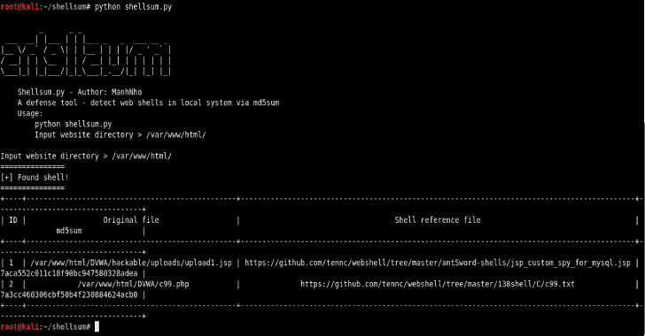

# Shellsum:一个防御工具——通过 MD5Sum 检测本地目录中的 Web 外壳

> 原文：<https://kalilinuxtutorials.com/shellsum-defense-tool-detect-web-shells/>

**Shellsum** 是一款防御工具，通过 md5sum 检测本地目录中的 web 外壳。以下是该工具的一些功能；

*   快速
*   轻量级选手
*   大数据库
*   列表输出

用途

**安装**

**git 克隆 https://github.com/ManhNho/shellsum.git
chmod 755-R shellsum/
CD shellsum/
pip install-R requirements . txt**

**也可阅读-[Dwarf:基于 pyqt 5&Frida](https://kalilinuxtutorials.com/dwarf-arch-os-debugger-pyqt5-frida/)构建的全功能 Multi Arch/OS 调试器**

**运行**

**python shellsum.py**

**待办事项**

*   平滑输出
*   导出文件报告
*   模块化
*   更大的数据库

[**Download**](https://github.com/ManhNho/shellsum)