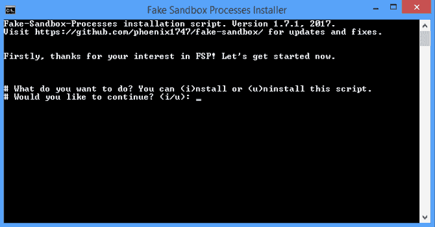
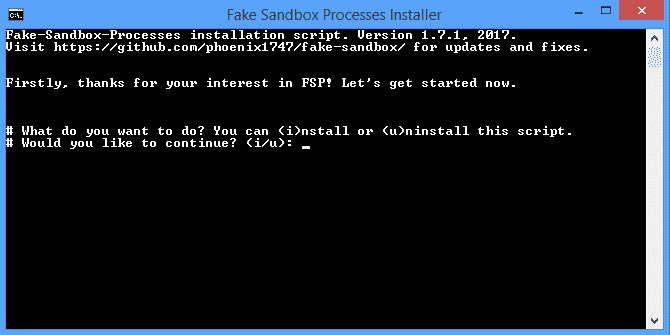
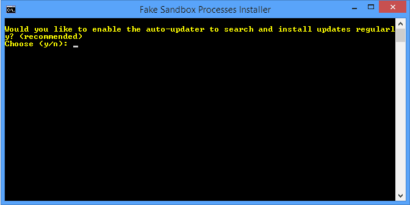
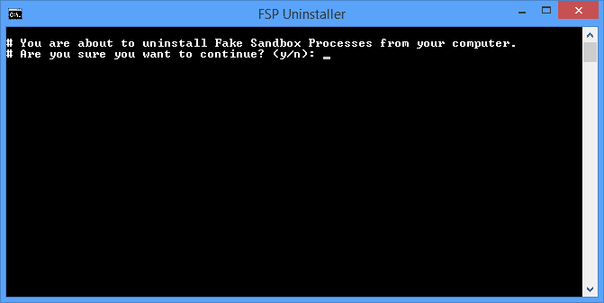

# 假沙箱:模拟分析沙箱/虚拟机的假进程的脚本

> 原文：<https://kalilinuxtutorials.com/fake-sandbox-script-fake-processes-vm/>

**假沙箱**进程小脚本将模拟一些恶意软件试图避免的分析、沙箱和 VM 软件的假进程。你可以在这里下载@x0rz 制作的原创剧本(顺便谢谢)。

您也可以从根目录下载我稍微优化过的脚本。该文件被命名为 FSP . PS1。FSP 安装程序中也使用了该脚本。

**脚本特性**

*   只要创建的进程运行，一些(更高级的)间谍软件可能会停止正确执行。
*   要求:Powershell(Win 7 及更新版本预装)，就这些。
*   无系统负载。
*   好用。

**也可阅读-[PasteHunter:用 Yara 规则扫描 Pastebin](https://kalilinuxtutorials.com/pastehunter-scanning-pastebin/)**

**安装程序-功能**

*   自动将脚本安装到您的 autostart 目录，这样您就不必在每次重新登录时都执行它。
*   要求:仅限 Powershell。
*   用卸载程序清除所有文件。
*   所有东西都打包到一个小小的离线包里。
*   可选更新包括在内，你可以选择如果你想要或不要它。

**用法**

右键单击该文件，然后选择“使用 Powershell 运行”

~或者~

打开命令行并粘贴该命令(不要忘记调整路径):

**Powershell-execution policy remote signed-F ' Your \ Path \ FSP . PS1 '**

按下回车键后，您可以选择启动或停止所有进程。

**自动启动**

如果您只是使用脚本并手动启动它，您将不得不在每次重新登录或启动时重新运行它，以再次创建流程。为了自动启动脚本，我制作了一个易于使用的安装程序。

*   从发布部分或从文件夹`**installer**`下载`**fsp-installer.bat**`文件。
*   双击它。
*   现在，您将看到以下命令提示符窗口:

*   选择“I”开始安装。
*   现在输入“y”开始安装，或者输入“n”中止安装。
*   如果您输入“y ”,该图像将会弹出:

*   输入“y”安装自动更新程序，或者输入“n”不安装它(不管怎样都可以，但是推荐使用更新程序)。

—>您现在可以关闭窗口或按任意键关闭它。安装完成。

**卸载**

如果你不再想在你的电脑上安装这个程序，你将再次需要这个`fsp-installer.bat`文件。运行它，并选择“u”开始删除过程。如果您准备清除所有创建的文件，请输入“y”。

如果该过程成功，您将看到一个确认屏幕-完成。

在以下 Windows 版本上成功测试:

*   Win 10 专业版
*   Win 8.1 首页
*   Win 7 专业版

[**Download**](https://github.com/Phoenix1747/fake-sandbox)