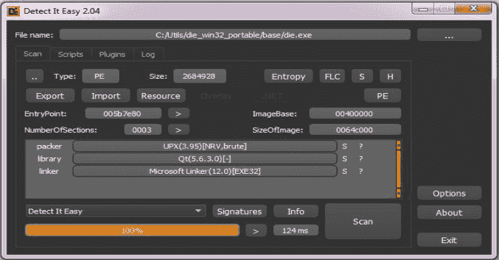

# DIE:用于确定 Windows、Linux 和 MacOS 的文件类型的程序

> 原文：<https://kalilinuxtutorials.com/die-windows-linux-macos/>

**Detect It Easy** ，或缩写为 **DIE** 是一个确定文件类型的程序。它是一个跨平台的应用程序，除了 Windows 版本，还有 Linux 和 Mac OS 的可用版本。

许多此类程序(PEID、PE 工具)允许使用第三方签名。不幸的是，这些签名仅扫描预设掩码的字节，并且不可能指定额外的参数。结果，错误触发经常发生。

更复杂的算法通常严格设置在程序本身。因此，要添加新的复杂检测，需要重新编译整个项目。除了作者自己，没有人能改变检测的算法。久而久之，没有持续的支持，这样的项目就失去了意义。

**也可阅读-[iKy:OSINT 从邮件中收集信息的项目](https://kalilinuxtutorials.com/iky-osint-project/)**

检测它容易有完全开放的签名架构。您可以轻松地添加自己的检测算法或修改那些已经存在的算法。这是通过使用脚本实现的。脚本语言与 JavaScript 非常相似，任何了解编程基础的人都会很容易理解它是如何工作的。

可能，有人会认为脚本运行非常慢。的确，脚本运行起来比编译的代码慢，但是，由于脚本引擎的良好优化，这不会造成任何特殊的不便。开放式架构的可能性弥补了这些限制。

骰子有三种版本。基本版(“DIE”)、精简版(“DIEL”)和控制台版(“DIEC”)。所有这三个都使用相同的签名，这些签名位于文件夹“db”中。如果您打开这个文件夹，将会找到嵌套的子文件夹(“二进制”、“PE”和其他)。

子文件夹的名称对应于文件的类型。首先，DIE 确定文件的类型，然后顺序加载位于相应文件夹中的所有签名。目前，该程序定义了以下类型:

*   可执行文件
*   PE 可执行文件窗口
*   ELF 可执行文件 Linux
*   MACH 可执行文件
*   文本文件
*   二进制所有其他文件

你可以在这里下载 Windows、Linux 和 Mac 的二进制文件:[http://ntinfo.biz/](http://ntinfo.biz/)

[**Download**](https://github.com/horsicq/Detect-It-Easy)