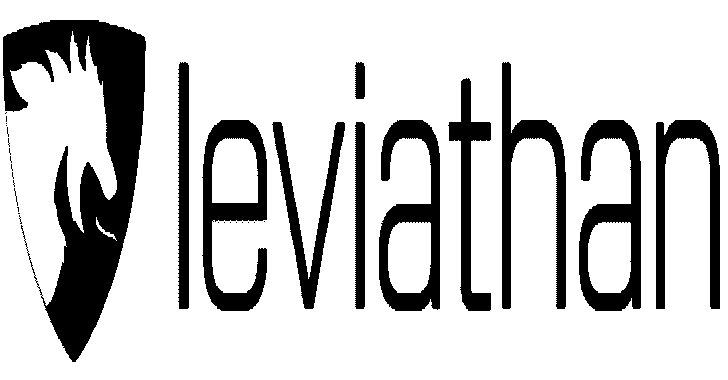
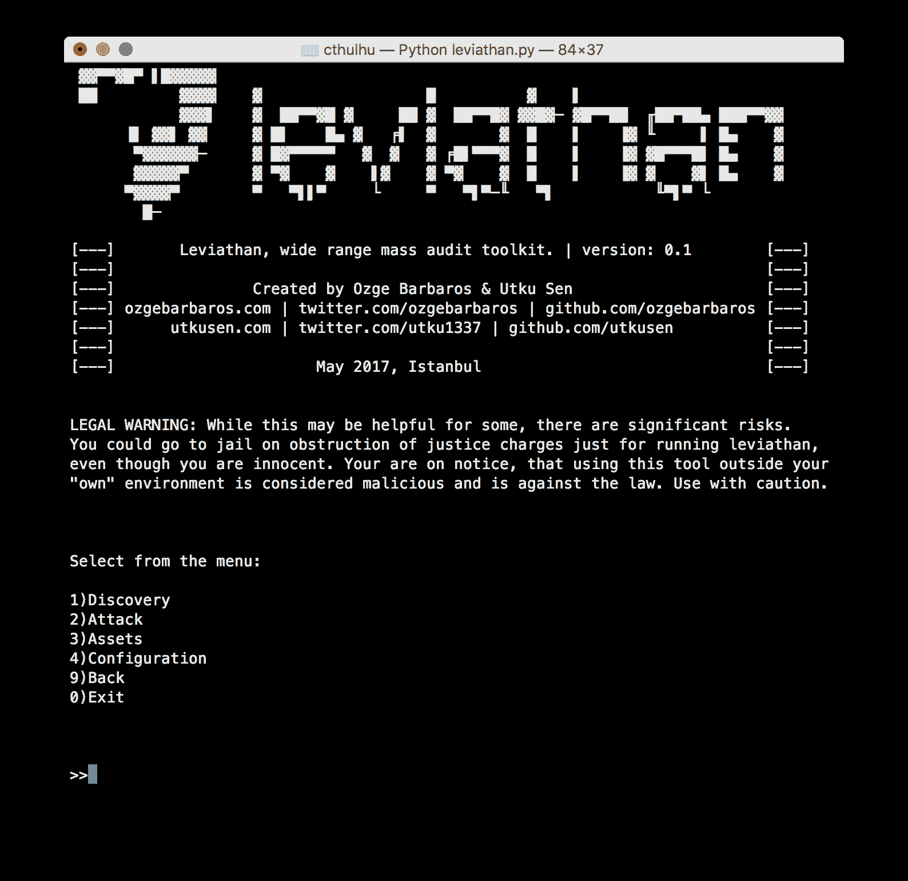
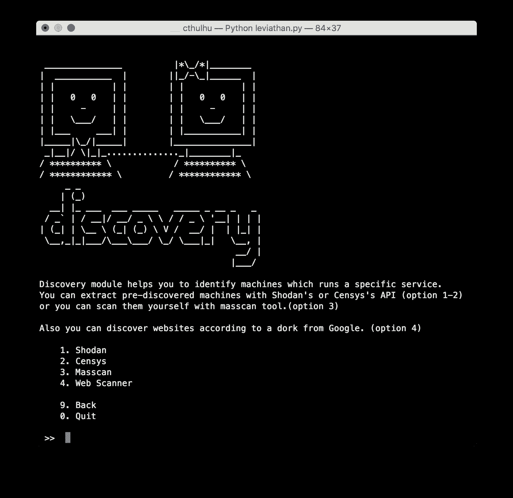
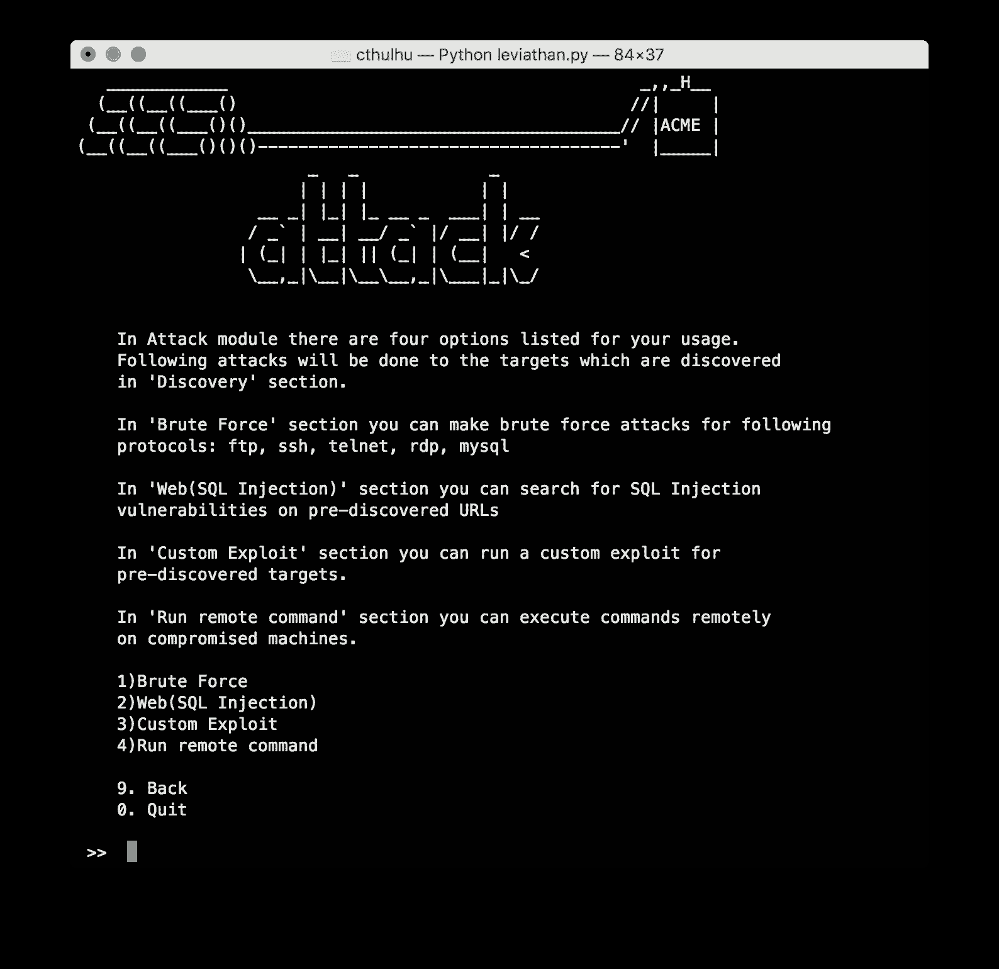
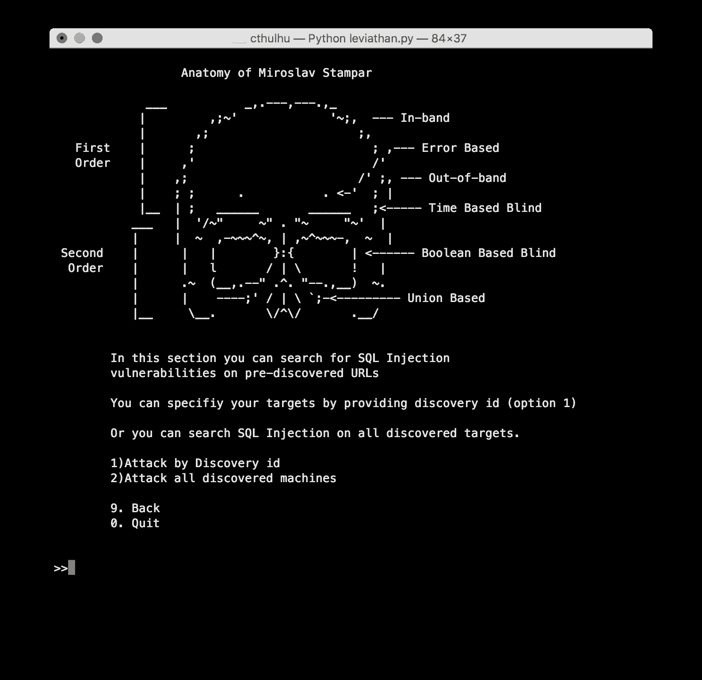

# Blisqy:利用 HTTP 头中基于时间的盲 SQL 注入

> 原文：<https://kalilinuxtutorials.com/blisqy-blind-sql-injection/>

Leviathan 是一个大规模审计工具包，具有广泛的服务发现、暴力破解、SQL 注入检测和运行自定义漏洞利用功能。它包括开源工具，如 masscan、ncrack、dsss，并为您提供组合使用它们的灵活性。

该项目的主要目标是审计尽可能多的全国范围或广泛的 IP 范围内的系统。

**特性**

**发现**:通过 Shodan、Censys 发现特定国家或 IP 范围内运行的 FTP、SSH、Telnet、RDP、MYSQL 服务。还可以通过集成的“masscan”工具手动发现 IP 范围内正在运行的服务。

简短演示:[https://asciinema.org/a/617bsxl1y84bav9f5bcwllx7r](https://asciinema.org/a/617bsxl1y84bav9f5bcwllx7r)

**暴力破解**:您可以使用集成的“ncrack”工具暴力破解发现的服务。它有词表，包括最流行的组合和特定服务的默认密码。

简短演示:[https://asciinema.org/a/43y2j38zu7hbnuahrj233d5r0](https://asciinema.org/a/43y2j38zu7hbnuahrj233d5r0)

**远程命令执行**:你可以在被入侵的设备上远程运行系统命令。

简短演示:[https://asciinema.org/a/0xcrhd12f2lpkbktjldwtab16](https://asciinema.org/a/0xcrhd12f2lpkbktjldwtab16)

**SQL 注入扫描器**:发现带有特定国家扩展名的网站或您自定义的 Google Dork 上的 SQL 注入漏洞。

简短演示:[https://asciinema.org/a/2mwfmd9afsuyg5p0vzcq5e6si](https://asciinema.org/a/2mwfmd9afsuyg5p0vzcq5e6si)

**利用特定漏洞**:使用 Shodan、Censys 或 masscan 发现易受攻击的目标，并通过提供您自己的漏洞或使用预先包含的漏洞来大规模利用它们。

简短演示:[https://asciinema.org/a/9uqsjvnru780h0ue6ok9j9ktb](https://asciinema.org/a/9uqsjvnru780h0ue6ok9j9ktb)

**也读-[UACME:击败 Windows 用户账户控制](https://kalilinuxtutorials.com/uacme-defeating-windows/)**

**集成工具**

Masscan 是罗伯特·戴维·格拉汉姆设计的一款非常快速的 TCP 端口扫描器。利维坦使用 masscan 在一个巨大的 IP 范围内检测服务。https://github.com/robertdavidgraham/masscan

**Ncrack** : Ncrack 是一款高速网络认证破解工具。利维坦使用 ncrack 暴力破解 FTP、SSH、RDP、Telnet、MYSQL 等服务。https://github.com/nmap/ncrack

DSSS(该死的小 SQLi 扫描器) : DSSS 是一个由米罗斯拉夫·斯坦帕开发的全功能最小 SQL 注入漏洞扫描器。利维坦使用 DSSS 识别特定 URL 上的 SQL 注入漏洞。https://github.com/stamparm/DSSS

**安装**

关于详细的安装，请访问我们的 [wiki](https://github.com/leviathan-framework/leviathan/wiki) 页面。

**卡利 Linux:**

通过克隆 Git 存储库下载 leviathan:

**git 克隆 https://github.com/leviathan-framework/leviathan.git**

进入文件夹内部

**cd 利维坦**

安装 Python 库:

**pip install-r requirements . txt**

搞定了！

**Debian/Ubuntu:**

通过克隆 Git 存储库下载 leviathan:

**git 克隆 https://github.com/leviathan-framework/leviathan.git**

进入文件夹内部

**cd 利维坦**

运行安装脚本。它将设置所需的工具(ncrack、masscan)和 python 库。

**bash scripts/debian _ install . sh**

搞定了！

**macOS:**

如果您的系统上没有安装 homebrew，请首先安装它:

**/usr/bin/ruby-e " $(curl-fsSL https://raw . githubusercontent . com/home brew/install/master/install)"**

通过克隆 Git 存储库下载 leviathan:

**git 克隆 https://github.com/leviathan-framework/leviathan.git**

进入文件夹内部

**cd 利维坦**

运行安装脚本。它将设置所需的工具(ncrack、masscan)和 python 库。

**bash scripts/MAC OS _ install . sh**

搞定了！

**要求**

*   运行该程序需要 python 2.7 . x 版。
*   **支持的平台** : Linux (Kali Linux，Debian，Ubuntu)，macOS

**用法**

使用以下命令运行程序:

**python 利维坦. py**

你可以在菜单里找到基本的用法信息。如需详细的使用手册，请访问我们的 [wiki](https://github.com/leviathan-framework/leviathan/wiki) 页面。

**截图**

**鸣谢:乌特库·森和奥兹格·巴巴罗斯**

**法律警告**

虽然这可能对一些人有帮助，但也有很大的风险。即使你是无辜的，你也可能因为经营利维坦而被指控妨碍司法公正而入狱。请注意，在您“自己”的环境之外使用该工具被视为恶意行为，并且是违法的。慎用。

[**Download**](https://github.com/tearsecurity/leviathan)