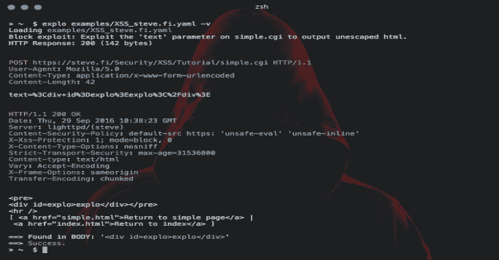

# Explo:人类和机器可读的 Web 漏洞测试格式

> 原文：<https://kalilinuxtutorials.com/explo-human-machine-readable-web-vulnerability/>

Explo 是一个简单的工具，以人类和机器可读的格式描述网络安全问题。通过定义请求/条件工作流，explo 能够利用安全问题，而无需编写脚本。这允许以简单可读和可执行的格式共享复杂的漏洞。

提取 csrf 令牌并在表单中使用它的示例:

名称:get_csrf
描述:提取 csrf 令牌
模块:http
参数:
URL:http://example.com/contact
方法:GET
头:
用户代理:Mozilla/5.0
提取:
csrf: [CSS，" #csrf"]
—
名称:利用
描述:利用有效 csrf 令牌
模块:http
参数:
URL:http://example.com/contact

在这个示例定义文件中，通过执行从上到下运行的两个步骤来测试安全问题。最后一步返回成功或失败，这取决于要找到的字符串“您的 SQL 语法中有错误”。

**安装**

**通过 PyPI 安装**

**pip 安装爆炸**

**通过源安装**

**git 克隆 https://github . com/dtag-dev-sec/explo
CD explo
python setup . py install**

**用法**

explo[–verbose |-v]test case . YAML
explo[–verbose |-v]examples/*。yaml

在`examples/`文件夹中有一些示例测试用例。

**$ explo examples/SQLI _ 简单 _ 测试 php.vulnweb.com.yaml**

您还可以将 explo 作为 python 库包含进来:

从 explo.core 导入 from _ content as explo _ from _ content
from explo . core 导入 ExploException，proxy exception

def save _ log(msg):
print(msg)

try:
result = explo _ from _ content(explo _ YAML _ file，save _ log)
exception as err:
print(err)

**也可阅读-[暴力:暴力 Gmail、Hotmail、Twitter、脸书&网飞](https://kalilinuxtutorials.com/brute-force-gmail-hotmail-twitter-facebook-netflix/)**

**选项**

http/https 代理和请求超时可以通过环境变量来设置。默认超时设置为 15 秒。

$ export http _ proxy = http://proxy:8089
$ export https _ proxy = https://proxy:8090
$ export time out = 10
$ explo…

**模块**

可以添加模块来改进安全问题的功能和级别。

**http(基本)**

http 模块允许发出 http 请求、提取内容和搜索/验证内容。

以下数据可用于以下步骤:

*   http 响应正文:`**stepname.response.content**`
*   http 响应 cookie:`**stepname.response.cookies**`
*   提取的内容:`**response.extracted.variable_name**`

如果设置了`**find_regex**` 参数，则在响应体上执行正则表达式匹配。如果失败，该模块将返回一个失败，从而停止当前工作流(以及所有步骤)的执行。

当通过正则表达式提取时，使用匹配组`extract`标记要提取的值(查看下面的示例)。

引用 cookies 时，从 **(** `**cookies: the_other_step.response.cookies**` **)** 中引用上一步要取 cookies 的名称。

参数示例:

参数:
URL:http://example.com
方法:GET
allow _ redirects:True
headers:
User-Agent:explo
Content-Type:ABC
cookies:stepname . response . cookies
body:
key:value
find:search string
find _ REGEX:search(reg | ular)expression
find _ in _ headers:search string in headers
expect _ response _ code:200
extract:)*？)value= "(？P.* ？)"']

**http_header**

`http_header`模块允许检查响应是否丢失了一组指定的头(和值)。所有其他参数都与 http 模块的*相同*。

以下数据可用于其他模块:

*   http 响应正文:`**stepname.response.content**`
*   http 响应 cookie:`**stepname.response.cookies**`

参数示例:

参数:
URL:http://example.com
方法:GET
allow _ redirects:True
headers:
User-Agent:explo
Content-Type:ABC
body:
key:value
headers _ required:
X-XSS-Protection:1
Server:。#所有值都有效

**sqli_blind**

sqli_blind 模块能够识别基于时间的盲 sql 注入。

以下数据可用于其他模块:

*   http 响应正文:`**stepname.response.content**`
*   http 响应 cookie:`**stepname.response.cookies**`

参数示例:

参数:
URL:http://example.com/vulnerable.php?id=1′等待延时' 00:00:5'–
方法:获取
延时 _ 秒:5

如果超过 5 秒(delay_seconds)的阈值，检查返回 true(从而导致成功)。

**元数据**

元数据块是一种特殊的块，可以作为. yaml 文件中的第一块添加，以便将元数据添加到漏洞中进行进一步处理。当 explo 被用作一个库并且每个漏洞描述的元数据可以用`meta_from_content(content)`读取时，这就变得有用了。该模块不需要名称或描述。

示例:

模块:元数据
参数:
cvss: 8.9
作者:罗宾·弗顿
—
名称:登录
描述:用测试凭证登录
模块:http
参数:
URL:http://testphp.vulnweb.com/userinfo.php
方法:POST
正文:
uname: test
通过:测试

[**Download**](https://github.com/dtag-dev-sec/explo)