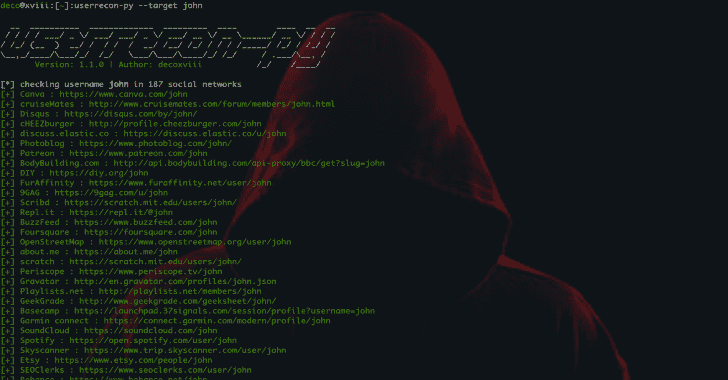

# 187 个社交网络中的识别用户名

> 原文：<https://kalilinuxtutorials.com/userrecon-py-recognition-usernames-social-networks/>

Userrecon PY 是一款用于识别 187 个社交网络用户名的工具。所以首先让我们看一下安装的步骤；

*   安装依赖项(Debian/Ubuntu):

sudo 安装 python3 python3-pip

*   用`pip3`安装:

**sudo -H pip3 安装 git+https://github . com/deco XVIII/user recon-py . git user recon-py–help**

**也可阅读-[Shellsum:防御工具-通过 MD 5 sum](https://kalilinuxtutorials.com/shellsum-defense-tool-detect-web-shells/)T3 检测本地目录中的 Web 外壳**

**建筑来源**

克隆此存储库，并:

**git 克隆 https://github.com/decoxviii/userrecon-py.git；CD user recon-py**
**sudo-H pip 3 install-r requirements . txt
python 3 setup . py build
sudo python 3 setup . py install**

**更新**

要将此工具更新到最新版本，请运行:

**sudo -H pip3 安装 git+https://github . com/deco XVIII/user recon-py . git–升级
user recon-py–版本**

**用法**

通过运行`userrecon-py --help`开始打印可用的动作。然后，您可以执行以下测试:

**user recon-py–目标 decoxviii -o test_one**

该计划之所以成为可能，是因为:

*   [userrecon](https://github.com/thelinuxchoice/userrecon)
*   [什么名字](https://github.com/WebBreacher/WhatsMyName)

**演示**

https://youtu.be/UcPIV4CgzY0[**Download**](https://github.com/decoxviii/userrecon-py)