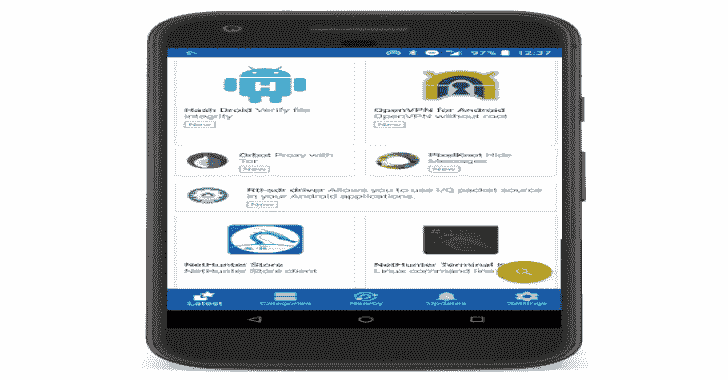

# Kali NetHunter 应用商店致力于免费安全应用

> 原文：<https://kalilinuxtutorials.com/kali-nethunter-app-store/>

Kali NetHunter 应用商店是一个可安装的 Android 应用目录，用于渗透测试和取证。客户端使您可以轻松浏览、安装和跟踪设备上的更新。

Kali NetHunter 应用程序商店是 Android 平台上免费安全相关软件的存储库，以及用于执行安装和更新的 Android 客户端，以及涵盖所有 Android 和安全相关内容的新闻、评论和其他功能。

**也可阅读-[盲 SQL 位移位:一个使用位移位来计算字符的盲 SQL 注入模块](https://kalilinuxtutorials.com/blind-sql-bitshifting/)**

store.nethunter.com 核心基础设施由进攻性安全公司运营，该公司是行业定义的渗透测试课程和认证的优质提供商。Kali NetHunter 商店是 F-Droid 的定制版本，

[**Kali NetHunter**](https://store.nethunter.com/NetHunterStore.apk)

**免责声明**

Kali NetHunter 商店是一个非盈利的志愿者项目。尽管我们尽了最大努力来确保存储库中的所有内容都可以安全安装，但是您使用它需要自担风险。

只要有可能，存储库中的应用程序都是从源代码构建的，并且会检查源代码是否存在潜在的安全或隐私问题。这种检查远非详尽无遗，也没有任何保证。

[**Download**](https://store.nethunter.com/en/)