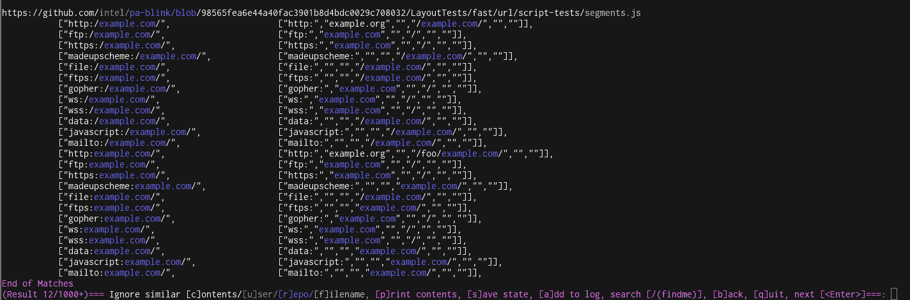

# git got——半自动、反馈驱动的工具，用于快速搜索 GitHub 上的公共数据，寻找敏感机密

> 原文：<https://kalilinuxtutorials.com/gitgot-semi-automated-feedback-driven-tool/>

GitGot 是一个半自动的、反馈驱动的工具，让用户能够快速搜索 GitHub 上的公共数据，寻找敏感的秘密。

**工作原理**

在搜索会话期间，用户会向 GitGot 提供关于要忽略的搜索结果的反馈，GitGot 会对结果集进行删减。用户可以通过文件名、存储库名称、用户名或文件内容的模糊匹配将文件列入黑名单。

从先前会话生成的黑名单可以被保存并针对类似查询(例如，`example.com` v.s. `subdomain.example.com` v.s. `Example Org`)重新使用。还可以随时暂停和恢复会话。

点击此处阅读有关半自动、人在回路设计的更多信息:[https://know . bishop fox . com/blog/going-semi-automated-in-an-automated-world-using-the-human-in-the-loop-workflows-to-improve-our-security-tools](https://know.bishopfox.com/blog/going-semi-automated-in-an-automated-world-using-human-in-the-loop-workflows-to-improve-our-security-tools)

**又读-[Machinae:Machinae 安全情报收集者](https://kalilinuxtutorials.com/machinae-security-intelligence-collector/)**

**安装说明**

*   为模糊哈希安装`ssdeep`依赖项。

Ubuntu/Debian(或您的发行版的同等版本):

**apt-get install libfuzzy-dev ss deep**

或者，对于麦克·OSX:

**brew 安装 ssdeep**

对于没有`ssdeep`软件包的 Windows 或*nix 发行版，请参见 [ssdeep 安装说明](https://ssdeep-project.github.io/ssdeep/index.html)。

*   安装`ssdeep`后，使用`pip`安装 Python 依赖项:

**pip 3 install-r requirements . txt**

**用法**

GitHub 需要一个令牌来限制速率。创建一个 [GitHub API 令牌](https://github.com/settings/tokens)，带有**无权限/无范围**。这将等同于公共 GitHub 访问，但它将允许访问使用 GitHub 搜索 API。在`gitgot.py`的顶部设置该令牌，如下所示:

**ACCESS _ TOKEN = "<NO-PERMISSION-GITHUB-TOKEN-HERE>"**

添加令牌后，您就可以开始了:

–>使用默认的正则表达式列表和日志文件位置(/logs/)查询字符串“example.com”。【T0 日志】。/git got . py-q example.com

–>使用 GitHub 高级搜索语法
。/git got . py-q " org:github cats "

–>自定义正则表达式列表和自定义日志文件位置
。/git got . py-q example.com-f checks/default . list-o example 1 . log

–>从现有会话中恢复
。/git got . py-q example.com-r example.com.state

–>使用现有会话(带有黑名单)进行新查询
。/gitgot.py -q "示例组织"-r example.com.state

**查询语法**

GitGot 查询被直接输入到 GitHub 代码搜索 API，所以请查看 [GitHub 的文档](https://help.github.com/en/articles/searching-code)以获得更高级的查询语法。

**UI 命令**

*   **忽略相似内容:**将文件内容的模糊散列列入黑名单，以忽略与所选文件相似的未来结果
*   **Ignore[r]EPO/[u]ser/[f]filename:**通过将所选字符串列入黑名单来忽略将来的结果
*   **Search [/(mykeyword)]:** 提供一个带有捕获组的自定义正则表达式，用于即时搜索(例如`/(secretToken)`)
*   **[a]添加到日志:**将正则表达式匹配添加到日志文件，包括搜索命令的所有即时搜索结果
*   **下一步[ <输入>，【b】确认:**在搜索结果中前进，或返回到先前的结果
*   **【s】保存状态:**保存会话搜索结果中的黑名单和进度
*   **【q】uit:**退出

[**Download**](https://github.com/BishopFox/GitGot)