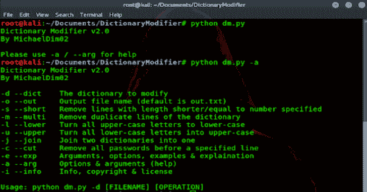

# Hvazard:删除短密码和重复密码，将小写字母改为大写字母并反转，合并单词列表

> 原文：<https://kalilinuxtutorials.com/hvazard/>

**HVAZARD** 字典修改器移除短密码&重复，将小写改为大写&反转，合并单词列表！

**手册&讲解**

*   d–dict 指定您想要修改的文件。这是唯一非可选的参数/自变量。
*   o–out 输出文件名(可选)。默认为 out.txt。
*   s-short 该操作删除长度小于或等于指定数量的行。示例:python DM . py-d dictionary.txt-s 5
*   d–dupli 此操作删除重复的行。如果一条线出现多次，它将被删除。这样做是为了避免多次尝试输入密码，因为这是浪费时间。示例:python dm.py -d wordlist -d
*   l–lower 该操作将所有大写字母转换为小写字母。小写字母仍然如此。示例:python DM . py–低维字典
*   该操作将所有小写字母转换成大写字母。大写字母保持不变。示例:python dm.py -u -d file.txt
*   这个操作将两个文件合并成一个更大的文件。示例:python DM . py-d wd1 . txt-j wd2.txt
*   c-cut 该操作删除指定行号之前的所有行。如果你已经使用了单词表的很大一部分，并且不想经历同样的过程，这是很有用的。示例:python–cut rock you . txt-o cut rocku . txt
*   e–exp 此选项显示此消息。
*   a–arg 该选项显示参数和选项。

**又读-[DIE:为 Windows、Linux&MAC OS](https://kalilinuxtutorials.com/die-windows-linux-macos/)确定文件类型的程序**

**免责声明**

这是免费软件，没有保修！根据 MCD 渗透测试软件许可证获得许可。请勿用于非法目的。

[**Download**](https://github.com/MichaelDim02/Hvazard)