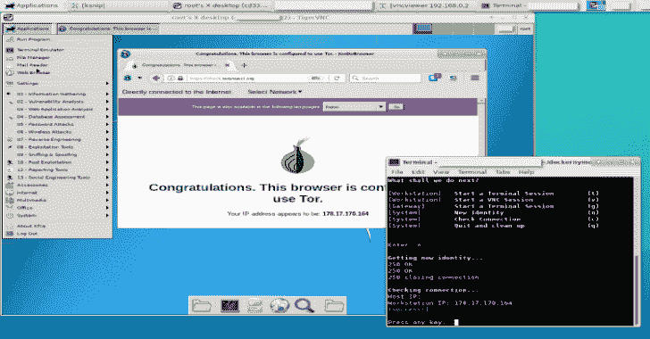

# Dockernymous:用 Docker 容器创建一个类似 Whonix 的网关/工作站环境的脚本

> 原文：<https://kalilinuxtutorials.com/dockernymous-script-whonix/>

**Dockernymous** 是一个脚本，用于使用 docker 容器创建一个类似 whonix 的网关/工作站环境。这是 Docker 的一个启动脚本，它运行并配置两个独立的 Linux 容器，以便作为一个匿名工作站-网关设置。

它面向有经验的 Linux/Docker 用户、安全专家和渗透测试人员！

网关容器充当匿名中间体(参见[https://TRAC . tor project . org/projects/Tor/wiki/doc/transparent proxy](https://trac.torproject.org/projects/tor/wiki/doc/TransparentProxy))并通过 Tor 网络路由来自工作站容器的所有流量。

这个想法是创建一个类似 whonix 的设置(见[https://www.whonix.org](https://www.whonix.org/))运行在不能有效运行两个硬件虚拟机或者根本没有虚拟化能力的系统上。

**也读作——[Explo:Human&机器可读 Web 漏洞测试格式](https://kalilinuxtutorials.com/explo-human-machine-readable-web-vulnerability/)**

**要求**

**主机(Linux):**

*   码头工人
*   vnc 查看器
*   xterm
*   卷曲

**网关图像:**

*   Linux(例如 Alpine、Debian)
*   突岩
*   procps
*   ncat
*   iptables

**工作站图像:**

*   Linux(例如 Kali)
*   xfce4 或其他桌面环境(用于 vnc 访问)
*   tightvncserver

**指令**

*   **主持人**

要克隆 dockernymous 存储库类型:

**git 克隆 https://github . com/bcappain/docernymus . git**

dockernymous 需要一个正常运行的 Docker 环境和一个非默认的 Docker 网络。让我们创建一个:

**docker 网络创建–驱动程序=网桥–子网= 192 . 168 . 0 . 0/24 docker _ internal**

*   **网关(阿尔卑斯):**

获得一个轻量级网关映像！例如阿尔卑斯山:

**码头工人拉阿尔卑斯**

运行映像，更新包列表，安装 iptables & tor:

**docker run-it alpine/bin/sh
apk add–update tor iptables iproute 2
exit**

在扩展之前，您可以根据自己的需要进一步定制网关。

为了使这个永久化，你必须从我们刚刚设置的网关容器中创建一个新的图像。每次运行 dockernymous 时，都会从该映像创建一个新的容器，并在退出时释放:

**docker commit[容器 ID] my_gateway**

通过运行以下命令获取容器 ID:

**docker ps -a**

*   **工作站(Kali Linux):**

获取工作站的图像。例如，Kali Linux 用于渗透测试:

**坞站拉卡里 linux 卡里 linux 坞站**

更新并安装您想要使用的工具(参见[https://www.kali.org/news/kali-linux-metapackages/](https://www.kali.org/news/kali-linux-metapackages/))。

**docker run-it kali Linux/kali-Linux-docker/bin/bash
apt-get 更新
apt-get dist-upgrade
apt 安装 kali-linux-top10**

确保安装了 tightvncserver 和 curl 包，这是大多数 Kali 元包的情况。

**apt-get install tightvncserver
apt-get install curl**

为最小图形桌面安装 xfce4:

**$ apt-get 安装 xfce4
$ apt-get 清理
$退出**

与网关一样，要使其永久化，您必须从定制的容器中创建一个映像。每次运行 dockernymous 时，都会创建一个新的容器，并在退出时释放。

**$ docker commit[容器 ID] my_workstation**

通过运行以下命令获取容器 ID:

**$ docker ps -a**

*   **运行 dockernymous** 以防您将图像的名称更改为不同的名称(默认为:“docker_internal”(网络)、“my_gateway”(网关)、“my_workstation”(您猜对了))用您喜欢的编辑器打开 dockernymous.sh，并在配置部分更新实际名称。

现在一切都应该设置好了，让我们试一试吧！运行 Dockernymus(不要忘记‘CD’到克隆的文件夹中):

**bash dockernymous.sh**

或者将其标记为可执行一次:

**chmod+x dock mode . sh**

并且总是用以下方式运行:

**。/docketernymus . sh**

我很高兴得到反馈。请记住，dockernymous 仍在开发中。该脚本相当混乱，因此将其视为 alpha 阶段的项目(还没有版本控制)。

[**Download**](https://github.com/bcapptain/dockernymous#requirements)