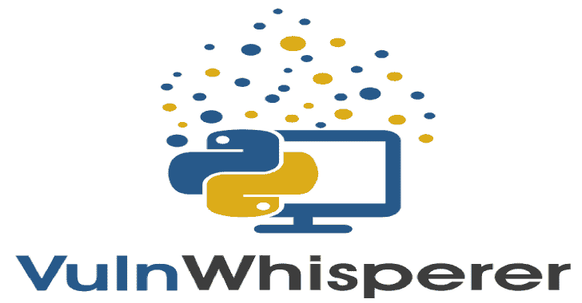
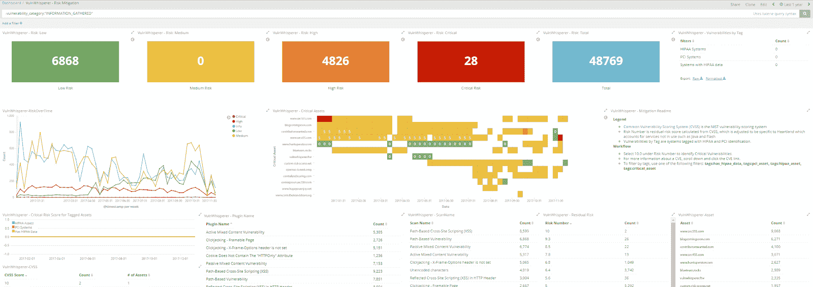
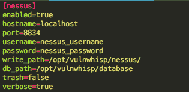
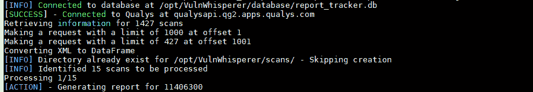

# VulnWhisperer:从漏洞扫描中创建可操作的数据

> 原文：<https://kalilinuxtutorials.com/vulnwhisperer-create-actionable-data-from-your-vulnerability-scans/>

VulnWhisperer 是一个漏洞管理工具和报告聚合器。VulnWhisperer 将从不同的漏洞扫描器中提取所有报告，并为每个报告创建一个具有唯一文件名的文件，稍后使用该数据与吉拉和 feed Logstash 同步。

吉拉对扫描器提供的数据进行闭环完全同步，而 Logstash 对报告中的所有信息进行索引和标记(请参见/resources/elk6/pipeline/。

然后，数据被发送到 ElasticSearch 进行索引，并在 Kibana 中以可视化和可搜索的格式结束，其中已经定义了仪表板。

**也可阅读–[Git Hound–使用代码搜索关键字](https://kalilinuxtutorials.com/git-hound-exposed-keys-across-github/)在 GitHub 中查找暴露的密钥**

**漏洞框架**

*   [内苏斯(**V6**/**V7**/**V8**)](https://www.tenable.com/products/nessus/nessus-professional)
*   [Qualys 网络应用](https://www.qualys.com/apps/web-app-scanning/)
*   [Qualys 漏洞管理](https://www.qualys.com/apps/vulnerability-management/)
*   [OpenVAS(**V7**/**V8**/**v9**)](http://www.openvas.org/)
*   [Tenable.io](https://www.tenable.com/products/tenable-io)
*   [检测](https://detectify.com/)
*   [下一步](https://www.rapid7.com/products/nexpose/)
*   [洞察虚拟机](https://www.rapid7.com/products/insightvm/)
*   [NMAP](https://nmap.org/)
*   [打嗝组曲](https://portswigger.net/burp)
*   [OWASP ZAP](https://www.zaproxy.org/)
*   还会有更多

**报告框架**

*   [每一个](https://www.elastic.co/elk-stack)
*   [吉拉](https://www.atlassian.com/software/jira)
*   [Splunk](https://www.splunk.com/)

**入门**

1.  遵循[安装要求](https://github.com/HASecuritySolutions/VulnWhisperer#installreq)
2.  在 [frameworks_example.ini 文件](https://github.com/HASecuritySolutions/VulnWhisperer/blob/master/configs/frameworks_example.ini)中填写您想要处理的部分
3.  [JIRA]如果使用吉拉，在上面提到的配置文件中填入吉拉配置。
4.  [ELK]修改 [Logstash 文件中的 IP 设置以适应您的环境](https://github.com/HASecuritySolutions/VulnWhisperer/tree/master/resources/elk6/pipeline)，并将它们导入到您的 logstash conf 目录中(默认为/etc/logstash/conf.d/)
5.  [麋鹿]导入[基巴纳可视化](https://github.com/HASecuritySolutions/VulnWhisperer/blob/master/resources/elk6/kibana.json)
6.  [运行 Vulnwhisperer](https://github.com/HASecuritySolutions/VulnWhisperer#run)

需要帮助还是只想聊天？加入我们的[休闲频道](https://join.slack.com/t/vulnwhisperer/shared_invite/enQtNDQ5MzE4OTIyODU0LWQxZTcxYTY0MWUwYzA4MTlmMWZlYWY2Y2ZmM2EzNDFmNWVlOTM4MzNjYzI0YzdkMDA0YmQyYWRhZGI2NGUxNGI)

**要求**

*   Python 2.7
*   漏洞扫描器
*   报告系统:吉拉/ ElasticStack 6.6

**安装要求——VulnWhisperer**

**安装操作系统包需求依赖**(基于 Debian 的发行版，CentOS 不需要它)

**sudo apt-get install zlib 1g-dev libxml 2-dev libxslt 1-dev**

**(可选)使用 python virtualenv 不要弄乱主机 python 库**

**virtualenv venv(将创建 python 2.7 virtualenv)source venv/bin/activate(启动 virtualenv，现在 pip 将在那里运行并应安装不带 sudo 的库)

deactivate(用于完成后退出 virtualenv)**

**安装 python 库需求**

**pip install-r/path/to/VulnWhisperer/requirements . txt
CD/path/to/VulnWhisperer
python setup . py install**

**(可选)如果使用代理，将代理 URL 作为环境变量添加到路径**

**导出 HTTP _ PROXY = HTTP://example . com:8080
导出 HTTPS _ PROXY = HTTP://example . com:8080**

现在你可以开始扫描了。(参见[运行部分](https://github.com/HASecuritySolutions/VulnWhisperer#run))

**配置**

设置 VulnWhisperer 有几个配置步骤:

*   配置 Ini 文件
*   设置日志存储文件
*   导入弹性搜索模板
*   导入 Kibana 仪表板

[frameworks_example.ini 文件](https://github.com/austin-taylor/VulnWhisperer/blob/master/configs/frameworks_example.ini)

**运行**

要运行，请使用您的漏洞扫描程序设置填写配置文件。然后，您可以从命令行执行。

(可选标志:-F-->提供“奇特的”日志颜色，在手动执行 VulnWhisperer 时有助于理解)vuln _ whisperer-c configs/framework _ example . ini-s Nessus
或
vuln _ whisperer-c configs/framework _ example . ini-s qualys

如果没有指定节(例如-s nessus)，vulnwhisperer 将在配置文件中检查具有属性`enabled=true`的模块，并按顺序运行它们。

接下来，您需要将可视化导入到 Kibana 中，并设置您的 logstash 配置。您可以遵循示例设置说明[此处]([https://github . com/HASecuritySolutions/VulnWhisperer/wiki/Sample-Guide-ELK-Deployment](https://github.com/HASecuritySolutions/VulnWhisperer/wiki/Sample-Guide-ELK-Deployment))或使用我们提供的“docker-compose”解决方案。

**【码头工】化合物**

ELK 本身就是一个完整的世界，对于该平台的新手来说，它需要基本的 Linux 技能，通常还需要一些故障排除，直到它被部署并按预期工作。由于我们无法为每个用户的 ELK 问题提供支持，我们整理了一份 docker-compose，其中包括:

*   vulnwhispherer
*   Logstash 6.6
*   弹性搜索 6.6
*   Kibana 6.6

docker-compose 只需要指定保存 VulnWhisperer 数据的路径以及配置文件所在的位置。如果在`git clone`之后直接运行，只需将扫描仪配置添加到 VulnWhisperer 配置文件([/resources/elk 6/VulnWhisperer . ini](https://github.com/HASecuritySolutions/VulnWhisperer/blob/master/resources/elk6/vulnwhisperer.ini))中，它就可以开箱即用。

它还负责通过 API 自动加载 Kibana 仪表板和可视化，这需要在 Kibana 启动时手动完成。

有关 docker-compose 的更多信息，请查看 [docker-compose wiki](https://github.com/HASecuritySolutions/VulnWhisperer/wiki/docker-compose-Instructions) 或 [FAQ](https://github.com/HASecuritySolutions/VulnWhisperer/wiki) 。

**入门**

我们当前的路线图如下:

*   创建漏洞标准
*   将每个扫描仪结果映射到标准
*   创建扫描仪模块指南，以便轻松集成新扫描仪(一致性将允许#14)
*   重构代码以重用函数并实现模块间的完全兼容性
*   将 Nessus CSV 更改为 JSON(一致性和修复#82)
*   使单一日志适应标准和 Kibana 仪表板
*   实现检测扫描器
*   实施 Splunk 报告/仪表板

最重要的是，我们试图尽快集中精力修复错误，这可能会延迟开发。我们也非常欢迎公关的，一旦我们有了新的标准实施，这将是非常容易增加与新扫描仪的兼容性。

漏洞标准最初将是一个新的简单的一级 JSON，其中所有信息都来自具有标准化变量名的不同扫描器，同时保持其余变量不变。

将来，一旦一切都实现了，我们将评估迁移到现有的标准，如 ECS 或 AWS 漏洞模式；我们将功能置于完美之上。

**视频教程**

[https://www.youtube.com/embed/zrEuTtRUfNw?feature=oembed&enablejsapi=1](https://www.youtube.com/embed/zrEuTtRUfNw?feature=oembed&enablejsapi=1)

**鸣谢:奥斯丁·泰勒(@HuntOperator) &贾斯汀·汉德森(@smapper)**

[**Download**](https://github.com/HASecuritySolutions/VulnWhisperer)