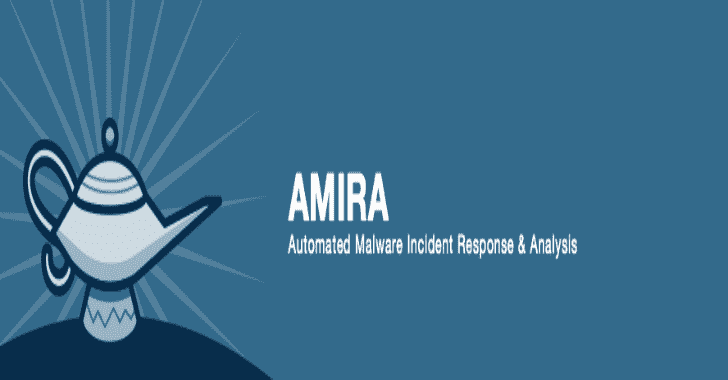
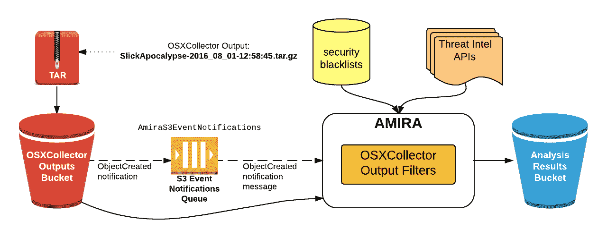

# AMIRA:自动化恶意软件事件响应和分析

> 原文：<https://kalilinuxtutorials.com/amira-automated-malware-analysis/>

AMIRA 是一个服务，用于自动运行对 [OSXCollector](https://github.com/Yelp/osxcollector) 输出文件的分析。自动分析通过 [OSXCollector 输出过滤器](https://github.com/Yelp/osxcollector_output_filters)执行，特别是一个过滤器来管理它们:分析过滤器。

它负责从 S3 存储桶中检索输出文件，运行分析过滤器，然后将分析结果上传回 S3(尽管也可以将它们附加到相关的 JIRA 票据上)。

**先决条件**

**tox**

以下步骤假设您的机器上安装了 [tox](http://tox.readthedocs.org/) 。

如果不是这样，请运行:

**$ sudo pip 安装毒性**

**OSXCollector 输出过滤器配置文件**

它使用 OSXCollector 输出过滤器来进行实际的分析，所以您需要在工作目录中有一个有效的`osxcollector.yaml`配置文件。示例配置文件可以在 [OSXCollector 输出过滤器](https://github.com/Yelp/osxcollector_output_filters/blob/master/osxcollector.yaml.example)中找到。

配置文件提到了文件散列的位置和域黑名单。确保配置文件中提到的黑名单位置在运行时也是可用的。

**也可阅读-[近距离观察无刷 DC 电动机](https://kalilinuxtutorials.com/a-closer-look-at-the-brushless-dc-electric-motor/)**

**AWS 凭证**

它使用 boto 与 AWS 接口。您可以使用任何一个可能的 [boto 配置文件](http://boto.cloudhackers.com/en/latest/boto_config_tut.html#details)来提供凭证。

凭证应该允许从 AMIRA 配置中指定的 SQS 队列中读取和删除 SQS 消息，以及对存储 OSXCollector 输出文件的 S3 存储桶中的对象的读取权限。为了能够将分析结果上传回 AMIRA 配置文件中指定的 S3 存储桶，凭据还应该允许对此存储桶进行写访问。

**阿米拉建筑**

该服务使用 [S3 桶事件通知](http://docs.aws.amazon.com/AmazonS3/latest/dev/NotificationHowTo.html)来触发分析。您需要为 OSXCollector 输出文件配置一个 S3 桶，这样当一个文件被添加到那里时，通知将被发送到一个 SQS 队列中(下图中的`AmiraS3EventNotifications`)。

它定期检查队列中是否有新消息，一旦收到新消息，它将从 S3 桶中获取 OSXCollector 输出文件。然后，它将对检索到的文件运行分析过滤器。

分析过滤器按顺序运行 OSXCollector 输出过滤器包中包含的所有过滤器。其中一些与外部资源通信，如域和哈希黑名单(或白名单)和威胁英特尔 API，例如 [VirusTotal](https://github.com/Yelp/threat_intel#virustotal-api) 、[OpenDNS investigation](https://github.com/Yelp/threat_intel#opendns-investigate-api)或 [ShadowServer](https://github.com/Yelp/threat_intel#shadowserver-api) 。

原始的 OSXCollector 输出使用所有这些信息进行扩展，由 Analyze 过滤器运行的最后一个过滤器将所有的发现总结成一种人类可读的形式。过滤器完成运行后，分析结果将上传到分析结果 S3 存储桶。

整个过程和其中涉及的系统组件概述如下:

**使用 AMIRA**

AMIRA 的主要入口点在`amira/amira.py`模块中。您首先需要通过提供 AWS 区域名称来创建 AMIRA 类的实例，其中包含 OSXCollector 输出桶的事件通知的 SQS 队列是，SQS 队列名称是:

**来自 amira。amira 进口 amira

amira = amira(' us-west-1 '，【amira 3 event notification ')**

然后，您可以注册分析结果上传程序，例如 S3 结果上传程序:

**从 amira.s3 导入 S3 results uploader

S3 _ results uploader = S3 results uploader(' amira-results-bucket ')amira . register _ results _ uploader(S3 _ results _ uploader)**

最后，运行 AMIRA:

**amira.run()**

去喝杯咖啡，坐下来，放松一下，等到分析结果出现在 S3 桶里！

[**Download**](https://github.com/Yelp/amira)