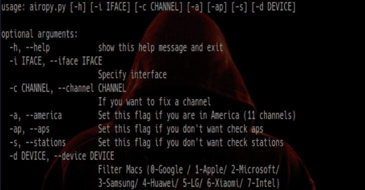

# Airopy:获取客户端和接入点

> 原文：<https://kalilinuxtutorials.com/airopy-wireless-packet-capture/>

**Airopy** 是获取客户端和接入点的无线数据包捕获。对于 Alfa cards，该脚本可以正常工作。

**依赖关系**

要运行此脚本，首先安装要求如下:

**sudo pip3 安装要求. txt**

**如何使用**

在示例中，我没有添加“sudo”，但是要执行它们，您需要高权限。

要获得帮助:

**python3 airopy.py -h**

要获取 APS:

**python 3 air opy . py-I wlx 00 c0ca 81 FB 80–APS**

要获取电台:

**python 3 airopy . py-I wlx 00 c 0 ca 81 FB 80–站**

要获取接入点和电台:

**python 3 air opy . py-I wlx 00 c0ca 81 FB 80–APS–station**

要按特定供应商过滤:

**python 3 airopy . py-I wlx 00 c 0 ca 81 FB 80–stations-d 0**

要过滤 mac 供应商，请检查 mac_vendors.py 中的数量。最后一个选项可能会返回不需要的设备，因为它基于以下未经验证的前缀:

*   [很少](https://gist.github.com/aallan/b4bb86db86079509e6159810ae9bd3e4)
*   [wifi root](https://raw.githubusercontent.com/hash3liZer/WiFiBroot/master/utils/macers.txt)

如果在美国用，加–America。

**也可阅读-[Git Hound:使用代码搜索关键字](https://kalilinuxtutorials.com/git-hound-exposed-keys-across-github/)在 GitHub 中找到暴露的密钥**

**免责声明**

本软件由版权所有者和贡献者“按原样”提供，拒绝任何明示或暗示的担保，包括但不限于适销性和特定用途适用性的暗示担保。在任何情况下，不对任何直接、间接、附带、特殊、惩戒性或后果性损害(包括但不限于替代货物或服务的采购)负责；用途、数据或利润的损失；或业务中断)以及任何责任理论，无论是合同责任、严格责任还是因使用本软件而产生的侵权行为(包括疏忽或其他),即使已被告知此类损害的可能性。

**贷方:霍苏埃·恩西纳**

[**Download**](https://github.com/Josue87/Airopy)