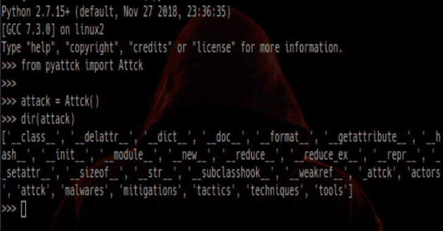

# Pyattck:一个 Python 模块，用于与米特 ATT&CK 框架交互

> 原文：<https://kalilinuxtutorials.com/pyattck-python-module-mitre-attck-framework/>

一个 Python 模块，用于与米特 ATT&CK 框架进行交互。Pyattck 在其当前版本中具有以下显著特征:

*   检索所有策略、技术、参与者、恶意软件、工具和缓解措施
*   所有技术都建议将缓解作为一个属性
*   对于每个类，您可以访问有关相关数据点的附加信息:
*   **演员**
    *   演员或团队使用的工具
    *   行动者或团体使用的恶意软件
    *   该演员或团体使用的技巧
*   **恶意软件**
    *   使用此恶意软件的演员或团体
    *   该恶意软件使用的技术
*   **缓解**
    *   与一组特定的缓解建议相关的技术
*   **战术**
    *   在特定战术(阶段)中发现的技术
*   **技术**
    *   战术是一种技巧
    *   给定技术的缓解建议
    *   使用这种技术的演员或团体
*   **工具**
    *   使用指定工具的技术
    *   使用特定工具的演员或团队

**也读作-[Hvazard:删除短密码&重复，将小写改为大写&反转，合并单词列表](https://kalilinuxtutorials.com/hvazard/)**

**安装**

**OS X & Linux:**

**pip 安装 pyattck**

**视窗:**

**pip 安装 pyattck**

**用法举例**

要使用 **pyattck** ，您必须实例化一个 **Attck** 对象:

**从 pyattck 导入 Attck

attack = Attck()**

您可以访问您的 **Attck** 对象的以下属性:

*   行动者
*   恶意软件
*   减轻
*   战略
*   技术
*   工具

[**Download**](https://github.com/swimlane/pyattck)