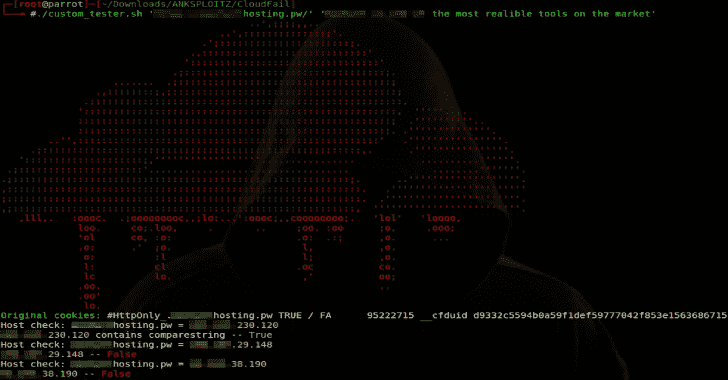
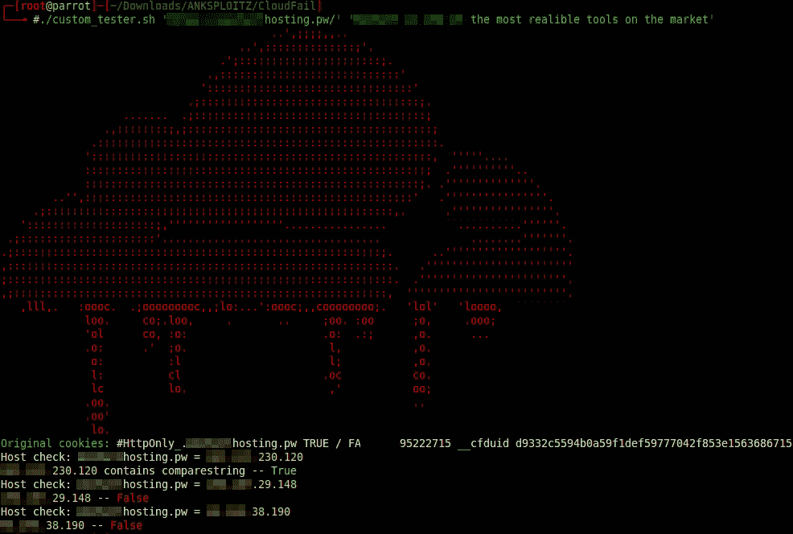

# Cloudcheck:使用测试字符串检查是否可以使用 CloudFail 绕过 Cloudflare DNS

> 原文：<https://kalilinuxtutorials.com/cloudcheck-cloudflare-dns-bypass-cloudfail/>

Cloudcheck 与 [CloudFail](https://github.com/m0rtem/CloudFail) 在同一个文件夹中使用。使用之前，请确保此存储库中的所有文件都在同一个文件夹中。

另外，在数据文件夹中创建一个名为 none.txt 的空文本文件，这样在测试时就不会出现子域冲突。

Cloudcheck 将自动更改您的 hosts 文件，使用 CloudFail 中的条目并测试指定的字符串，以检测该条目是否可用于绕过 Cloudflare。

**也可阅读-[SUDO 杀手:识别工具&利用 SUDO 规则的错误配置&Sudo](https://kalilinuxtutorials.com/sudo-killer-misconfigurations-vulnerabilities/)内部的漏洞**

如果输出结果为“True ”,您可以在 hosts 文件中使用 IP 地址绕过 Cloudflare。(稍后自动化该过程)

示例:

[**Download**](https://github.com/ANK1036Official/Cloudcheck)