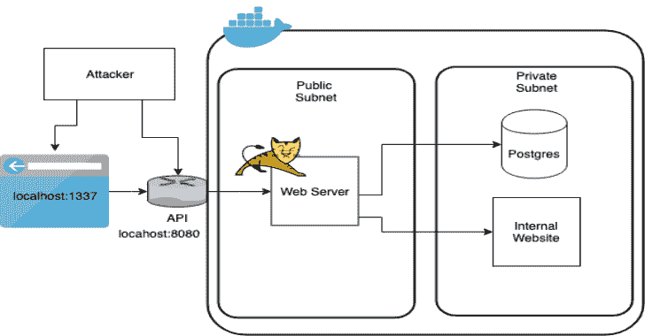
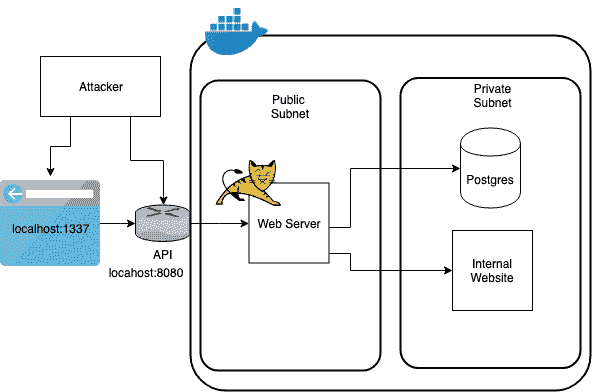

# vulcano——故意制造漏洞的 java 应用程序

> 原文：<https://kalilinuxtutorials.com/vulnado-vulnerable-java-application/>

Vulnado 是一个故意制造漏洞的 Java 应用程序，用于帮助领导安全编码研讨会。Vulnado 应用程序和练习将带您了解 OWASP 的 10 大漏洞以及如何防范它们。

**上升&运行**

*   为 [MacOS](https://hub.docker.com/editions/community/docker-ce-desktop-mac) 或 [Windows](https://hub.docker.com/editions/community/docker-ce-desktop-windows) 安装 Docker。如果您还没有 Docker 帐户，您需要创建一个。
*   `**git clone git://github.com/ScaleSec/vulnado**`
*   `**cd vulnado**`
*   `**docker-compose up**`
*   打开浏览器并导航到客户端以确保其工作正常: [http://localhost:1337](http://localhost:1337/)
*   然后回到您的终端，验证您已经连接到您的 API 服务器:`**nc -vz localhost 8080**`

**另请阅读-[HiddenEye:具有高级功能的现代网络钓鱼工具](https://kalilinuxtutorials.com/hiddeneye-modern-phishing-tool/)**

**建筑**

由`docker-compose`创建的 docker 网络很好地映射到一个多层架构，其中一个 web 服务器是公开可用的，还有其他网络资源，如数据库和内部网站，是不公开可用的。

**练习**

*   [SQL 注入](https://github.com/ScaleSec/vulnado/blob/master/exercises/01-sql-injection.md)
*   [XSS–跨站点脚本](https://github.com/ScaleSec/vulnado/blob/master/exercises/02-xss.md)
*   [SSRF-服务器端请求伪造](https://github.com/ScaleSec/vulnado/blob/master/exercises/03-ssrf.md)
*   [RCE——远程代码执行&反向外壳](https://github.com/ScaleSec/vulnado/blob/master/exercises/04-rce-reverse-shell.md)

[**Download**](https://github.com/ScaleSec/vulnado)