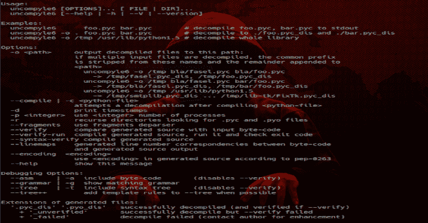

# Python 非编译 6——一个跨版本的 Python 字节码反编译器

> 原文：<https://kalilinuxtutorials.com/python-uncompyle6/>

将 Python 字节码翻译回等价的 Python 源代码。它接受从 Python 版本 1.3 到版本 3.8 的字节码，跨越了 24 年的 Python 版本。我们包括了 Dropbox 的 Python 2.5 字节码和一些 PyPy 字节码。

一个原生的 Python 跨版本反编译器和片段反编译器。“反编译”、“取消编译”和“取消编译 2”的后续版本。

好吧，我就说:这个软件太神奇了。这不仅仅是普通的黑客反编译程序。使用[编译器](https://pypi.python.org/pypi/spark_parser)技术，程序从指令中创建程序的解析树；上层的节点看起来有点像来自 Python AST 的节点。因此，我们可以真正分类并理解 Python 字节码的各个部分发生了什么。

在此基础上，使它不同于其他 CPython 字节码反编译器的另一点是能够只分解源代码的*片段*,并给出给定字节码偏移量周围的源代码信息。

我使用树片段在运行时将代码片段*分解到我的[特雷普恩](https://pypi.python.org/pypi/trepan2g) [调试器](https://pypi.python.org/pypi/trepan3k)中。为此，字节码偏移量被记录并与源代码片段相关联。这个目的，虽然符合原意，但还是有点不同。更多信息见[本](https://github.com/rocky/python-uncompyle6/wiki/Deparsing-technology-and-its-use-in-exact-location-reporting)。*

给定指令偏移量的 Python 片段分离在显示堆栈跟踪方面很有用，并且可以合并到任何希望在运行时显示比行号更详细的位置的程序中。当源代码信息不存在，只有字节码时，也可以使用这段代码。同样，我的调试器利用了这一点。

过去有(现在仍然有)许多反编译、非编译、非编译、非编译的分叉。几乎都是基本来自同一个代码库，而且(差不多？)都不再主动维护了。一个非常擅长反编译 Python 1.5-2.3 左右，另一个非常擅长 Python 2.7，但仅此而已。另一个只处理 Python 3.2 另一个补丁只处理了 3.3。你明白了。这段代码将所有这些分叉拉到一起，*向前移动*。在这些旧的分支上，这个代码库有一些严重的重构和清理。

这显然是在所有 Python 版本中反编译 Python 的最佳方式。即使有另一个项目只为 Python 版本的子集提供反编译，我们通常也做得更好。

我们怎么知道？通过获取随 Python 版本发布的 Python 字节码并反编译这些字节码。在那些成功反编译的程序中，我们可以通过运行那个字节码版本的 Python 解释器来确保结果程序在语法上是正确的。最后，在程序有自我测试的情况下，我们可以对反编译的代码进行检查。

我们认真对待测试，并使用自动化流程来发现错误。在针对其他反编译器的问题跟踪中，你会发现一些我们已经发现的错误。很少甚至没有在其他反编译器中被修复。

**另请阅读-[漏洞报告者:从您的漏洞扫描中创建可操作的数据](https://kalilinuxtutorials.com/vulnwhisperer-create-actionable-data-from-your-vulnerability-scans/)**

**要求**

这里的代码可以在 Python 或更高版本、PyPy 3-2.4 或 PyPy-5.0.1 上运行。python-2.4 分支支持 python 2.4-2.7 版本。它能读取的字节码文件已经在 Python 字节码 1.4、2.1-2.7、3.0-3.8 以及上面提到的 PyPy 版本上进行了测试。

**安装**

这使用 setup.py，因此它遵循标准的 Python 例程:

**pip install -e . #设置为从源代码树运行
#或者如果你想安装而不是
python setup.py install #可能需要 sudo**

还提供了一个 GNU makefile，因此`make install`(可能作为 root 或 sudo)将执行上述步骤。

**运行测试**

**进行检查**

添加了一个 GNU makefile 来平滑设置运行正确的命令，并从最快到最慢运行测试。

如果你安装了[改造](https://bashdb.sf.net/remake)，你可以通过`remake --tasks`看到包括测试在内的所有任务的列表

**用途**

奔跑

**$ un compile 6 *编译-python-file-pyc-or-pyo***

有关用法帮助:

**$ un style 6-h**

**验证**

在 Python 的早期版本中，可以通过反编译字节码来验证字节码，然后使用该字节码版本的 Python 解释器进行编译。完成这些后，产生的字节码可以与原始字节码进行比较。然而，随着 Python 的代码生成变得更好，这不再可行。

如果你想用 Python 语法验证反编译过程的正确性，添加`--syntax-verify`选项。然而，由于 Python 语法发生了变化，如果字节码是用于检查语法的 Python 解释器的正确字节码，那么您应该使用这个选项。

您还可以将结果与另一个 python 反编译器如 [pycdc](https://github.com/zrax/pycdc) 进行交叉比较。由于它们的工作方式不同，这里的 bug 通常不在那里，反之亦然。

这些程序中有一类很有趣的程序，它们可以提供更强的验证:那些在运行时可以自我测试的程序。我们的测试套件包括这些。

Python 附带了另一套类似的程序:它的标准库测试套件。我们在`test/stdlib`中也有一些代码来促进这种检查。

**已知缺陷/限制**

最大的已知且可能是可修复的(但困难的)问题与处理控制流有关。(Python 可能是我见过的最多样、最古怪的复合语句集；我怀疑许多程序员不知道循环和 try 块中有“else”子句。)

我看过的所有 Python 反编译程序在反编译 Python 的控制流时都有问题。在某些情况下，我们可以检测到错误的反编译并报告出来。

Python 2.7 中对 Python 的支持最强，当你离它越远，支持就越弱。对 python 2.3-2.4 的支持可能也很好，因为那个时代的早期版本的反编译器的许多优点都被保留了下来(那个时代的 python 编译很少)

在较低端的 Python 版本上有一些工作要做，这对我们来说更难处理，因为我们没有针对版本 1.6 和 2.0 的 Python 解释器。

在 Python 3 系列中，Python 支持在 3.4 或 3.3 左右最强，随着离这些版本越远，支持越弱。Python 3.0 很奇怪，因为它在某些方面更像 2.6，而不是 3.1 或 2.7。Python 3.6 通过使用字代码而不是字节代码彻底改变了事情。因此，跳转指令参数中的跳转偏移量字段已经减少。这使得`EXTENDED_ARG`指令现在在跳转指令中更加普遍；以前它们很少见。也许是为了补偿额外的`EXTENDED_ARG`指令，增加了额外的跳转优化。因此，总来说，像目前所做的那样通过特设手段来处理控制流是更糟糕的。

在 Python 3.5、3.6 和 3.7 之间，`MAKE_FUNCTION`和`CALL_FUNCTION`指令有了很大的变化。

目前并不是所有的 Python 幻数都被支持。具体来说，在 Python 的一些版本中，尤其是 Python 3.6，幻数在一个版本中会发生多次变化。

我们只支持已发布的版本，不支持候选版本。但是请注意，发布版本的魔力通常与发布前的*最后一个*候选版本相同。

也有定制的 Python 解释器，特别是 Dropbox，它们使用自己的魔法和加密 bytcode。除了 Dropbox 的旧 Python 2.5 解释器之外，这种事情没有被处理。

我们也不处理混乱的代码。对于那个尝试:在尝试这个工具之前，PJOrion [Deobfuscator](https://github.com/extremecoders-re/PjOrion-Deobfuscator) 解读字节码以获得有效的字节码。这个程序不能反编译由 [Py2EXE](https://en.wikipedia.org/wiki/Py2exe) 创建的微软 Windows EXE 文件，虽然我们可能可以在你正确提取字节码后反编译代码。对于这种情况，你可能想考虑像[疯狂编译器](http://www.crazy-compilers.com/decompyle/)这样的反编译服务。处理异常长的表达式或语句列表非常慢。

[**Download**](https://github.com/rocky/python-uncompyle6)