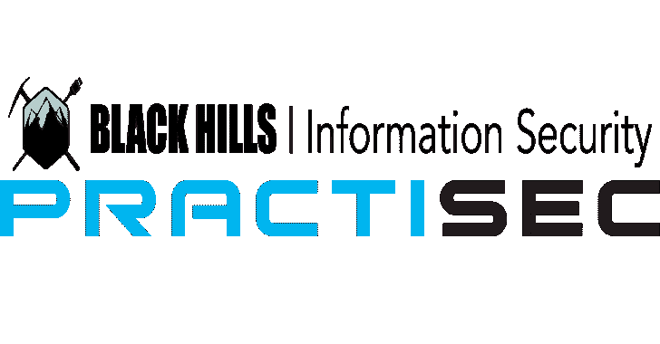

# Recon NG:开源情报收集工具，旨在减少从开源获取信息所花费的时间

> 原文：<https://kalilinuxtutorials.com/recon-ng-open-source-intelligence-gathering-tool/>

Recon NG 是一个全功能的侦察框架，旨在提供一个强大的环境来快速、彻底地进行基于开源网络的侦察。

它的外观和感觉类似于 Metasploit 框架，缩短了利用该框架的学习曲线。然而，它是完全不同的。Recon-ng 并不打算与现有框架竞争，因为它是专门为基于 web 的开源侦察而设计的。如果要利用，就使用 Metasploit 框架。如果你想成为社会工程师，使用社会工程师工具包。如果你想进行侦察，使用侦察！参见 [Wiki](https://github.com/lanmaster53/recon-ng/wiki) 开始。

**也可阅读-[AMIRA:自动恶意软件事件响应&分析](https://kalilinuxtutorials.com/amira-automated-malware-analysis/)**

它是一个完全模块化的框架，即使是 Python 开发新手也可以轻松地参与进来。有关构建和维护模块的更多信息，请参见[开发指南](https://github.com/lanmaster53/recon-ng/wiki/Development-Guide)。

[**Download**](https://github.com/lanmaster53/recon-ng)