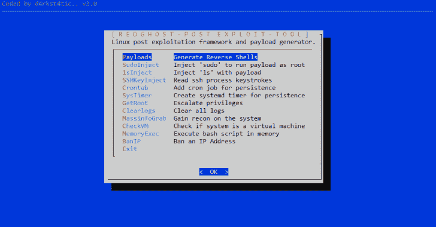

# RedGhost : Linux 后期开发框架

> 原文：<https://kalilinuxtutorials.com/redghost-linux-post-exploitation-2/>

RedGhost 是一个 Linux 后期开发框架，旨在帮助 red 团队进行持久性、侦察、权限提升和不留痕迹。

*   **Payloads** :在 netcat、bash、python、php、ruby、perl 中生成各种编码反向 shells 的函数。
*   **SudoInject** :在每次为权限提升运行“sudo”时，用包装函数注入 sudo 命令以运行反向根 shell 的函数。
*   **lsInject** :在“ls”命令中注入一个包装函数的函数，以在每次“ls”持久运行时运行有效负载。
*   使用 strace 记录 ssh 进程的击键。
*   **Crontab** :创建 cron 作业的函数，该作业从远程服务器下载有效负载，并每分钟运行有效负载以实现持久性。
*   **SysTimer** :创建 systemd timer 的函数，该函数每 30 秒下载并执行一次有效负载，以实现持久性。
*   **GetRoot** :尝试各种方法提升权限的函数。
*   **Clearlogs** :清除日志，使取证调查变得困难的功能。
*   **MassInfoGrab** :抓取系统上的大量识别/信息的功能。
*   **CheckVM** :检查系统是否为虚拟机的函数。
*   **MemoryExec** :在内存中执行远程 bash 脚本的函数。
*   **BanIp** :使用 iptables 进行 BanIp 的功能

**也可阅读-[Evil WinRM:用于黑客攻击/测试的终极 WinRM 外壳](https://kalilinuxtutorials.com/evil-winrm-hacking-pentesting/)**

**安装**

**一个安装它的内胆:**

**wget https://raw . githubusercontent . com/d4rk 007/red ghost/master/red ghost . sh；chmod+x red ghost . sh；。/redghost.sh**

**一个安装先决条件和 it 的内衬:**

**wget https://raw . githubusercontent . com/d4rk 007/red ghost/master/red ghost . sh；chmod+x red ghost . sh；apt-get 安装对话框；apt-get 安装 gccapt-get 安装 iptablesapt-get 安装策略；。/redghost.sh**

**先决条件**

*   对话
*   （同 groundcontrolcenter）地面控制中心
*   iptables
*   失去了

[Download](https://github.com/d4rk007/RedGhost)