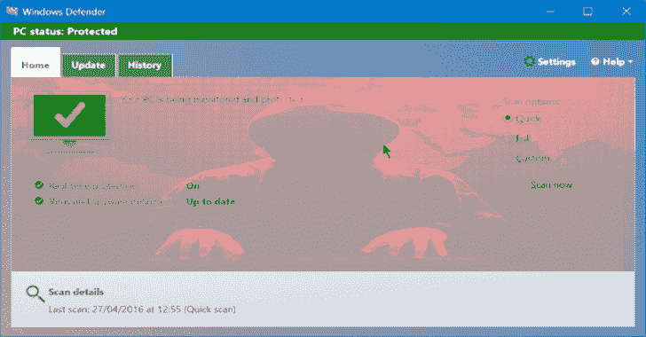

# WDExtract:提取 Windows Defender 数据库

> 原文：<https://kalilinuxtutorials.com/wdextract-extract-windows-defender-database/>

**WDExtract** 是从 vdm 文件中提取 Windows Defender 数据库并将其解压缩。

*   本程序按原样发布，没有任何担保；
*   没有官方支持，如果你喜欢这个工具，请随意投稿。

**特性**

*   打开 Windows Defender/Microsoft Security Essentials 的 VDM 容器；
*   解密恶意软件清除工具(MRT.exe)中嵌入的 VDM 容器；
*   动态地从解包/解密的容器中提取所有 PE 映像(-e 开关):
    *   转储虚拟 dll(虚拟 DLLs
    *   转储 VFS(虚拟文件系统)内容；
    *   转储签名辅助图像；
    *   转储 NIS(网络检查系统)使用的 GAPA(通用应用层协议分析器)映像；
    *   代码可适用于转储特定类型的数据库块(未实现)；
*   比任何剧本都快。

**也可理解为—[cloud check:使用测试字符串检查是否可以通过 cloud fail](https://kalilinuxtutorials.com/cloudcheck-cloudflare-dns-bypass-cloudfail/)T3 绕过 Cloudflare DNS**

**用途**

**wdextract 文件[-e]**

*   文件–VDM 容器的文件名(*。vdm 文件或 MRT.exe 可执行文件)；
*   -e 可选参数，解压缩/解密后提取在 VDM 找到的所有 PE 映像块(这包括 VFS 组件和仿真器 VDLLs)。

**举例**:

**wd extract c:\ wd base \ mpas base . VDM
wd extract c:\ wd base \ mpas base . VDM-e
wd extract c:\ wd base \ mrt . exe
wd extract c:\ wd base \ mrt . exe-e**

**注意**:基础将作为%originalname%解包/解密到源目录。解压缩(例如，如果原始文件 c:\wdbase\mpasbase.vdm，解压缩后将是 c:\ wd base \ mpas base . VDM . extracted)。

图像块将被转储到 wdextract 当前目录中创建的“块”目录(例如，如果 wdextract 从 c:\wdbase 运行，它将是 c:\wdbase\chunks 目录)。输出文件总是覆盖现有文件。

**建造**

*   用 C 写的源代码；
*   使用安装了 Windows SDK 17763 的 MSVS 2017 构建；
*   可以用以前版本的 MSVS 和 SDK 构建。

**学分** : (c) 2019 WDEXTRACT 项目

[Downoad](https://github.com/hfiref0x/WDExtract)