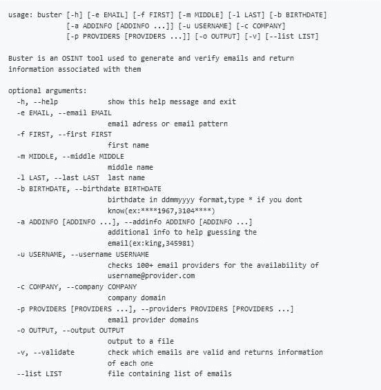

# 巴斯特:找到一个人的电子邮件并返回相关信息

> 原文：<https://kalilinuxtutorials.com/buster-find-emails-of-a-person-return/>

巴斯特是一个工具，找到一个人的电子邮件，并返回与他们相关的信息。这是一个简单的 OSINT 工具，用于:

*   从各种渠道获取社交账户(gravatar、about.me、myspace、skype、github、linkedin、avast)
*   使用 google、twitter、darksearch 和 paste 网站获得找到该邮件的链接
*   获取用电子邮件注册的域名(反向 whois)
*   生成一个人可能的电子邮件和用户名
*   查找社交媒体帐户的电子邮件
*   从用户名中查找电子邮件
*   使用 hunter.io 查找一个人的工作邮件

**安装**

**克隆存储库:**

**$ git 克隆 git://github . com/sham 00n/buste**r

**一旦你有了源代码的副本，你就可以用:**来安装它

**$ CD buster/
$ python 3 setup . py 安装
$ buster -h**

**API 键**

该项目使用 hunter.io 从公司电子邮件中获取信息，前两次“公司电子邮件”搜索不需要密钥，如果你对公司电子邮件感兴趣，我建议你在 hunter.io 上注册一个帐户。

**也读作:[Vulnado——故意有漏洞的 Java 应用](https://kalilinuxtutorials.com/vulnado-vulnerable-java-application/)**

获得 API 密钥后，将其添加到文件“api-keys.yaml”中，然后重新运行命令:

**$ python setup.py 安装**

**用途**

**用法举例**

获取单封电子邮件的信息(存在或不存在、使用电子邮件的社交媒体、数据泄露、粘贴和找到电子邮件的链接)

**$巴斯特-e target@example.com**

查询电子邮件列表` 2

**$ buster–list emails . txt**

生成与模式匹配的电子邮件，并检查它们是否存在(如果要添加更多信息，请使用-a 参数(例如:-昵称 fav_color phone #)

**$ buster -e j9@g****。com -f john -l doe -b ****1989**

生成用户名(使用-o 选项并将文件输入到 recon-ng 的 profiler 模块)

**$巴斯特-f 约翰-m 詹姆斯-l 多伊-b 13071989**

生成电子邮件(如果您想要验证并获取每封电子邮件的信息，请使用-v)

**$巴斯特-f 约翰-m 詹姆士-l 多伊-b 13071989-p gmail.com yahoo.com**

以 username@provider.com 格式生成 100+封电子邮件，并返回有效的邮件(如果您不想要所有 100+封，请使用-p)

**【巴斯特-u 约翰多】**

生成公司电子邮件并返回相关信息

**$巴斯特-f 约翰-l 多伊-c company.com**

[Download](https://github.com/sham00n/buster)