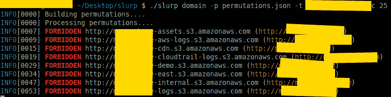
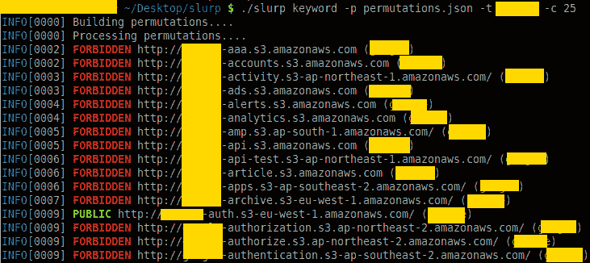
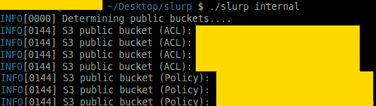

# Slurp:评估 S3 桶的安全性

> 原文：<https://kalilinuxtutorials.com/slurp-evaluate-the-security-s3-buckets/>

是一个黑盒/白盒 S3 桶枚举器。

**概述**

*   归功于所有使这个工具成为可能的供应商包。
*   这是一个安全工具；这意味着测试人员和安全专业人员可以对 s3 存储桶进行审计。

**特色**

*   通过域扫描；您可以将单个域或一系列域作为目标
*   通过关键字扫描；您可以将单个关键字或一系列关键字作为目标
*   通过 AWS 凭据扫描；您可以锁定自己的 AWS 帐户，查看哪些存储桶已经暴露
*   可视化 grep 的彩色输出
*   目前每个域名和关键词产生超过 28，000 个排列(感谢@jakewarren 和@random-robbie)
*   对国际化域名的 Punycode 支持
*   强版权许可(GPLv3)

**又读:[Python un compile 6——一个跨版本的 Python 字节码反编译器](https://kalilinuxtutorials.com/python-uncompyle6/)**

**模式**

该工具有两种工作模式:黑盒和白盒模式。白盒模式(或内部)比黑盒模式(外部)快得多。

**【黑盒(外部)】**

在这种模式下，您使用排列列表进行扫描。它将返回误报，并且没有办法将桶链接到实际的 aws 帐户！不要打开问题询问如何做到这一点。

**域**

**关键词**

**白盒(内部)**

在这种模式下，您使用 AWS API **和您拥有的的特定账户*上的凭证***来查看打开了什么。此方法提取所有 S3 存储桶，并检查策略/ACL 权限。注意，我不会提供如何使用 AWS API 的支持。你的证件应该在`**~/.aws/credentials**`里。

**内部**

**用途**

*   `**slurp domain <-t|--target> example.com**`将枚举特定目标的 S3 域。
*   `**slurp keyword <-t|--target> linux,golang,python**`将根据这 3 个关键词列举 S3 桶。
*   `**slurp internal**`使用 AWS API 执行内部扫描。

**安装**

本项目使用`vgo`；您可以克隆和`go build`或者从 Releases 部分下载。**请不要公开为什么不能建项目**的问题；这个项目像其他项目一样在围棋中建造，如果你不能建造，那么我强烈建议你阅读[围棋规范](https://golang.org/ref/spec)。

此外，我包含的唯一二进制文件是`linux/amd64`；如果你想要 mac/windows 二进制，那就自己构建。

[**Download**](https://github.com/hehnope/slurp)