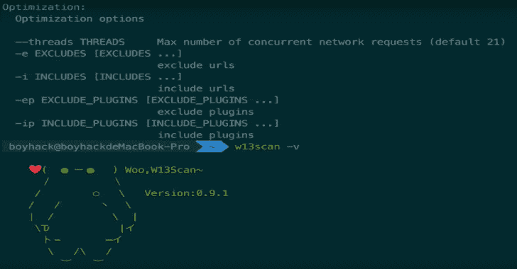

# W13Scan:被动安全扫描器 Linux/Windows/Mac 系统

> 原文：<https://kalilinuxtutorials.com/w13scan-passive-security-scanner/>

**W13scan** 是一款基于代理的 web 扫描器，运行在 Linux/Windows/Mac 系统上。如果想让 w13scan 支持 https，类似于 BurpSuite，首先需要设置一个代理服务器(默认 127.0.0.1:7778)，然后去 [http://w13scan.ca](http://w13scan.ca/) 下载根证书，信任它。

**安装**

**pip3 安装 w13 扫描**

**用途**

**#帮助**
w13s can-h

#运行
w13scan -s 127.0.0.1:7778

**也可阅读-[Recon NG:开源情报收集工具，旨在减少从开源渠道获取信息所花费的时间](https://kalilinuxtutorials.com/recon-ng-open-source-intelligence-gathering-tool/)**

**开发**

**从 W13SCAN.api 导入扫描器

Scanner = Scanner(threads = 20)
Scanner . put(" http://example . com/？post=1")
scanner.run()**

通过引入 w13scan 包，您可以快速创建扫描仪。

**演示**

[https://www.youtube.com/embed/zBgfnY-qSTU?feature=oembed&enablejsapi=1](https://www.youtube.com/embed/zBgfnY-qSTU?feature=oembed&enablejsapi=1)

[**Download**](https://github.com/boy-hack/w13scan)