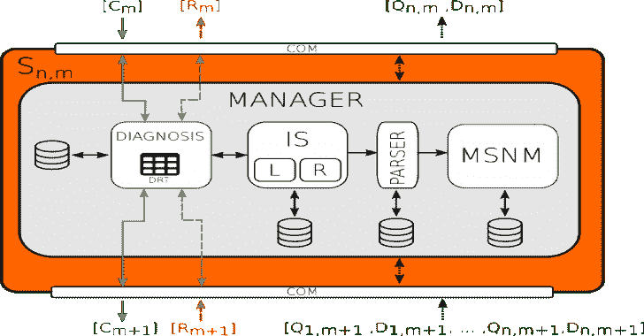
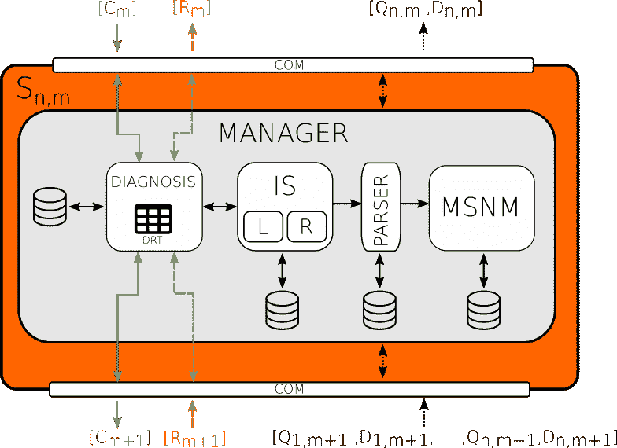
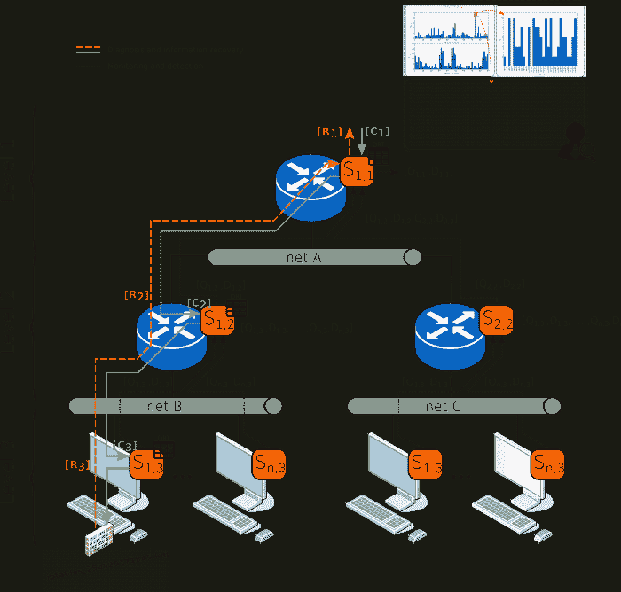

# MSNM 传感器–多元统计网络监控传感器

> [https://kallinuxxtauthorities . com/msnm 传感器/](https://kalilinuxtutorials.com/msnm-sensor/)

**MSNM 传感器**(多元统计网络监测传感器)显示了在 [PCA-MSNM](https://www.sciencedirect.com/science/article/pii/S0167404816300116) 和[分级 PCA-MSNM](http://ieeexplore.ieee.org/document/7823895/) 工程中发现的方法的实际适用性。

第一个提出了网络异常检测的 MSNM 方法和新的多元统计方法，而第二个提出了在分层和结构化网络系统中的前一个方法。

这些工作背后的主要思想是使用多元统计技术以两种统计的形式产生有用的信息。这种光信息来自网络层次结构中较低到较高的级别。

**也读作——[Python un compile 6——一个跨版本的 Python 字节码反编译器](https://kalilinuxtutorials.com/python-uncompyle6/)**

通过这种方式，根传感器(例如，边界路由器)收到所有统计信息，能够计算自己的统计数据(Q，D)。通过检查这些统计信息，安全分析师可以确定当某些统计值高于特定控制限制时，是否发生了异常事件。

**MSNM-S** 被认为是高度可扩展和无菌的，因为在被监控的网络或系统中，只有两个参数在级别或设备之间发送。此外，由于采用了 [FCParser(作为计数器解析器的功能)](https://github.com/josecamachop/FCParser)功能工程方法，MSNMSensor 能够管理每个受监控设备上的多种不同类型的数据源。

**安装**

**要求**

MSNSensor 运行 python 2.7，已经在 Ubuntu 16.04 版本及以上成功测试。此外，还必须安装以下依赖项。

*   数值> = 1.14
*   scipy:= 1.0
*   -= ytet-伊甸园字幕组=-翻译:粒粒粒尘紫月猫姐校对
*   IPy >= 0.83
*   熊猫> = 0.22
*   看门狗> = 0.8.3
*   [FCParser(作为计数器解析器的特性)== 1.0.0](https://github.com/josecamachop/FCParser/releases/tag/v1.0.0)

**如何安装**

创建 python 执行环境可能是运行应用程序的更好方式。所以我建议您在进行需求安装之前创建一个。Anaconda 环境可以帮助您，如果您决定使用它，可以运行以下命令:

**$康达创建-n py27 python=2.7
$康达激活 py27**

运行前面的命令将安装所有需要的东西。

**(py27)$ pip install-r requirements . txt**

**如何运行示例**

请参见[示例](https://github.com/nesg-ugr/msnm-sensor/blob/master/examples/README.md)中的说明，或者在 [MSNM-S-UBUNTU](https://drive.google.com/file/d/1zNf4mIuKEfEwQIDwPUbkM9oGiOVcCa22/view?usp=sharing) 下载预配置的虚拟机。我们建议您使用虚拟机。记得提取存储库来更新 MSNM-S 项目。在下文中，您可以看到在虚拟机中运行预配置实验的必要步骤:

运行 MSNM-Ss(后端)

打开终端窗口并激活 netflow 守护程序和收集器。

**$ cd ~/msnm 传感器/脚本/netflow/
$ sudo。/activateflow . sh(pass:msnm 1234)**

等待 5 分钟以获取网络流量记录。在示例/场景 4 中运行和部署 MSNM-Ss 示例:

**$**CD ~/msnm-sensor/scripts/$ conda 激活 py27
**$** 。/start_experiment.sh../examples/scenario _ 4/
**$**PS-ef | grep msnmsensor(只是为了检查四个 MSNM-S 是否都在运行)
**$**tail-500 f ~/msnm-sensor/examples/scenario _ 4/border router/logs/msnm . log(另一种查看 MSNM-S 如何工作的方式。如果你想看其他的，就把 MSNM 的名字换掉。)

运行仪表板(前端):

打开一个新的终端窗口。

**$ CD ~/msnm-传感器/仪表板/
$ conda 激活 msnm-仪表板
$ ln -s../examples examples
$ python manage . py runserver**

浏览到 [http://localhost:8000](http://localhost:8000)

[**Download**](https://github.com/nesg-ugr/msnm-sensor)