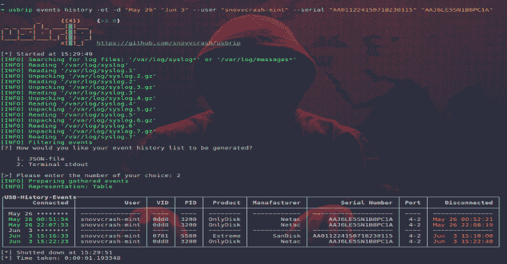
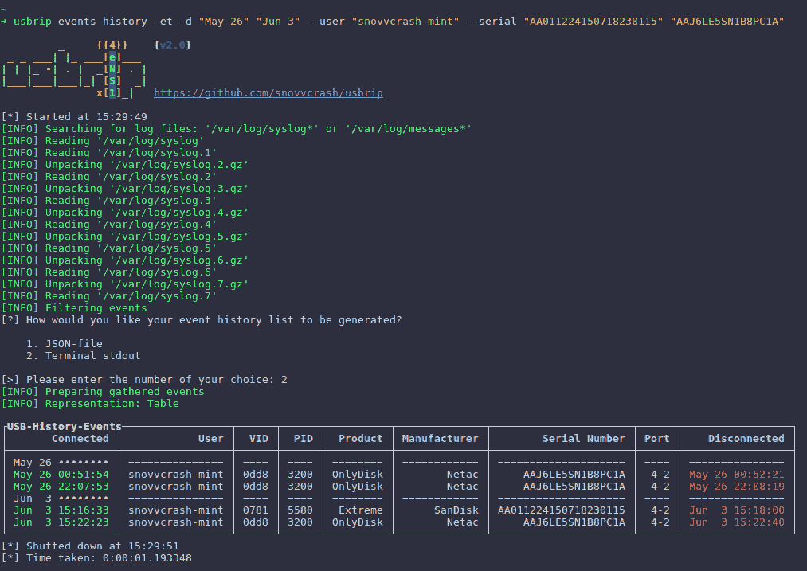
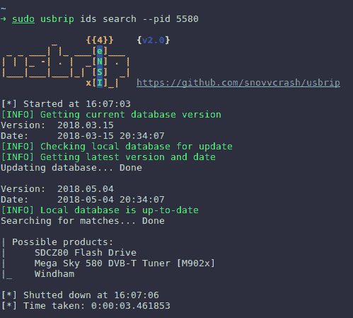

# Usbrip:用于跟踪 USB 设备工件的简单 CLI 取证工具

> 原文：<https://kalilinuxtutorials.com/usbrip-simple-cli-forensics/>

**Usbrip** (源自“USB Ripper”，而非“USB R.I.P .”)是一款带有 CLI 界面的开源取证工具，可以让您跟踪 Linux 机器上的 USB 设备工件(也称为 USB 事件历史、“连接”和“断开”事件)。

这是一个用纯 Python 3 编写的小软件(虽然使用了一些外部模块，请参见[依赖/PIP](https://github.com/snovvcrash/usbrip#pip-packages) )，它解析 Linux 日志文件(`**/var/log/syslog***` **或** `**/var/log/messages***`取决于发行版)以构建 USB 事件历史表。

这种表可以包含以下列:“**连接”(日期&时间)、“用户”、“VID”(供应商 ID)、“PID”(产品 ID)、“产品”、“制造商”、“序列号”、“端口”和“断开”(日期&时间)**。

除此之外，它还可以:

*   将收集的信息导出为 JSON 转储(当然，还要打开这样的转储)；
*   生成一个授权的(*可信的* ) USB 设备列表作为 JSON(称之为`auth.json`)；
*   基于`auth.json`搜索“违规事件”:显示(或生成另一个 JSON)历史中出现过而`auth.json`中没有出现的 USB 设备；
*   **当安装了`-s`标志** 时，创建加密存储(7zip 存档)以在`crontab`调度器的帮助下自动备份和累积 USB 事件；
*   根据特定 USB 设备的 VID 和/或 PID，搜索有关该设备的其他详细信息。

**也读作——[Python un compile 6——一个跨版本的 Python 字节码反编译器](https://kalilinuxtutorials.com/python-uncompyle6/)**

**快速启动**

usbrip 可在 [PyPI](https://pypi.org/project/usbrip/) 下载和安装:

**$ pip3 安装 usbrip**

**Git 克隆**

为了简单起见，让我们假设所有出现前缀`~/usbrip$`的命令都在`~/usbrip`目录中执行，该目录是 git 克隆的结果:

**~$ git 克隆 https://github . com/snovvcrash/sud IP . git 爆发 ip & & cd 爆发 IP**
**~/sud IP $**

**依赖关系**

usbrip 只与**非**修改的系统日志文件结构一起工作，因此，不幸的是，如果你改变 syslogs 的格式(例如用`syslog-ng`或`rsyslog`)，它将不能解析 USB 历史。顺便说一下，这就是为什么“连接”和“断开”字段的时间戳没有年份。记住这一点。

**DEB 包**

*   python3.6(或更新版本)解释器
*   python3-venv
*   p7zip-满(由`storages`模块使用)

**~$ sudo 安装 python3-venv p7zip-full -y**

**PIP 包**

usbrip 使用以下外部模块:

*   [终端表](https://github.com/Robpol86/terminaltables)
*   [术语颜色](https://pypi.org/project/termcolor)

**便携式**

要手动解析 Python 依赖关系(实际上没有必要，因为`pip`或`setup.py`可以自动完成这个过程，参见[安装](https://github.com/snovvcrash/usbrip#installation))创建一个*虚拟环境*(可选)并从内部运行`pip`:

~/usbrip $ python 3-m venv venv & & source venv/bin/activate(venv)~/usbrip $ pip install-r requirements . txt

或者让 [`**pipenv**`](https://github.com/pypa/pipenv) 的俏皮话为你做所有的脏活:

~/usbrip＄pipenv 安装&& pipenv shell

之后，您可以运行 usbrip portably:

**(venv)~/暴发$ python -m 爆发-h
或
(venv)~/爆发$ python __main_。py -h**

**安装**

将 usbrip 安装到系统中有两种方式:`**pip**` 或`**setup.py**`。

**pip 或 setup.py**

首先，usbrip 是 pip 可安装的。这意味着在 git 克隆了 repo 之后，您可以简单地启动 pip 安装过程，然后在您的终端的任何地方运行 usbrip，如下所示:

~/av IP $ python 3-m venv venv & & source venv/bin/activate(venv)~/av IP $ pip install。

(venv)~/爆发美元-h

或者如果您想在本地解决 Python 依赖关系(不打扰 PyPI)，请使用`**setup.py**`:

~/expip $ python 3-m venv venv & & source venv/bin/activate(venv)~/expip $ python setup . py install

(venv)~/expip $ expip-h

**注意**:您可能希望在 Python 虚拟环境处于活动状态时运行安装过程(如上图所示)。

**install.sh**

其次，usbrip 也可以用`**./installers/install.sh**`脚本安装到系统中。

使用`**./installers/install.sh**`时，一些额外的功能变得可用:

*   虚拟环境是自动创建的；
*   `**storage**`模块变得可用:您可以设置一个 crontab 作业来按计划备份 USB 事件(crontab 作业的示例可以在`**usbrip/cron/usbrip.cron**`中找到)。

**警告**:如果你正在使用 crontab 调度，你想用`**sudo crontab -e**`配置 cron 作业，以强制`**storage update**`子模块作为 root 运行，并保护 USB 事件存储器的密码。存储密码保存在`**/var/opt/usbrip/usbrip.ini**`T5。

`**./installers/uninstall.sh**`脚本从您的系统中删除所有的安装工件。

要安装 usbrip，请使用:

~/usbrip $ chmod+x ./installers/install . sh
~/usbrip $ sudo-H ./installers/install . sh[-l/–local][-s/–storages]
~/usbrip $ CD

~ $ usbrip-H

*   当`**-l**`开关启用时，Python 依赖关系从本地解析。tar 包(`**./3rdPartyTools/**`)而不是 PyPI。
*   当`**-s**`开关启用时，不仅安装了 usbrip 项目，还创建了可信 USB 设备列表、历史和违规存储。

**注意**:在安装过程中使用`-s`选项时，确保系统日志确实包含至少一个*外部* USB 设备条目。这是 usbrip 成功创建可信设备列表(并因此成功创建违规存储)的必要条件。

安装完成后，请随意删除 usbrip 文件夹。

**路径**

安装后，usbrip 使用以下路径:

*   `**/opt/usbrip/**` —项目的主目录；
*   `**/var/opt/usbrip/usbrip.ini**` — usbrip 配置文件:保存 7 个 zip 存储的密码；
*   `**/var/opt/usbrip/storage/**` — USB 事件存储:`**history.7z**`和`**violations.7z**`(安装过程中创建)；
*   `**/var/opt/usbrip/log/**` — usbrip 日志(建议在使用 crontab 时记录 usbrip 活动，参见`**usbrip/cron/usbrip.cron**`)；
*   `**/var/opt/usbrip/trusted/**` —可信 USB 设备列表(在安装过程中创建)；
*   `**/usr/local/bin/usbrip**` —指向`**/opt/usbrip/venv/bin/usbrip**`脚本的符号链接。

**克朗**

Cron 作业可以设置如下:

~/sud IP $ sudo crontab-l > tmpcron & echo " " > > tmpcron
~/sud IP $ cat sud IP/cron/sud IP . cron | tee-a tmpcron
~/sud IP $ sudo crontab tmpcron
~/sud IP $ RM tmpcron

**uninstall.sh**

要卸载 usbrip，请使用:

~/usbrip $ chmod+x ./installers/uninstall . sh
~/usbrip $ sudo。/installers/uninstall . sh[-a/–all]

*   当`-a`开关被激活时，不仅 usbrip 项目目录被删除，所有的存储和 usbrip 日志也被删除。

不要忘记删除 cron 作业。

**截图**

[**Download**](https://github.com/snovvcrash/usbrip)