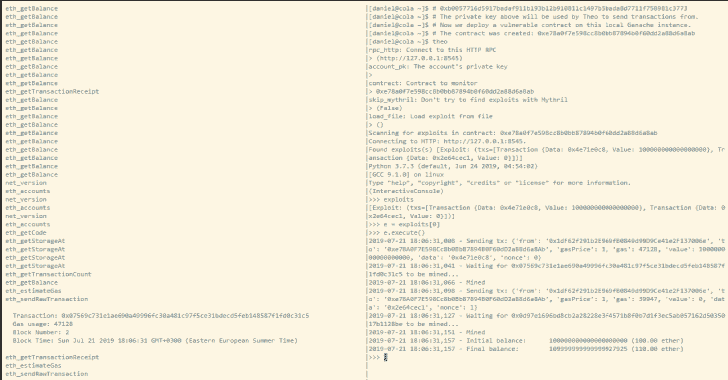

# Theo:以太坊侦查和开发工具

> 原文：<https://kalilinuxtutorials.com/theo-ethereum-recon-exploitation/>

Theo 的目标是成为一个开发框架和区块链侦察和互动工具。

**特性**

*   自动智能合同扫描，生成可能利用的列表。
*   发送交易以利用智能合约。
*   事务池监视器。
*   Web3 控制台
*   前置和后置交易。
*   等待事务列表并发送其他事务。
*   为事务估计 gas 意味着只发送成功的事务。
*   禁用气体估算将发送具有固定气体量的交易。

Theo 的目的是打击试图成为 leet 黑客的脚本小子。他可以听他们试图利用他的蜜罐，让他们失去他们的资金，为他自己的收益。

**安装**

Theo 以 PyPI 包的形式提供:

**$ pip 安装 theo
$ theo–help
用法:**theo[-h][–RPC-HTTP RPC _ HTTP][–RPC-WS RPC _ WS][–RPC-IPC RPC _ IPC]
[–ACCOUNT-PK ACCOUNT _ PK][–contract ADDRESS]
[–SKIP-myth RIL SKIP _ myth RIL][–LOAD-FILE LOAD _ FILE][–version]

**监控合同余额变化或 tx 池。** 
**可选参数:** -h，–help 显示此帮助消息并退出
–RPC-http RPC _ HTTP 连接到此 HTTP RPC(默认值:
HTTP://127 . 0 . 0 . 1:8545)
–ACCOUNT-PK ACCOUNT _ PK 帐户的私钥(默认值:None)
–Contract 地址 Contract to monitor(默认值:None)
–SKIP-SKIP

**也可阅读-[w13 scan:被动安全扫描器 Linux/Windows/Mac 系统](https://kalilinuxtutorials.com/w13scan-passive-security-scanner/)**

**从源安装**

**$ git 克隆 https://github.com/cleanunicorn/theo
$ CD 西奥
$ virtualenv。/venv
$。。/venv/bin/activate
$ pip install-r requirements . txt
$ pip install-e .
$ theo–help**

**要求**

*   Python 3.5 或更高版本。
*   一个有 RPC 可用的以太坊节点。Ganache 在测试或验证漏洞方面非常有效。

**德莫斯**

**找到漏洞并执行**

扫描智能合同，发现漏洞，利用它:

*   启动 Ganache 作为我们的本地以太坊节点
*   部署易受攻击的合同(发生在不同的窗口中)
*   扫描漏洞
*   运行漏洞利用

**抢先受害者**

设置蜜罐，部署蜜罐，等待攻击者，frontrun:

*   启动 geth 作为我们的本地以太坊节点
*   开始采矿
*   部署蜜罐
*   启动 Theo 并扫描 mem 池中的事务
*   抢在攻击者前面，偷走他的乙醚

[**Download**](https://github.com/cleanunicorn/theo)