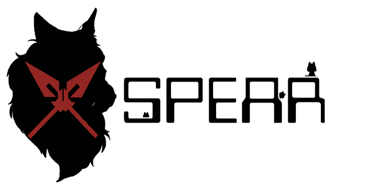
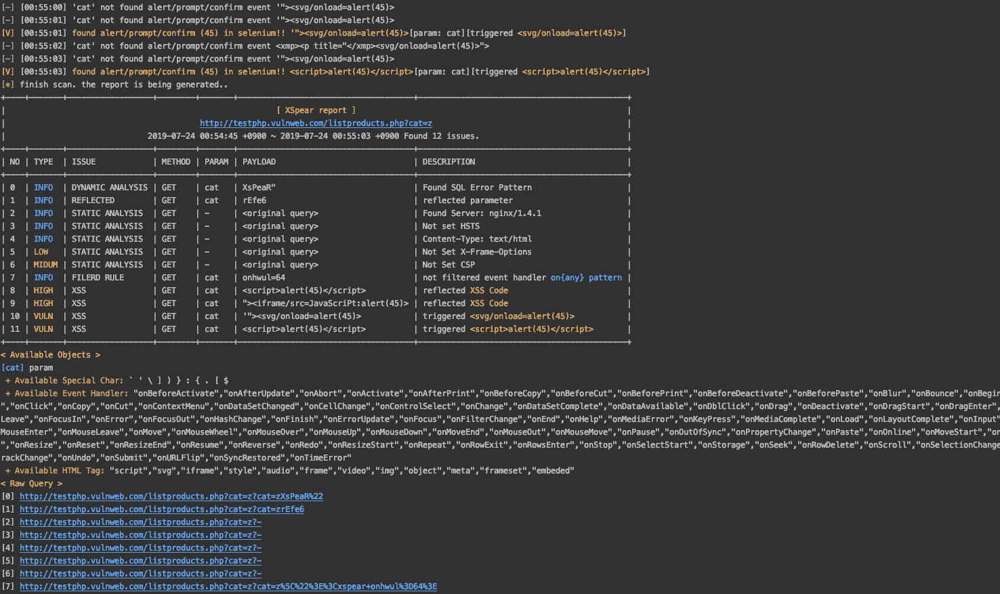
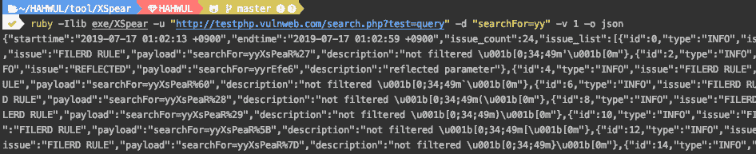

# XSpear:全功率 XSS 扫描和参数分析

> 原文：<https://kalilinuxtutorials.com/xspear-powerfull-xss-scanning-parameter-analysis/>

**XSpear** 是红宝石上的 XSS 扫描仪。

**主要特征**

*   基于模式匹配的 XSS 扫描
*   检测无头浏览器上的`**alert**` `**confirm**` `**prompt**`事件(带硒)
*   XSS 保护旁路和反射参数的测试请求/响应

    *   反射参数
    *   过滤测试`**event handler**`**`**HTML tag**`**`**Special Char**`****
*   ******测试盲 XSS(与 XSS 亨特，ezXSS，HBXSS 等所有网址基础盲测试…)******
*   ******动态/静态分析

    *   查找 SQL 错误模式
    *   分析安全标题**(**`**CSP**`**`**HSTS**`**`**X-frame-options**`**，** `**XSS-protection**` **等..)******
    *   ****分析其他标题..(服务器版本、内容类型等)********** 
*   ****从原始文件扫描(打嗝套件，ZAP 请求)****
*   ****运行在 ruby 代码上的 XSpear(带有 Gem 库)****
*   ****显示`**table base cli-report**`**`**filtered rule**`**`**testing raw query**`**(网址)**********
*   ****在选定参数下测试****
*   ****支持输出格式`**cli**` `**json**`

    *   cli:摘要、过滤规则(参数)、原始查询**** 
*   ****支持详细级别(退出/正常/原始数据)****
*   ****支持自定义回调代码来任意测试各种攻击媒介****

 ******也读作: [MSNM 传感器——多元统计网络监测传感器](https://kalilinuxtutorials.com/msnm-sensor/)**

**安装**

自己安装，如下所示:

**$ gem 安装 XSpear**

或者自己安装为(本地文件):

**$ gem 安装 XSpear-{version}。宝石**

将这一行添加到应用程序的 Gemfile 中:

**宝石‘x 梨’**

然后执行:

**$ bundle**

**依赖宝石**

`**colorize**` `**selenium-webdriver**` `**terminal-table**`
如果你配置了在 Gem 库中自动安装，但是它表现异常，用下面的命令安装。

**$宝石安装着色
$宝石安装硒-网络驱动
$宝石安装终端-表格**

**CLI 上的用法**

**用法:** xspear -u【目标】-【选项】【值】
**->例如**
$ ruby a . r b-u 'https://www.hahwul.com/？q = 123’–COOKIE = ' role = admin '
**–>Options**
-u，–URL = Target _ URL[required]目标 Url
-d，–data = POST 主体[可选] POST 方法主体数据
–HEADERS = HEADERS[可选]Add HTTP HEADERS
–COOKIE = COOKIE[可选]Add COOKIE
–raw = FILENAME[可选]加载原始文件(例如 raw_sample.txt)
-p， –output = FILENAME[可选]保存 JSON 结果
-v，–verbose = 1 ~ 3[可选]显示日志深度
+默认值:2
+ v=1:安静模式
+ v=2:显示扫描日志
+ v=3:显示详细日志(req/res)
-h，–help 打印此帮助
–版本显示 XSpear 版本
–更新与在线更新

**结果类型**

*   (I)NFO:获取信息(例如，sql 错误、过滤规则、反射参数等..)
*   ㈤UNL:脆弱的 XSS，用 Selenium 检查警报/提示/确认
*   (L)OW:低级别问题
*   (M)EDIUM:中级问题
*   (H)IGH:高级别问题

**逐个案例**

**扫描 XSS**

**$ x spear-u "http://testphp.vulnweb.com/search.php？test=query" -d "searchFor=yy"**

**json 输出**

**$ x spear-u "http://testphp.vulnweb.com/search.php？test = query "-d " search for = YY "-o JSON-v 1**

**详细日志**

**$ x spear-u "http://testphp.vulnweb.com/search.php？test = query "-d " search for = YY "-v 3**

**设定螺纹**

**$ x spear-u "http://testphp.vulnweb.com/search.php？测试=查询”-t 30**

**在选定参数下测试**

**$ x spear-u "http://testphp.vulnweb.com/search.php？test = query&cat = 123&ppl = 1fhhahwul "-p cat，test**

**测试盲 xss**

**$ x spear-u "http://testphp.vulnweb.com/search.php？test = query "-b " https://hah wul . XSS . ht "**

**更新**

如果是普通用户

**$ gem 更新 XSpear**

如果开发者(软)

**$ git 拉-v**

如果开发者(硬)

**$ git reset–硬头；git pull -v**

**开发**

在签出 repo 之后，运行`bin/setup`来安装依赖项。然后，运行`rake spec`来运行测试。你也可以运行`bin/console`得到一个交互式提示，让你进行实验。

要将这个 gem 安装到您的本地机器上，运行`bundle exec rake install`。要发布一个新版本，更新`version.rb`中的版本号，然后运行`bundle exec rake release`，这将为版本创建一个 git 标签，推送 git 提交和标签，并将`.gem`文件推送到【rubygems.org】的。

**截图**

[**Download**](https://github.com/hahwul/XSpear)****