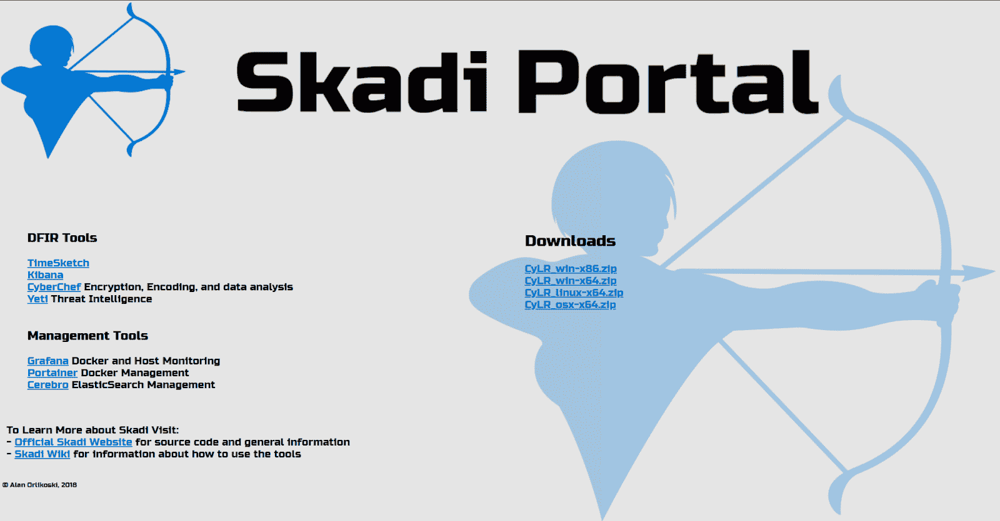
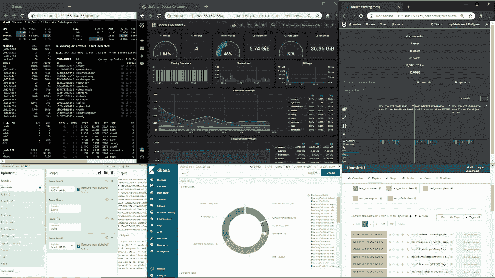
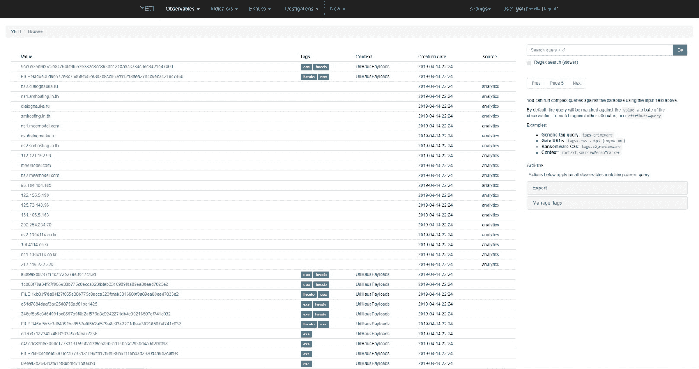
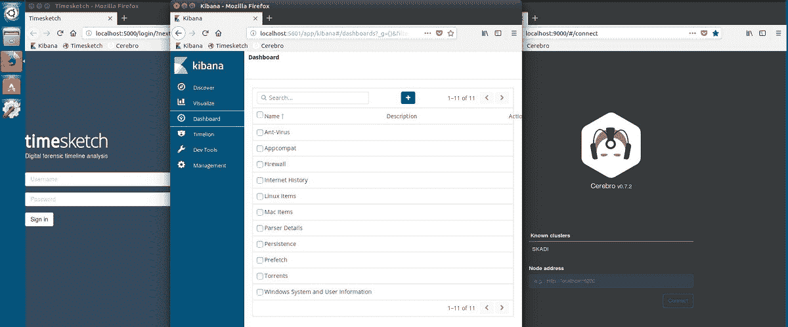
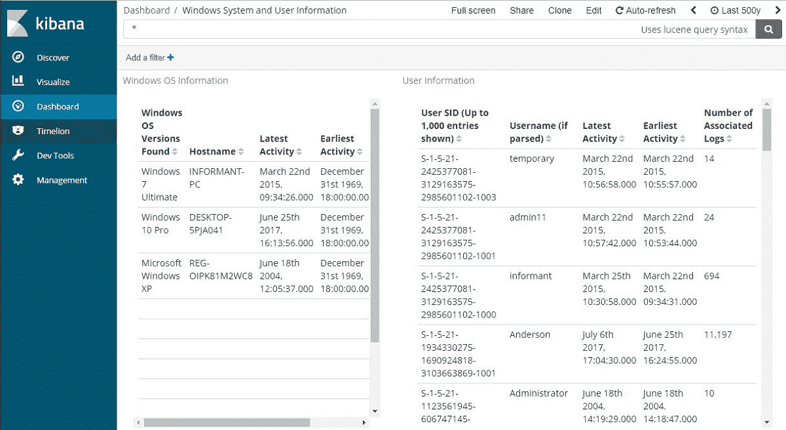
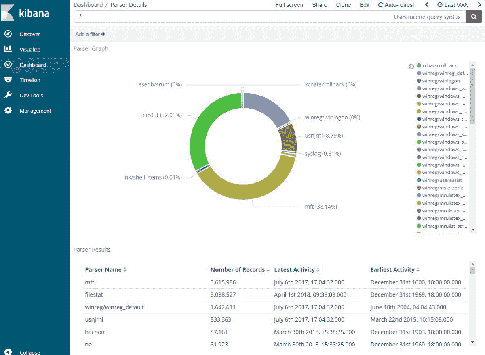
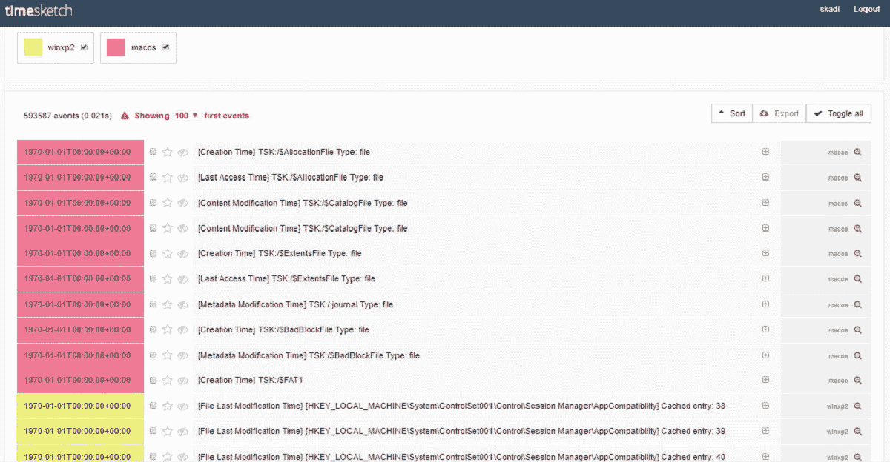
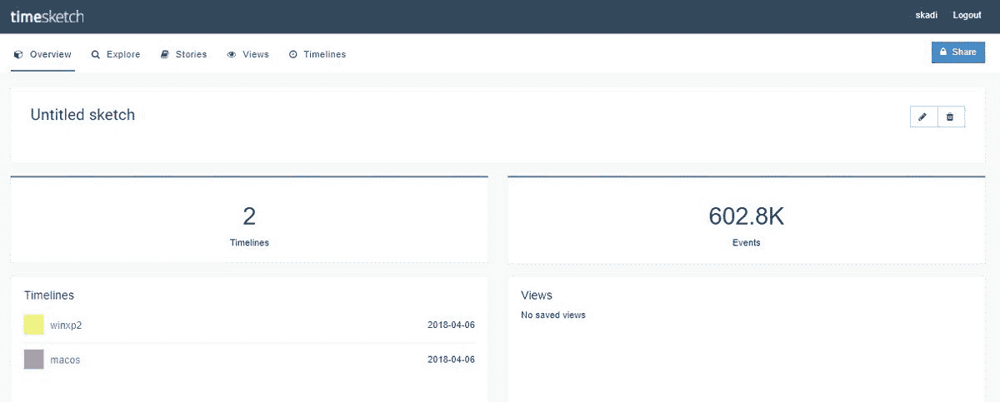

# 丝卡蒂:收集、处理和搜索来自 MacOS、Windows 和 Linux 的基于主机的数据

> 原文：<https://kalilinuxtutorials.com/skadi-macos-windows-linux/>

丝卡蒂是一个免费的开源工具集，可以收集、处理和高级分析法医文物和图像。它可以在 MacOS、Windows 和 Linux 机器上运行。

它可以扩展以在笔记本电脑、台式机、服务器、云上有效工作，并且可以安装在强化/黄金磁盘映像之上。

该门户允许轻松访问丝卡蒂工具。默认情况下，它在丝卡蒂服务器的 IP 地址上可用。
默认凭证有:

*   用户名:`skadi`
*   密码:`skadi`

通过位于服务器 IP 地址的 web 浏览器访问门户。在本例中，服务器是`192.168.1.2`，而流浪者和停靠者将创建一个到`localhost`的链接

*   例如: [http://192.168.1.2](http://192.168.1.2/)
*   流浪示例: [http://localhost](http://localhost/)

**也读作-[GrapheneX:自动化系统加固框架](https://kalilinuxtutorials.com/graphenex-automated-system-hardening-framework/)**

**包含的工具**

这些工具被整合到一个平台中，共同提供收集数据、将位和字节转换为单词和数字以及快速轻松地分析结果的能力。这使得能够快速准确地搜寻恶意活动的基于主机的证据。

*   CDQR
*   网络咖啡馆
*   CyLR
*   码头工人
*   弹性搜索
*   反光
*   格拉夫纳
*   便携式集装箱
*   Kibana
*   夜帝
*   普拉索
*   时代周刊

**Yeti(威胁情报工具)**

**包含 Kibana 和 TimeSketch】**

**11 个 Kibana 仪表盘**

**TimeSketch**

**鸣谢:** [**艾伦**](https://github.com/orlikoski)

[**Download**](https://github.com/orlikoski/Skadi)