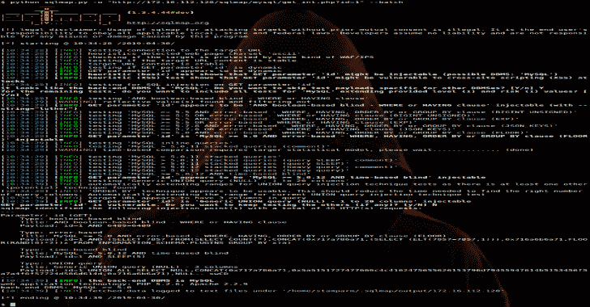

# SQLMap:自动 SQL 注入和数据库接管工具

> 原文：<https://kalilinuxtutorials.com/sqlmap-sql-injection-database/>

SQLMap 是一个开源渗透测试工具，它可以自动检测和利用 SQL 注入漏洞，接管数据库服务器。

它配备了一个强大的检测引擎，许多针对终极渗透测试器的利基功能，以及一系列广泛的开关，从数据库指纹识别、从数据库获取数据，到通过带外连接访问底层文件系统和在操作系统上执行命令。

该项目由[网络安全扫描器](https://www.netsparker.com/scan-website-security-issues/?utm_source=sqlmap.org&utm_medium=banner&utm_campaign=github)赞助。

**也可以理解为-[SET:trusted sec](https://kalilinuxtutorials.com/set-social-engineer-toolkit-trustedsec/)T3 的社会工程师工具包储存库**

**安装**

点击[这里](https://github.com/sqlmapproject/sqlmap/tarball/master)可以下载最新的 tarball，点击[这里](https://github.com/sqlmapproject/sqlmap/zipball/master)可以下载最新的 zipball。

最好是，您可以通过克隆 [Git](https://github.com/sqlmapproject/sqlmap) 存储库来下载它:

git 克隆–深度 1 https://github.com/sqlmapproject/sqlmap.git SQL map-dev

它在任何平台上都可以与 [Python](http://www.python.org/download/) 版本 **2.6** 、 **2.7** 和 **3.x** 一起开箱即用。

**用法**

要获得基本选项和开关的列表，请使用:

**python sqlmap.py -h**

要获得所有选项和开关的列表，请使用:

**python sqlmap.py -hh**

你可以在这里找到一个样本运行[。要获得其功能的概述、支持的功能列表、所有选项和开关的描述以及示例，建议您查阅](https://asciinema.org/a/46601)[用户手册](https://github.com/sqlmapproject/sqlmap/wiki/Usage)。

[**Download**](https://github.com/sqlmapproject/sqlmap)