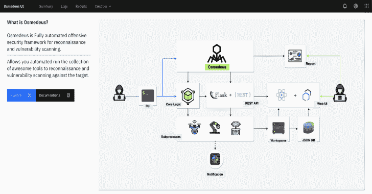
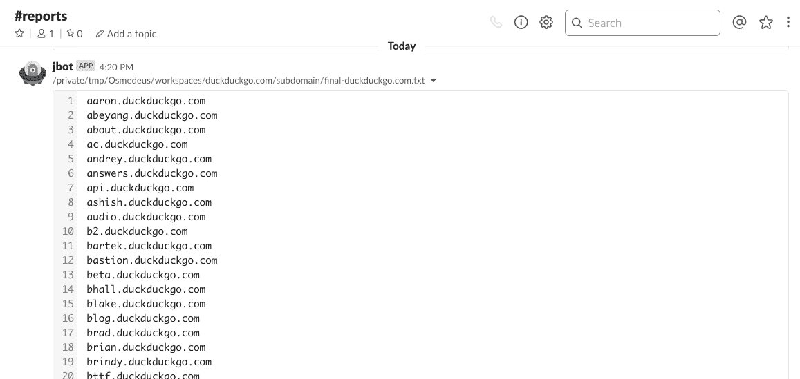
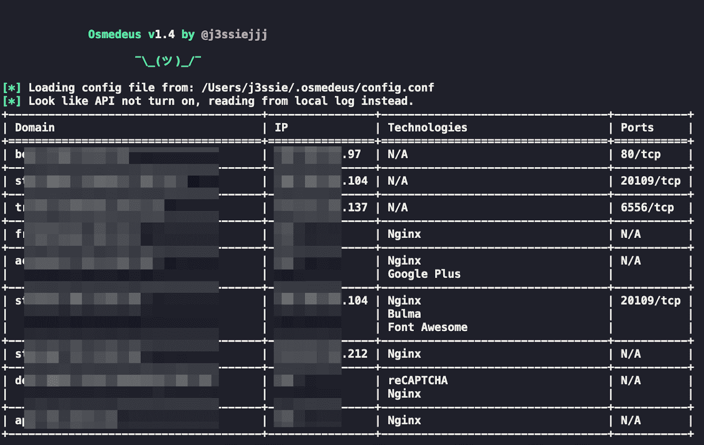
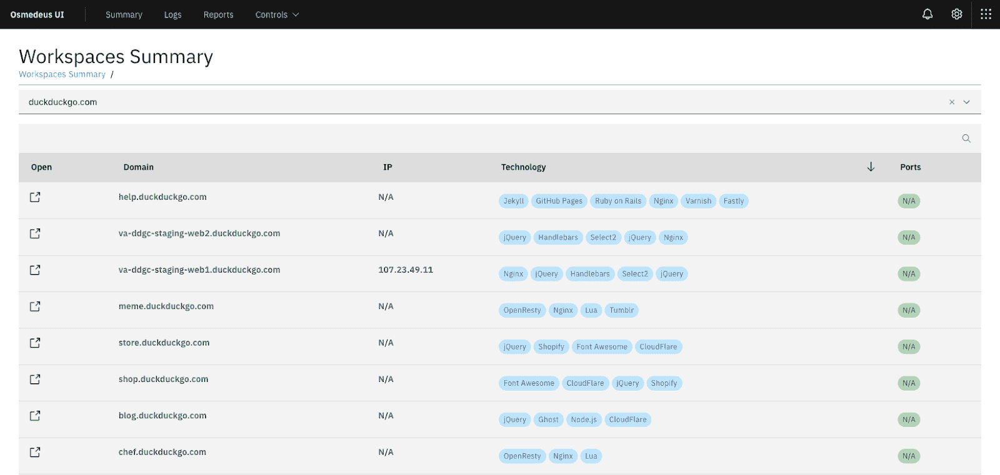
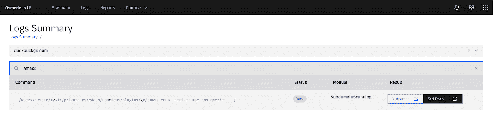

# Osmedeus:侦察和漏洞扫描的安全框架

> 原文：<https://kalilinuxtutorials.com/osmedeus-reconnaissance-vulnerability-scanning-2/>

**Osmedeus** 让你自动运行 awesome 工具集合，对目标进行侦察和漏洞扫描。

**安装**

git 克隆 https://github.com/j3ssie/Osmedeus
CD osme deus
。/install.sh

本次安装只关注 Kali linux，更多安装请查看 [Wiki 页面](https://github.com/j3ssie/Osmedeus/wiki)

**如何使用**

如果你不知道你在做什么，只需键入下面的命令或查看[高级用法](https://github.com/j3ssie/Osmedeus/wiki/Advanced-Usage)

**。/osme deus . py-t example.com**

**特色**

*   子域扫描。
*   子域接管扫描。
*   截图目标。
*   基本侦察，如 Whois，挖掘信息。
*   网络技术检测。
*   IP 发现。
*   彩色扫描。
*   SSL 扫描。
*   回溯机器发现。
*   URL 发现。
*   标题扫描。
*   端口扫描。
*   脆弱扫描。
*   单独的工作区存储所有扫描输出和详细记录。
*   REST API。
*   React [Web UI](https://github.com/j3ssie/Osmedeus/wiki/Web-UI) 。
*   支持连续扫描。
*   延期通知。
*   从命令行轻松查看[报告](https://github.com/j3ssie/Osmedeus/wiki/report)。

**也读作——[KRF:一个 Kernelspace 的随机故障者](https://kalilinuxtutorials.com/krf-kernelspace-randomized-faulter/)**

**示例命令**

**== >正常套路** 。/osme deus . py-t example.com

**= =>常规但在子域模块** 上速度变慢。/osme deus . py-t example.com–慢'子域'

**== >直接模式示例** 。/osme deus . py-m ports can-I " 1 . 2 . 3 . 4/24 "

。/osme deus . py-m ports can-I list _ of _ targets . txt-t result _ folder

。/osmedeus.py -m "portscan，vulnscan "-I " 1 . 2 . 3 . 4/24 "-t result _ folder

。/osme deus . py-m " assets "-I " example . com "
。/osmedeus.py -m "assets，dirb "-I " example . com "

**= =>报表模式** 。/osemdeus . py-t example.com–报告列表
。/osemdeus . py-t example.com–报告摘要
。/osemdeus . py-t example.com-m 子域——报告短
。/osemdeus . py-t example.com-m "子域，端口扫描"-完整报告

**更多选项**

**== >基本用法**

python 3 osme deus . py-T
python 3 osme deus . py-T
python 3 osme deus . py-M[-I |-I][-T workspace _ name]
python 3 osme deus . py–report-T[-M]

**=>高级用法**

**[*】列出所有模块
运行特定模块** python 3 osme deus . py-t-m-I

**[*]示例命令** python 3 osme deus . py-m subdomain-t example.com
python 3 osme deus . py-t example.com–slow“subdomain”
python 3 osme deus . py-t sample 2-m vuln-I hosts . txt
python 3 osme deus . py-t sample 2-m dir (默认值:https://127 . 0 . 0 . 1:5000)
–AUTH AUTH 指定身份验证，例如:–AUTH = " username:password "
查看您的配置文件以了解更多详细信息(默认值:core/CONFIG . conf)
–客户端只需运行客户端内容，以防您在

**=>更多选项**

–从 git -c CONFIG 更新最后一次更新配置
–慢速“全部”:所有模块以慢速模式运行
-s，–慢速“子域”:仅在子域模块
中运行慢速模式–调试仅用于调试目的

**演示**

**截图**

**免责声明**

这个工具的大部分是由 [CREDITS.md](https://github.com/j3ssie/Osmedeus/blob/master/CREDITS.md) 中列出的工具的作者完成的。我只是把所有的碎片拼在一起，加上一些额外的魔法。该工具仅用于教育目的。你要对自己的行为负责。如果你在使用这个软件时搞砸了一些事情或者违反了任何法律，那是你的错，而且仅仅是你的错。

[**Download**](https://github.com/j3ssie/Osmedeus)