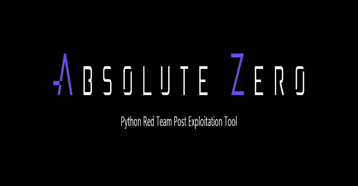

# AbsoluteZero : Python APT 后门

> 原文：<https://kalilinuxtutorials.com/absolutezero-python-apt-backdoor/>

**AbsoluteZero** 是一个 Python APT 后门，针对红队后期开发工具进行了优化，它可以生成二进制有效载荷或纯 Python 源代码。

最终的存根使用多态加密为其自身提供第一混淆层。

**部署**

AbsoluteZero 是一个用 Python 2.7 编写的完整软件，可以在 Windows 和 Linux 平台上运行，为了让它工作，你需要安装 Python 2.7，然后使用“pip”安装 requirements.txt 文件。

**也可阅读-[commando VM:一个完全可定制的基于 Windows 的 Pentesting 虚拟机分发版](https://kalilinuxtutorials.com/commandovm-a-fully-customizable-windows-based-pentesting-virtual-machine-distribution/)**

记住，要为 Windows 编译二进制文件，你必须在微软平台上运行整个软件。

确保 Python 安装文件夹设置在“C:/Python27”上，以避免二进制编译问题。

[**Download**](https://github.com/TheSph1nx/AbsoluteZero)