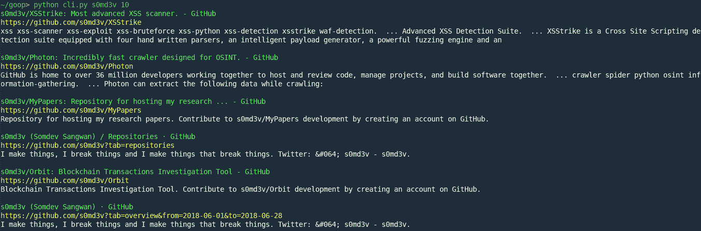

# 谷歌搜索刮刀

> 原文：<https://kalilinuxtutorials.com/goop-google-search-scraper/>

Goop 可以执行谷歌搜索，不会被验证码阻止，也不会遇到任何速度限制。

**它是如何工作的？**

脸书为其刮刀提供了一个[调试工具](https://developers.facebook.com/tools/debug/echo/?q=https://example.com)。有趣的是，Google 并没有限制这个调试器发出的请求(白名单？)因此，它可以用来废弃谷歌搜索结果，而不会被验证码阻止。

因为涉及到 facebook，所以每次请求都必须向图书馆提供一个 facebook 会话`Cookie`。

**也可理解为-[osme deus:侦察安全框架&漏洞扫描](https://kalilinuxtutorials.com/osmedeus-reconnaissance-vulnerability-scanning-2/)**

**用法**

**安装**

**pip 安装 goop**

**例子**

from goop import goop

page _ 1 = goop . search('红鞋'，"
page_2 = goop.search('红鞋'，"，page = ' 1 ')
include _ ignored _ results = goop . search('红鞋'，"，page='8 '，full=True)

返回的是以下结构的`dict`

**{
" 0 ":{
" URL ":" https://Example . com "，
"text ":"示例网页"，
"summary ":"这是一个示例网页，目的是演示…"
}，
"1": {
…**

`cli.py`通过使用以下命令从终端执行 google 搜索来演示用法

**python CLI . py******<查询> <页数>****

**

**免责声明**

抓取谷歌搜索结果是非法的。这个库仅仅是旁路概念的一个证明。作者不对最终用户的行为负责。

[**Download**](https://github.com/s0md3v/goop)**