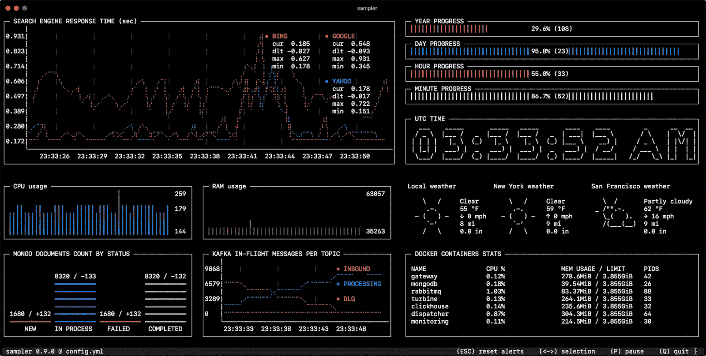
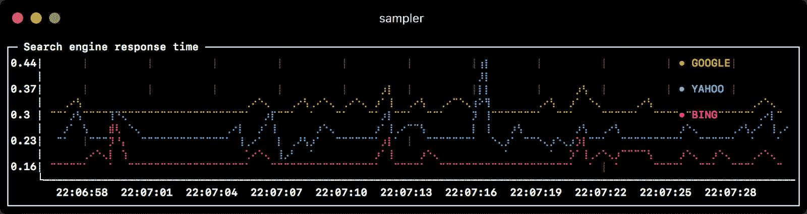
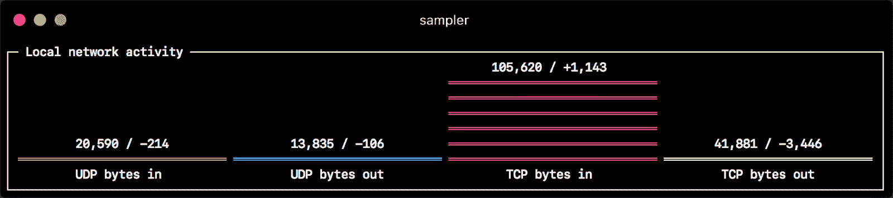
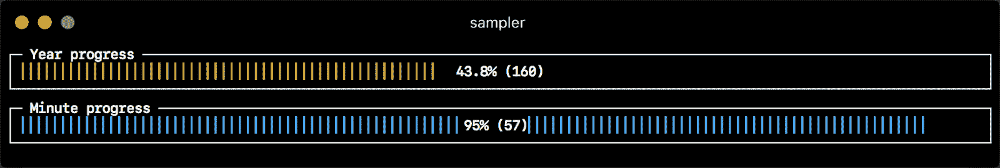
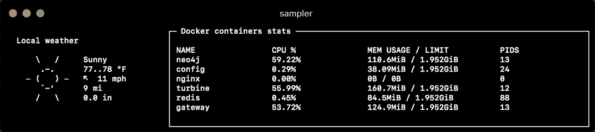
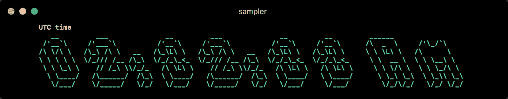

# 采样器:一个用于 Shell 命令执行、可视化和警报的工具

> 原文：<https://kalilinuxtutorials.com/sampler-shell-commands-execution-visualization-alerting/>

**Sampler** 是一个用于 shell 命令执行、可视化和警报的工具。使用简单的 YAML 文件进行配置。

用户可以直接从终端对任何动态流程进行采样——观察数据库中的变化、监控 MQ 运行中的消息、触发部署脚本并在完成时获得通知。

如果有一种方法可以使用 shell 命令获得一个指标，那么可以使用 Sampler 立即可视化它。

**安装**

**苹果电脑**

**酿造桶安装取样器**

或者

**sudo curl-Lo/usr/local/bin/sampler https://github . com/sqshq/sampler/releases/download/v 1 . 0 . 2/sampler-1 . 0 . 2-Darwin-amd64
sudo chmod+x/usr/local/bin/sampler**

**Linux**

**sudo wget https://github . com/sqshq/sampler/releases/download/v 1 . 0 . 2/sampler-1 . 0 . 2-Linux-amd64-O/usr/local/bin/sampler
sudo chmod+x/usr/local/bin/sampler**

**注意:** `**libasound2-dev**`需要安装系统库，采样器才能播放[触发](https://github.com/sqshq/sampler#triggers)音。通常图书馆是在适当的位置，但是如果不是，你可以进来

用你最喜欢的软件包管理器拖延它，例如`**apt install libasound2-dev**`

**用途**

您指定 shell 命令，Sampler 以所需的速率执行它们。输出用于可视化。

使用采样器基本上是一个 3 步的过程:

*   在 YAML 配置文件中定义您的 shell 命令
*   运行`sampler -c config.yml`
*   调整 UI 上组件的大小和位置

**但是已经有这么多监控系统了**

采样器绝不是全面监测系统的替代品，而是易于设置的开发工具。

如果用 Grafana 启动和配置 [Prometheus 对你来说是大材小用，那么 Sampler 可能是正确的解决方案。没有服务器，没有数据库，没有部署–您指定 shell 命令，它就工作了。](https://prometheus.io)

那它应该安装在我监控的每台服务器上？

不，您可以在本地运行采样器，但仍然可以从多个远程机器收集遥测数据。任何可视化都可能有`init`命令，您可以通过 ssh 连接到远程服务器。

**又读-[Goop:谷歌搜索刮刀](https://kalilinuxtutorials.com/goop-google-search-scraper/)**

**组件**

以下是每种组件类型的配置示例列表，带有 macOS 兼容的采样脚本。

**运行图**

*   **运行图:**
    *   t **itle:搜索引擎响应时间**
    *   **rate-ms: 500 #采样率，默认= 1000**
    *   **刻度:样本小数点后 2 #位数，默认= 1**
    *   **图例:**
        *   enabled: true #启用项目标签，默认值= true
        *   详细信息:false #启用项目统计:cur/min/max/dlt 值，默认值= true
    *   **项目:**
        *   **标签:谷歌**
            *   示例:curl-o/dev/null-s-w“% { time _ total }”https://www.google.com
            *   颜色:178 # 8 位色号，默认从预定义的调色板中选择
        *   **标签:雅虎**
            *   示例:curl-o/dev/null-s-w“% { time _ total }”https://search.yahoo.com
        *   **标签:冰**
            *   示例:curl-o/dev/null-s-w“% { time _ total }”https://www.bing.com

**迷你图**

*   迷你图
    *   标题:CPU 使用率
        *   速率-毫秒:200
        *   比例:0
        *   示例:PS-A-o % CPU | awk“{ s+= $ 1 } END { print s }”
    *   标题:释放内存页面
        *   速率-毫秒:200
        *   比例:0
        *   示例:memory_pressure | grep '可用页数' | awk '{print $3} '

**Barchart**

*   **barcharts** :
    *   **标题:本地网络活动**
        *   rate-ms: 500 #采样率，默认值= 1000
        *   小数位数:样本小数点后 0 #位数，默认值= 1
    *   **项目:**
        *   **标签:**中的 UDP 字节
            *   示例:nettop-J bytes _ in-l 1-m UDP | awk“{ sum+= $ 4 } END { print sum }”
        *   **标签:UDP 字节输出**
            *   示例:nettop-J bytes _ out-l 1-m UDP | awk“{ sum+= $ 4 } END { print sum }”
        *   **标签:**中的 TCP 字节
            *   示例:nettop-J bytes _ in-l 1-m TCP | awk“{ sum+= $ 4 } END { print sum }”
        *   **标签:TCP 字节输出**
            *   示例:nettop-J bytes _ out-l 1-m TCP | awk“{ sum+= $ 4 } END { print sum }”

**计量器**

*   **仪表**:
    *   **标题:一分钟进度**
        *   rate-ms: 500 #采样率，默认值= 1000
        *   标度:样本小数点后的 2 #位数，默认值= 1
        *   仅百分比:false #切换当前值的显示，默认值= false
        *   颜色:178 # 8 位色号，默认从预定义的调色板中选择
        *   **cur:**
            *   示例:当前值的 date +%S #示例脚本
        *   **最大值:**
            *   示例:echo 60 #最大值示例脚本
        *   **分钟:**
            *   示例:最小值回显 0 #示例脚本
    *   **标题:年进度**
        *   **cur:**
            *   样本:日期+%j
        *   最大值:
            *   样本:echo 365
        *   **分钟:**
            *   样本:回声 0

**Textbox**

*   **文本框**:
    *   **标题:当地天气**
        *   rate-ms: 10000 #采样率，默认值= 1000
        *   示例:curl wttr.in？0ATQF
        *   border: false #项目周围的边框，默认值= true
        *   颜色:178 # 8 位色号，默认为白色
*   **标题:码头集装箱统计数据**
    *   速率-毫秒:500
    *   示例:docker stats–no-stream–format " table { {。Name}}\t{{。CPUPerc}}\t{{。MemUsage}}\t{{。PIDs } } "

**ascii 盒**

*   **ascii box:**
    *   **标题:世界协调时**
        *   rate-ms: 500 #采样率，默认值= 1000
        *   字体:3d #字体类型，默认为 2d
        *   border: false #项目周围的边框，默认值= true
        *   颜色:43 # 8 位色号，默认为白色
        *   示例:环境 TZ=UTC 日期+%r

[**Download**](https://github.com/sqshq/sampler)