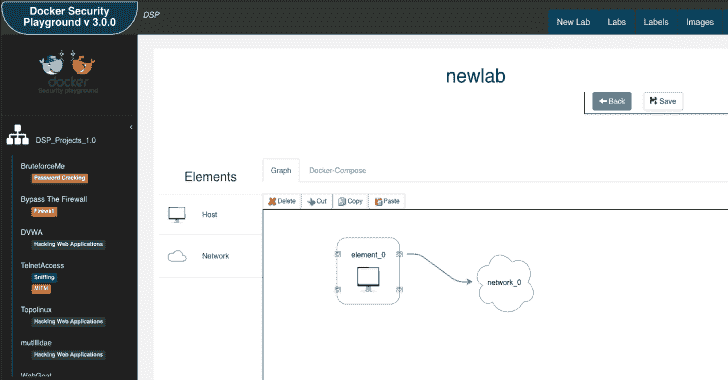

# Docker Security Playground:一个基于微服务的网络安全和渗透测试技术研究框架

> 原文：<https://kalilinuxtutorials.com/docker-security-playground/>

**Docker Security Playground** 是一款应用程序，允许您:

*   创建**网络和网络安全场景**，以便通过在您的 PC 中安装 DSP 来理解网络协议、
    规则和安全问题。
*   通过模拟漏洞实验室场景学习**渗透测试技术**
*   管理一套 docker-compose 项目。DSP 的主要目标是学习渗透测试和网络安全，但它的灵活性允许你的所有 **docker-compose labs** 的**创建**、**图形编辑**和**管理运行/停止**。有关更多信息，请查看[实验室管理](https://github.com/giper45/DockerSecurityPlayground/blob/master)页面。

**DSP 特性**

*   docker-compose 的图形编辑器
*   Docker 图像管理
*   GIT 集成
*   具有一组网络安全场景的 DSP 存储库

**也读作-[find domain:最快&跨平台子域枚举器](https://kalilinuxtutorials.com/findomain-cross-platform-subdomain-enumerator/)**

我如何与世界分享我的实验室？

在安装过程中，您可以创建一个没有与 git 链接的本地环境，或者您可以在应用程序中关联一个个人存储库。如果你想和别人分享你的作品，这是非常有用的。

DSP 存储库必须有几个要求，所以我创建了一个基本的 DSP Repo 模板，您可以用它来创建您的个人存储库。
因此，共享实验室最简单的方法如下:

*   分叉 DSP _ 回购项目:[https://github.com/giper45/DSP_Repo.git](https://github.com/giper45/DSP_Repo.git)
*   在安装过程中，将 github 目录参数设置为分叉的存储库。
*   现在创建您的实验室并共享它！

其他用户应该可以使用您使用的所有图像，这一点很重要，因此:

*   您可以在 docker hub 上发布，这样其他用户就可以提取您的图像来使用您的实验室。
*   您可以在。docker-images 目录，因此用户可以使用 build.sh 来构建您的映像并使用您的 repo。

如果你需要一种“私人的方式”来共享实验室，你应该以其他方式共享库，目前还不支持共享私人库。

在 DSP 中，您可以管理多个用户存储库(存储库选项卡)

**先决条件**

*   Nodejs (v 7 或更高版本)
*   饭桶
*   码头工人
*   坞站-合成
*   编译器工具(g++，c，c++)

**安装**

安装必备组件并运行:

**npm 安装**

**安装过程中的故障排除**

如果您有关于**节点 pty** 模块的错误，请尝试:

*   安装 build-essentials:(在 Ubuntu:apt install-y build-essentials 中)
*   使用 nodejs LTS(注意-pty 有一些 isseus，如这里所示

**更新应用:**

当您更新应用程序时，更新 npm 包很重要(应用程序使用 mydockerjs，这是我在 DSP 开发期间开发的一个 NPM docker API:[https://www.npmjs.com/package/mydockerjs](https://www.npmjs.com/package/mydockerjs))

**npm 运行更新**

**开始**

**运行**

**npm 开始**

启动应用程序。这将启动一个服务器监听本地主机的 8080(或者另一个，如果你在 index.js 文件中设置了 ENV 变量的话)端口。

转到你最喜欢的浏览器和数字本地主机:8080。您将被重定向到安装页面，设置参数并单击安装。

**文档**

有关 DSP 使用的文档，请访问 Wiki 页面:

*   主页面:[http://git lab . comics . unina . it/NS-Thesis/DockerSecurityPlayground _ 1/wikis/home](http://gitlab.comics.unina.it/NS-Thesis/DockerSecurityPlayground_1/wikis/home)
*   用户指南[http://git lab . comics . unina . it/NS-Thesis/DockerSecurityPlayground _ 1/wikis/user _ Guide](http://gitlab.comics.unina.it/NS-Thesis/DockerSecurityPlayground_1/wikis/user_guide)
*   Docker 包装器图片:[http://git lab . comics . unina . it/NS-Thesis/DockerSecurityPlayground _ 1/wikis/DSP _ Wrapper _ Image](http://gitlab.comics.unina.it/NS-Thesis/DockerSecurityPlayground_1/wikis/dsp_wrapper_image)

有点过时了，我会尽量更新的！

**Docker 包装图像**

DSP 实现了一个名为 DockerWrapperImage 的标签约定，允许您创建图像来显示实验室运行时要执行的操作。看[文档](http://gitlab.comics.unina.it/NS-Thesis/DockerSecurityPlayground_1/wikis/dsp_wrapper_image)

**错误调试**

MacOS ECONNRESET 错误:

events.js:183
抛出 er；//未处理的“错误”事件
^
错误:在 TCP.onread (net.js:618:25)处读取 econreset
at _ errno exception(util . js:992:11)

在 Mac 上，某些节点包似乎存在一些问题，因此为了解决这个问题:

**MacBook-Pro:DockerSecurityPlayground gaetanoperone $ NPM install ws @ 3 . 3 . 2–save-dev–save-exact**

此处的其他信息:[http://git lab . comics . unina . it/NS-prospect/DockerSecurityPlayground _ 1/wikis/docker-operation-errors](http://gitlab.comics.unina.it/NS-Thesis/DockerSecurityPlayground_1/wikis/docker-operation-errors)

*   创建您的特征分支:`**git checkout -b my-new-feature**`
*   提交您的更改:`**git commit -am 'Add some feature'**`
*   推到分支:`**git push origin my-new-feature**`
*   提交拉取请求，我们会检查

[**Download**](https://github.com/giper45/DockerSecurityPlayground)