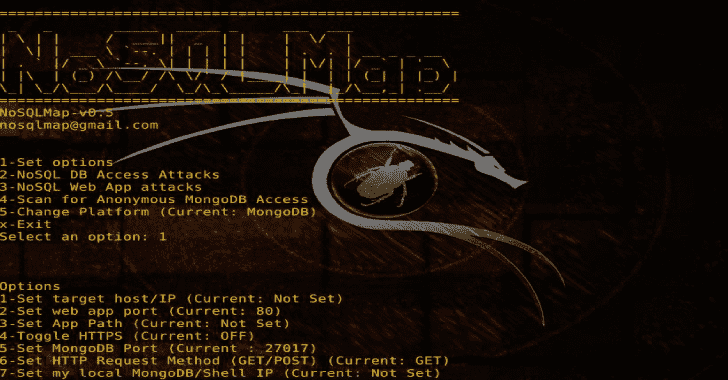

# NoSQLMap:自动化 NoSQL 数据库枚举和 Web 应用程序开发工具

> 原文：<https://kalilinuxtutorials.com/nosqlmap-enumeration-web-application-exploitation-tool/>

**NoSQLMap** 是一款开源 Python 工具，旨在审计和自动执行注入攻击，并利用 NoSQL 数据库和使用 NoSQL 的 web 应用程序中的默认配置弱点，从而泄露或克隆数据库中的数据。

NoSQL(最初指“非 SQL”、“非关系”或“不仅仅是 SQL”)数据库提供了一种存储和检索数据的机制，该机制以不同于关系数据库中使用的表格关系的方式建模。

这种数据库自 20 世纪 60 年代末就已经存在，但直到 21 世纪初，在脸书、谷歌和 Amazon.com 等 Web 2.0 公司的需求推动下，才获得了“NoSQL”的绰号。

NoSQL 数据库越来越多地用于大数据和实时网络应用。NoSQL 系统有时也被称为“不仅仅是 SQL ”,以强调它们可能支持类似 SQL 的查询语言。

**也可阅读-[DRM ITM:一个旨在全球记录一个网站](https://kalilinuxtutorials.com/drmitm-globally-log-traffic-website/)** 所有流量的程序

**数据库管理系统支持**

目前，该工具的开发集中在 MongoDB 和 CouchDB 上，但计划在未来的版本中为其他基于 NoSQL 的平台(如 Redis 和 Cassandra)提供额外的支持。

**要求**

在基于 Debian 或 Red Hat 的系统上，setup.sh 脚本可以作为 root 运行，以自动安装 NoSQLMap 的依赖项。

根据使用的功能而有所不同:

*   Metasploit 框架，
*   Python 和 PyMongo，
*   httplib2，
*   和 urllib 可用。
*   用于克隆数据库的本地默认 MongoDB 实例。检查[此处](http://docs.mongodb.org/manual/installation/)的安装说明。

正常的 Python 安装还需要一些其他的库。你的年龄可能会有所不同，检查脚本。

**设置**

**python setup.py 安装**

或者，您可以通过转到 docker 目录并输入以下内容来构建 Docker 映像:

docker build -t nosqlmap。

**使用说明**

**从**开始

**python 的 NoSQLMap**

NoSQLMap 使用基于菜单的系统来构建攻击。启动 NoSQLMap 后，您会看到主菜单:

*   设置选项(先这样做)
*   NoSQL 数据库访问攻击
*   NoSQL 网络应用攻击
*   扫描匿名 MongoDB 访问
*   出口

**选项说明:**

*   设置目标主机/IP——您想要攻击的目标 web 服务器(即 www.google.com)或 MongoDB 服务器。
*   如果目标是 web 应用程序，则设置 web 应用程序端口-web 应用程序的 TCP 端口。
*   设置 URI 路径——URI 的一部分，包含页面名称和任何参数，但不包含主机名(例如/app/acct.php？acctid=102)。
*   设置 HTTP 请求方法(GET/POST)-将请求方法设置为 GET 或 POST；目前只实现了 GET，但是正在实现从 Burp 导出的 POST 请求。
*   设置我的本地 Mongo/Shell IP——如果直接攻击一个 MongoDB 实例到一个目标 Mongo 安装的 IP 来克隆受害者数据库或打开 Meterpreter shells，则设置此选项。
*   设置 shell 侦听器端口-如果打开 Meterpreter shells，请指定端口。
*   加载选项文件-加载先前保存的 1-6 设置。
*   从保存的 Burp 请求加载选项-解析从 Burp Suite 保存的请求并填充 web 应用程序选项。
*   保存选项文件-保存设置 1-6 以备将来使用。
*   回到主菜单--一旦选项设置好了，就可以开始攻击了。

设置选项后，返回主菜单，根据您攻击的是 NoSQL 管理端口还是 web 应用程序，选择适当的数据库访问攻击或 web 应用程序攻击。

该工具的其余部分是基于“向导”的，相当简单明了，但如果你有任何问题或建议，请发送电子邮件至[codingo@protonmail.com](mailto:codingo@protonmail.com)或在 Twitter [@codingo_](https://twitter.com/codingo_) 上找到我。

**视频教程**

[https://www.youtube.com/embed/xSFi-jxOBwM?feature=oembed&enablejsapi=1](https://www.youtube.com/embed/xSFi-jxOBwM?feature=oembed&enablejsapi=1)

[**Download**](https://github.com/codingo/NoSQLMap)