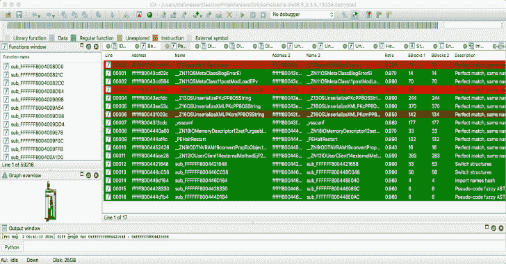
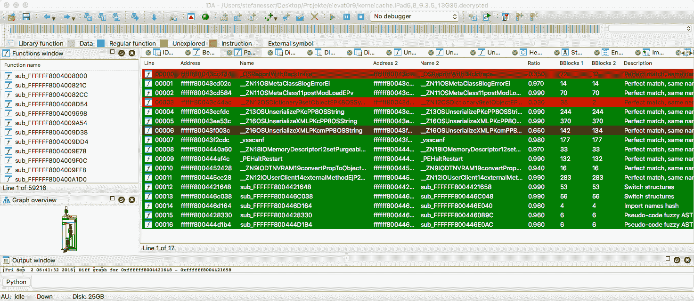
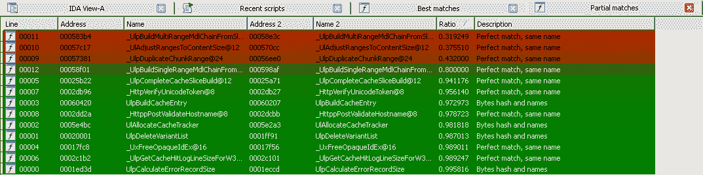
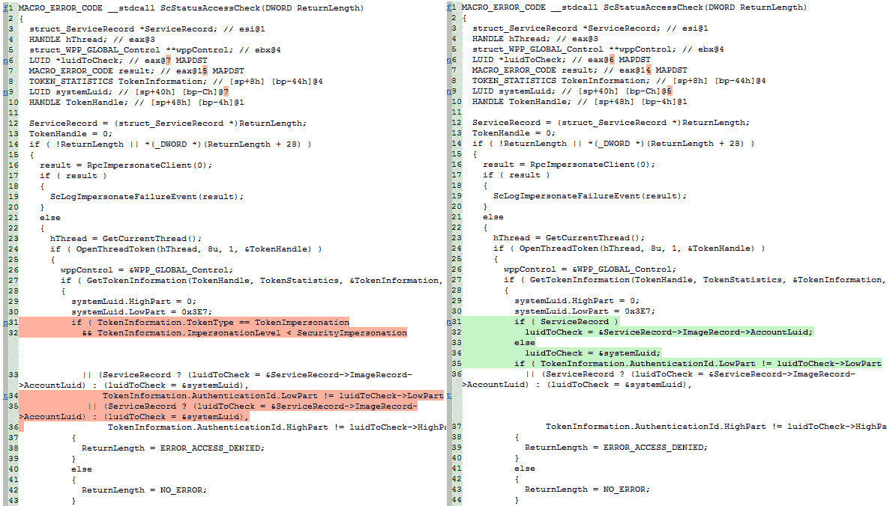
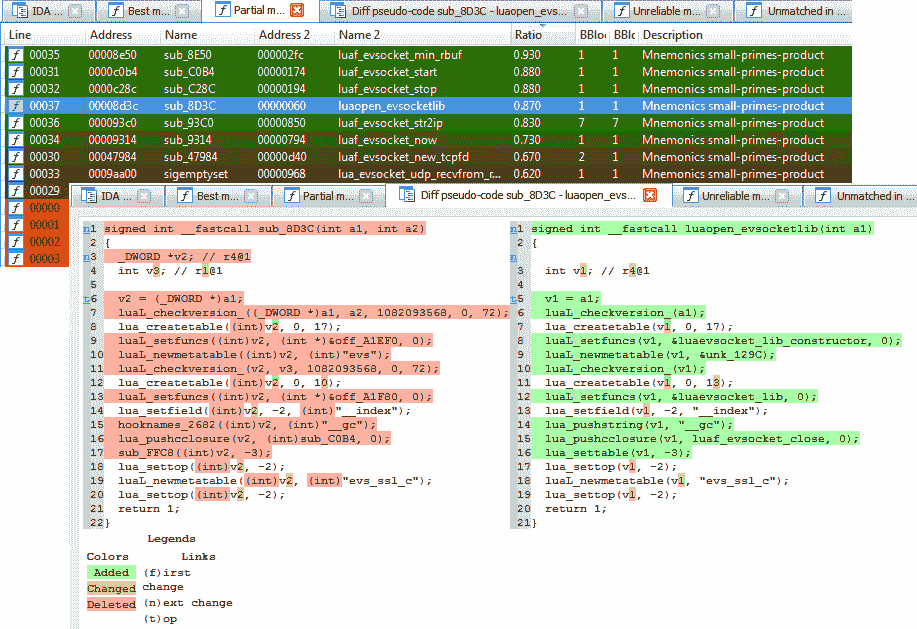

# 最先进的免费开源程序区分工具

> 原文：<https://kalilinuxtutorials.com/diaphora-open-source-diffing-tool/>

1.2.4 版本是一个用于 IDA 的程序区分插件，类似于 Zynamics Bindiff 或其他自由/开源软件的同行，如 YaDiff、DarunGrim、TurboDiff 等。它是在 SyScan 2015 期间发布的。

它适用于 IDA 6.9 到 7.3。对 Ghidra 的支持正在开发中。对二进制忍者的支持也在计划中，但将在 Ghidra 的端口之后。如果你正在寻找 Radare2 支持，你可以[检查这个非常旧的叉子](https://github.com/radare/diaphora)。

更多细节请查看“doc”目录下的教程。

注意:如果你正在寻找一个在二进制文件和源代码之间区分或匹配函数的工具，你可能想看看 [Pigaios](https://github.com/joxeankoret/pigaios) 。

**也可阅读-[DRM ITM:一个旨在全球记录一个网站](https://kalilinuxtutorials.com/drmitm-globally-log-traffic-website/)** 所有流量的程序

**获得帮助和询问功能**

你可以加入邮件列表[https://groups.google.com/forum/?hl=es#!forum/diaphora](https://groups.google.com/forum/?hl=es#!forum/diaphora)来寻求帮助、新特性、报告问题等等……然而，为了报告错误，我推荐使用问题跟踪器:[https://github.com/joxeankoret/diaphora/issues](https://github.com/joxeankoret/diaphora/issues)

请注意，官方只支持 IDA 的最后 3 个版本。到今天为止，意味着只支持 IDA 7.1、7.2 和 7.3。版本 6.8、6.9、6.95 和 7.0 确实可以工作(带有提供给*客户*的所有最新补丁)，但是没有为它们提供官方支持。但是，如果你遇到这些版本的任何问题，ping 我和我会尽我所能。

**截图**

这是 iOS 9.3.5 中修复的 dia phora diffing PEGASUS iOS 内核漏洞的截图:

这是一张旧的微软公告 MS15-034 的截图:

这些是一些与微软公告 MS15-050 不同的透明物截图，摘自阿历克斯·约内斯库的博客文章[分析 MS15-050 与透明物](http://www.alex-ionescu.com/?p=271)。

下面是 iOS 10.3.3 与 iOS 11.0 的差异 [iBoot 的截图:](https://blog.matteyeux.com/hacking/2018/04/04/diaphora-diff-and-ida.html)

[**Download**](https://github.com/joxeankoret/diaphora)