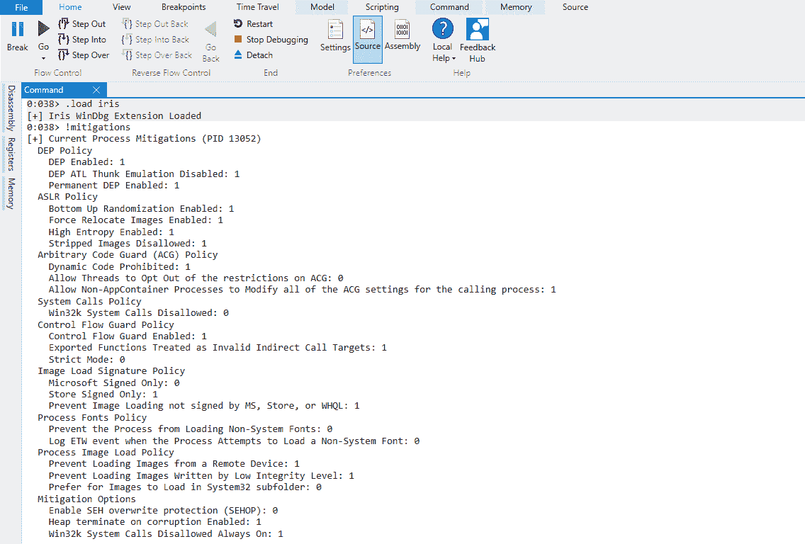
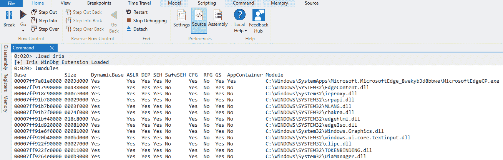

# Iris : WinDbg 扩展，用于显示 Windows 进程缓解

> 原文：<https://kalilinuxtutorials.com/iris-windbg-extension/>

**Iris** WinDbg 扩展执行常见 Windows 进程缓解(32 位和 64 位)的检测。

从上面的屏幕截图中可以看出，所实施的检查包括:

**为当前进程**

*   DEP 政策
    *   DEP ATL Thunk 仿真已禁用
    *   永久 DEP 已启用
*   ASLR 政策
    *   启用自下而上随机化
    *   启用强制重新定位图像
    *   启用高熵
    *   不允许去除图像
*   任意代码保护(ACG)政策
    *   禁止动态代码
    *   允许线程退出对 ACG 的限制
    *   允许非 AppContainer 进程修改调用进程的所有 ACG 设置
*   系统调用策略
    *   不允许 Win32k 系统调用
*   控制流保护策略
    *   控制流防护已启用
    *   导出的函数被视为无效的间接调用目标
    *   严格模式
*   图像加载签名策略
    *   仅 Microsoft 签名
    *   仅商店签名
    *   防止加载未经 MS、Store 或 WHQL 签名的图像
*   处理字体策略
    *   防止进程加载非系统字体
    *   当进程试图加载非系统字体时记录 ETW 事件
*   处理映像加载策略
    *   防止从远程设备加载图像
    *   防止加载由低完整性级别写入的图像
    *   首选图像加载到 System32 子文件夹中
*   缓解方案
    *   启用 SEH 覆盖保护(SEHOP)
    *   启用损坏时堆终止
    *   不允许 Win32k 系统调用始终开启

**对于加载的模块**

*   动态数据库
*   ASLR
*   DEP
*   圣伊丽莎白医院
*   SafeSEH
*   稳频发电机（发生器）（constant frequency generator 的缩写）
*   RFG
*   (美国联邦政府职员)总表(General Schedule)
*   app container-app container-app container-app container-app container-app container-app container

如果你不知道上面一些关键词的意思，用谷歌，你会找到比我能给你的更好的解释。

**也可阅读-[Docker Security Playground:一个基于微服务的网络安全研究框架&渗透测试技术](https://kalilinuxtutorials.com/docker-security-playground/)**

**设置**

要“安装”，将`**x86\iris.dll**`或`**x64\iris.dll**`复制到 WinDbg 的`**winext**`文件夹中(用于`**x86**`和`**x64**`)。

**WinDbg 10.0.xxxxx**

除非您将调试工具安装在非标准路径中，否则您会在以下位置找到`winext`文件夹:

c:\ Program Files(x86)\ Windows Kits \ 10 \ Debuggers \ x64 \ winext

或者，对于 32 位:

c:\ Program Files(x86)\ Windows Kits \ 10 \ Debuggers \ x86 \ winext

**WinDbg 预览**

除非您~~将~~复制的 WinDbg 预览安装文件夹安装到一个非标准位置，否则您会将它放在一个名称与下面的名称相近的文件夹中(取决于安装的版本):

c:\ Program Files \ windows apps \ Microsoft。WinDbg _ 1 . 1906 . 12001 . 0 _ neutral _ _ 9 we kib 2d 8 acwe

对于 64 位，将`**x64\iris.dll**`复制到`**amd64\winext**`中，或者将`**x86\iris.dll**`复制到 32 位的`**x86\winext**`中。

**加载扩展**

完成上述步骤后，只需用`.load iris`加载扩展并运行`!iris.help`来查看可用的命令。

0:014> .加载 iris
[+] Iris WinDbg 扩展已加载
0:014 >！IRIS . help
IRIS WinDbg 扩展(rui@deniable.org)。可用命令:
**帮助** =显示此帮助
模块=显示所有加载模块的进程缓解。
缓解=显示当前流程缓解策略。

**运行中**

如上图截图所示，只需运行:`**!iris.modules**`或简单的`**!modules**`，和`**!iris.mitigations**`或简单的`**!mitigations**`。

[**Download**](https://github.com/fdiskyou/iris)