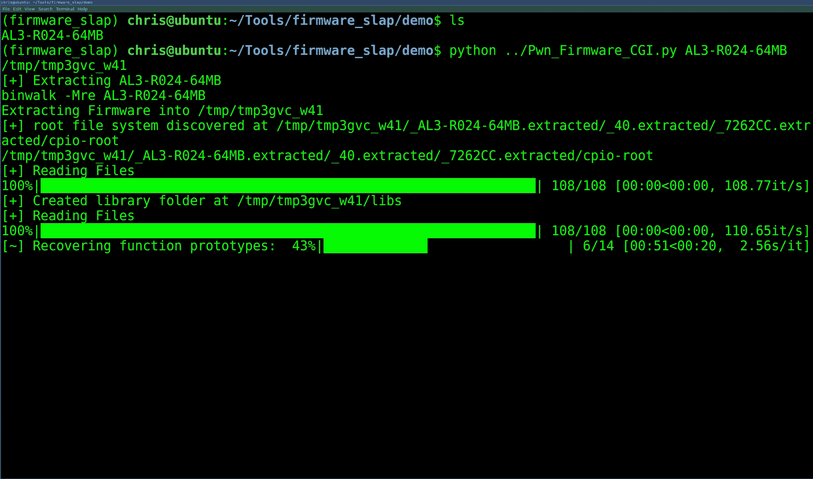

# 固件 Slap:通过 Concolic 分析和功能集群发现固件漏洞

> 原文：<https://kalilinuxtutorials.com/firmware-slap-vulnerabilities-concolic-analysis-function-clustering/>

**固件 slap** 将 concolic 分析与功能聚类相结合，用于固件中的漏洞发现和功能相似性。固件 slap 构建为一系列库，并将大多数信息导出为 pickles 或 JSON，以便与其他工具集成。

**设置**

固件 slap 应该在虚拟环境中运行。已经在 Python3.6 上测试过了

**python setup.py 安装**

你需要 rabbitmq 和(radare2 或 Ghidra)

**= =>Ubuntu**
【sudo apt 安装 rabbitq 服务器】
>【OSX】
【brew 安装 rabbitq】**>雷达 2】/雷达 2/sys/install . sh**= =>【铸铁】**
【wget https://铸铁-sre . org/铸铁 _9.0.4_PUBLIC_20190516.zip
【未开化铸铁 _9.0.4_PUBLIC_20190516.zip -d 铸铁】巴什科尔**

吉德拉需要 JDK 11 号。

sudo 安装 default-JDK
Java–版本

如果你想使用弹性搜索工具，运行`**Elasticsearch_and_kibana.sh**`脚本

**快速入门**

确保 rabbitmq-server 正在运行。

== >在单独的终端中，在顶级“Firmware_Slap”目录中运行这个
celery-A Firmware _ Slap . celery _ tasks worker–log level = info
= =>基本缓冲区溢出
Discover _ And _ dump . py examples/iwconfig-D iwconfig _ results
= =>命令注入
tar-xvf examples/Almond _ libs . tar . gz
Vuln _ Discover _ celery . py examples/upload . CGI-L Almond _ Root/lib/

**也可阅读-[Airflowscan:清单&提高阿帕奇航空安全的工具](https://kalilinuxtutorials.com/airflowscan-checklist-security-apache-airflow/)**

**用途**

== >获取用于示例的固件
wget https://firmware.securifi.com/AL3_64MB/AL3-R024-64MB
bin walk-Mre AL3-R024-64MB

从项目根目录开始芹菜工作:

== >在单独的终端中
celery-A firmware _ slap . celery _ tasks worker–log level = info

在不同的终端窗口中，运行漏洞发现作业。

$ Vuln _ Discover _ celery . py Almond _ Root/etc _ ro/light tpd/www/CGI-bin/upload _ boot loader . CGI-L Almond _ Root/lib/
[+]获取参数函数
[+]解析 1 函数
0%| | 0/1 [00:01 <？, ?it/s]
{ ' Injected _ Location ':{ ' base ':' 0x 7 FFE FDE 8 '，
…………………… SNIP ……
' Type ':' Command Injection ' }
Python 3 . 5 . 2(默认，2018 年 11 月 12 日 13:43:14)
键入' copyright '、' credits '或' license '了解更多信息
IPython 7.3.0 —一种增强的交互式 Python。键入“？”寻求帮助。
在[1]中:

**返回的漏洞对象**

上述命令将在`result`变量中返回一个对象。这是一本关于漏洞的各种精彩信息的字典。对象中有三个主要的键:函数参数、内存和注入位置。

**In[3]:result . keys()
Out[3]:dict _ keys([' args '，' file_name '，' type '，' mem '，' Injected _ Location ')**

**参数**

args 键将详细说明有关已恢复参数的信息，以及重现漏洞所需的参数值。在下面的示例中，恢复了一个参数，要触发命令注入，该参数必须是一个包含“` reboot `”的 char*以触发重新启动。

in[1]:result[' args ']
Out[1]:
[{ ' base ':' a1 '，
'type': 'int '，
' value ':" 0x 0->b '`reboot`\ x01 \ x01 \ x01 \ x01 \ x01 \ x01 \ x01 \ x01 \ x01 \ x01 \ x01 \ x01 \ x01 \ x01 \ x01 \ x01 \ x01 \ x01 \ x01 \ x01 \ x01 \ x01 \ x01 \ x01 \ x01 \ x01 \ x01 \ x01 \

**内存**

对象的内存组件跟踪触发漏洞所需的内存值。它还提供堆栈地址和。带有违规命令的文本地址，用于设置所需的内存约束。

所需的第一个存储器事件在`**mtd_write_firmware+0x0**`处，第二个在`**mtd_write_firmware+0x38**`处。提供装配是为了帮助美化未来的展示工作。

在[2]:result[' mem ']
out[2]:T3][{ ' bbl _ add:0x 401138 '，
bbl _ desc:{ ' description:` MTD _ write _ firmware+0x 0 in upload _ boot . CGI(0x 401138)，
卸载:['0x401138:\tlui\t$gp，0x42 '，]
【拆卸】:【0x401170:\tlw\t$gp，0x18($sp】、
【0x 401174:\ tnop \ t】、
【0x 401178:\ tlw \ t $ 9、-0x7f68($gp】、
【0x 40117 c:\ tnop \ t】、
0x 401180:\ TJ

**命令喷射特定的**

因为命令注入是最容易演示的，所以我创建了一个方便的字典键来轻松演示命令注入的位置。

in[4]:result[' Injected _ Location ']Out[4]:{ ' base ':' 0x 7 FFE FDE 8 '，' type': 'char * '，' value ':/bin/MTD _ write-o 0-l 0 write ` reboot ` ' }

**样本漏洞集群脚本**

漏洞群集脚本将尝试使用示例漏洞发现脚本中的方法来发现漏洞，然后跨提取的固件构建一组给定函数的 k-means 群集，以找到与易受攻击的函数相似的函数。

$ Vuln_Cluster_Celery.py -h
用法:Vuln _ Cluster _ celery . py[-h][-L LD _ PATH][-V Vuln _ PICKLE]
目录
位置参数:
目录
可选参数:
-h，–help 显示此帮助消息并退出
-L LD_PATH，–LD _ PATH LD _ PATH
加载库的路径
-F 函数，–FUNCTION FUNCTION
-V Vuln _ t

以下命令将-F 作为一个已知易受攻击的函数。-V 作为上一次运行的转储 pickle，表示不需要发现新的漏洞，而-L 表示库路径。一个用法示例:

$ python 填充 _ cluster _ celery . py-f MTD _ write _ firmware-l almon _ root/lib/almon _ root/etc _ ro/lighttpd/www/CGI-bin/
【读文件】100% \ \ππ

[**Download**](https://github.com/ChrisTheCoolHut/Firmware_Slap)