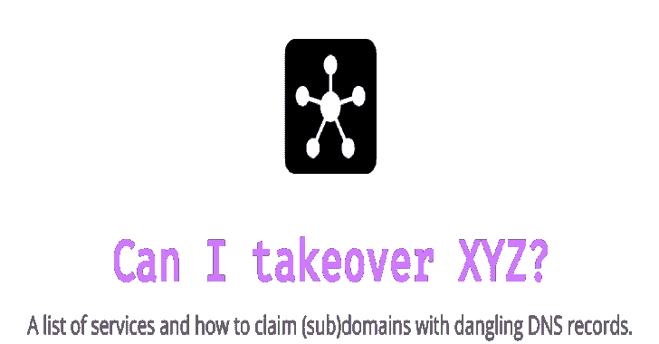

# 服务列表&如何声明带有悬空 DNS 记录的子域

> 原文：<https://kalilinuxtutorials.com/subdomain-dangling-dns-records/>

当子域(subdomain.example.com)指向服务(如 GitHub pages、Heroku 等)时，会出现子域接管漏洞。)已被移除或删除。

这使得攻击者能够在正在使用的服务上设置页面，并将其页面指向该子域。

例如，如果 subdomain.example.com 指向一个 GitHub 页面，用户决定删除他们的 GitHub 页面，攻击者现在可以创建一个 GitHub 页面，添加一个包含 subdomain.example.com 的 CNAME 文件，并声称 subdomain.example.com。

**安全演示子域接管**

根据个人经验，谨慎地声明子域并在隐藏页面上提供无害文件通常足以证明安全漏洞。不要在索引页上提供内容。一个好的概念证明可以由通过随机路径提供的 HTML 注释组成:

**$猫 aelfjj1or81uegj9ea8z31zro.html
<！–按用户名进行 PoC—>**

**也可阅读-[递:最先进的免费&开源程序分发工具](https://kalilinuxtutorials.com/diaphora-open-source-diffing-tool/)**

请注意，这取决于你的目标是什么臭虫奖励计划。如有疑问，请参考 bug bounty 计划的安全政策和/或向该计划背后的团队寻求澄清。

**如何投稿？**

可以在这里提交新服务:[https://github . com/EdOverflow/can-I-take-over-XYZ/issues/new？template=new-entry.md](https://github.com/EdOverflow/can-i-take-over-xyz/issues/new?template=new-entry.md) 。

可以在这里找到可以检查的服务列表(尽管首先要检查列表中的重复项):[https://github.com/EdOverflow/can-i-take-over-xyz/issues/26](https://github.com/EdOverflow/can-i-take-over-xyz/issues/26)。

**所有条目**

| 发动机 | 状态 | 指纹 | 讨论 | 证明文件 |
| --- | --- | --- | --- | --- |
| 阿卡迈 | 不脆弱 |  | [第 13 期](https://github.com/EdOverflow/can-i-take-over-xyz/issues/13) |  |
| AWS/S3 | 易受伤害的 | `The specified bucket does not exist` | [第 36 期](https://github.com/EdOverflow/can-i-take-over-xyz/issues/36) |  |
| Bitbucket | 易受伤害的 | `Repository not found` |  |  |
| 活动监视器 | 易受伤害的 | 试图进入你的账户？ |  | [支持页面](https://help.campaignmonitor.com/custom-domain-names) |
| 货物集合 | 易受伤害的 | `404 Not Found` |  | [货物支持页面](https://support.2.cargocollective.com/Using-a-Third-Party-Domain) |
| 云锋 | 不脆弱 | ViewerCertificateException | [第 29 期](https://github.com/EdOverflow/can-i-take-over-xyz/issues/29) | [亚马逊 CloudFront 上的域安全](https://aws.amazon.com/blogs/networking-and-content-delivery/continually-enhancing-domain-security-on-amazon-cloudfront/) |
| 书桌 | 不脆弱 | `Please try again or try Desk.com free for 14 days.` | [第 9 期](https://github.com/EdOverflow/can-i-take-over-xyz/issues/9) |  |
| 快速地 | 边缘情况 | `Fastly error: unknown domain:` | [第 22 期](https://github.com/EdOverflow/can-i-take-over-xyz/issues/22) |  |
| 饲料压机 | 易受伤害的 | `The feed has not been found.` | [黑客# 19350](https://hackerone.com/reports/195350) |  |
| Fly.io | 易受伤害的 | `404 Not Found` | [第 101 期](https://github.com/EdOverflow/can-i-take-over-xyz/issues/101) |  |
| Freshdesk | 不脆弱 |  |  | [Freshdesk 支持页面](https://support.freshdesk.com/support/solutions/articles/37590-using-a-vanity-support-url-and-pointing-the-cname) |
| 《人鬼情未了》 | 易受伤害的 | `The thing you were looking for is no longer here, or never was` |  |  |
| 开源代码库 | 易受伤害的 | `There isn't a Github Pages site here.` | [第 37 期](https://github.com/EdOverflow/can-i-take-over-xyz/issues/37) [第 68 期](https://github.com/EdOverflow/can-i-take-over-xyz/issues/68) |  |
| Gitlab | 不脆弱 |  | [黑客#312118](https://hackerone.com/reports/312118) |  |
| 谷歌云存储 | 不脆弱 |  |  |  |
| HatenaBlog | 易受伤害的 | `404 Blog is not found` |  |  |
| 帮助果汁 | 易受伤害的 | `We could not find what you're looking for.` |  | [帮助果汁支持页面](https://help.helpjuice.com/34339-getting-started/custom-domain) |
| 帮助侦察员 | 易受伤害的 | `No settings were found for this company:` |  | [HelpScout Docs](https://docs.helpscout.net/article/42-setup-custom-domain) |
| Heroku | 边缘情况 | `No such app` | [第 38 期](https://github.com/EdOverflow/can-i-take-over-xyz/issues/38) |  |
| 对讲机 | 易受伤害的 | `Uh oh. That page doesn't exist.` | [第 69 期](https://github.com/EdOverflow/can-i-take-over-xyz/issues/69) | [帮助中心](https://www.intercom.com/help/) |
| JetBrains | 易受伤害的 | `is not a registered InCloud YouTrack` |  | [YouTrack InCloud 帮助页面](https://www.jetbrains.com/help/youtrack/incloud/Domain-Settings.html) |
| 基普斯塔 | 易受伤害的 | `No Site For Domain` | [第 48 期](https://github.com/EdOverflow/can-i-take-over-xyz/issues/48) | [kinsta-add-domain](https://kinsta.com/knowledgebase/add-domain/) |
| 发射石 | 易受伤害的 | `It looks like you may have taken a wrong turn somewhere. Don't worry...it happens to all of us.` | [第 74 期](https://github.com/EdOverflow/can-i-take-over-xyz/issues/74) |  |
| 精通 | 边缘情况 | `Unrecognized domain` | [第 275714 期](https://hackerone.com/reports/275714)，[第 14 期](https://github.com/EdOverflow/can-i-take-over-xyz/issues/14) |  |
| 微软 Azure | 易受伤害的 |  | [第 35 期](https://github.com/EdOverflow/can-i-take-over-xyz/issues/35) |  |
| Netlify | 边缘情况 |  | [第 40 期](https://github.com/EdOverflow/can-i-take-over-xyz/issues/40) |  |
| 万神殿 | 易受伤害的 | `404 error unknown site!` | [第 24 期](https://github.com/EdOverflow/can-i-take-over-xyz/issues/24) | [万神殿-次级收购](https://medium.com/@hussain_0x3c/hostile-subdomain-takeover-using-pantheon-ebf4ab813111) |
| Readme.io | 易受伤害的 | `Project doesnt exist... yet!` | [第 41 期](https://github.com/EdOverflow/can-i-take-over-xyz/issues/41) |  |
| Sendgrid | 不脆弱 |  |  |  |
| Shopify | 边缘情况 | `Sorry, this shop is currently unavailable.` | [第 32 期](https://github.com/EdOverflow/can-i-take-over-xyz/issues/32)，[第 46 期](https://github.com/EdOverflow/can-i-take-over-xyz/issues/46) | [中条](https://medium.com/@thebuckhacker/how-to-do-55-000-subdomain-takeover-in-a-blink-of-an-eye-a94954c3fc75) |
| 方形空间 | 不脆弱 |  |  |  |
| 状态页面 | 易受伤害的 | 访问子域会将用户重定向到[https://www . status page . io](https://www.statuspage.io/)。 | [PR #105](https://github.com/EdOverflow/can-i-take-over-xyz/pull/105) | [状态页面文档](https://help.statuspage.io/knowledge_base/topics/domain-ownership) |
| 显著地 | 易受伤害的 | `page not found` | [第 58 期](https://github.com/EdOverflow/can-i-take-over-xyz/issues/58) | [引人注目——次级收购](https://medium.com/@sherif0x00/takeover-subdomains-pointing-to-strikingly-5e67df80cdfd) |
| Surge.sh | 易受伤害的 | `project not found` |  | [浪涌文件](https://surge.sh/help/adding-a-custom-domain) |
| Tumblr | 易受伤害的 | `Whatever you were looking for doesn't currently exist at this address` |  |  |
| 蒂尔达 | 边缘情况 | `Please renew your subscription` | [PR #20](https://github.com/EdOverflow/can-i-take-over-xyz/pull/20) |  |
| 打开 | 不脆弱 | `The requested URL was not found on this server.` | [第 11 期](https://github.com/EdOverflow/can-i-take-over-xyz/issues/11) |  |
| Uptimerobot | 易受伤害的 | `page not found` | [第 45 期](https://github.com/EdOverflow/can-i-take-over-xyz/issues/45) | [Uptimerobot-Sub-takeover](https://exploit.linuxsec.org/uptimerobot-com-custom-domain-subdomain-takeover/) |
| 用户之声 | 易受伤害的 | `This UserVoice subdomain is currently available!` |  |  |
| Webflow | 不脆弱 |  | [第 44 期](https://github.com/EdOverflow/can-i-take-over-xyz/issues/44) | [论坛 webflow](https://forum.webflow.com/t/hosting-a-subdomain-on-webflow/59201) |
| wordpress 软件 | 易受伤害的 | `Do you want to register *.wordpress.com?` |  |  |
| WP 引擎 | 不脆弱 |  |  |  |
| Zendesk | 不脆弱 | `Help Center Closed` | [第 23 期](https://github.com/EdOverflow/can-i-take-over-xyz/issues/23) | [Zendesk 支持](https://support.zendesk.com/hc/en-us/articles/203664356-Changing-the-address-of-your-Help-Center-subdomain-host-mapping-) |

**免责声明**

本文档的作者不对其正确性负责。这个项目只是为了帮助指导安全研究人员确定某个东西是否易受攻击，但不保证准确性。这个项目很大程度上依赖于公众的贡献；因此，证明某个东西是易受攻击的是安全研究员和 bug bounty 程序的唯一自由裁量权。最重要的是，值得注意的是，一些 bug bounty 程序可能会接受悬空的 DNS 记录报告，而不需要提供妥协的证据。

[**Download**](https://github.com/EdOverflow/can-i-take-over-xyz)