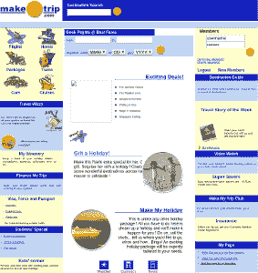
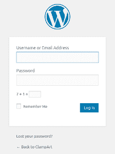

# Eyeballer:用于分析 Pentest 的卷积神经网络

> 原文：<https://kalilinuxtutorials.com/eyeballer-convolutional-neural-network-pentest/>

Eyeballer 用于大范围的网络渗透测试，你需要从一大堆基于网络的主机中找到“有趣的”目标。

继续使用您最喜欢的截屏工具，如 normal(witness 或 GoWitness ),然后通过 Eyeballer 运行它们，告诉您哪些可能包含漏洞，哪些不包含。

**设置**

Eyeballer 在 Tensorflow 2.0 上使用 TF.keras。这是(截至目前)仍在“测试”。所以对它的 pip 要求看起来有点奇怪。如果您安装了常规的 1.0 版本，它也可能会与现有的 TensorFlow 安装冲突。所以，注意了。但是根据谷歌的说法，2.0 应该很快就会退出测试版和正式版，所以这个问题应该会在短期内自行解决。

在 pip 上下载所需的软件包:

sudo pip3 安装要求. txt

或者，如果您需要 GPU 支持:

sudo pip3 install -r 要求-gpu.txt

**注意**:设置 GPU 以与 TensorFlow 一起使用超出了本自述文件的范围。有硬件兼容性要考虑，有驱动程序要安装…有很多。因此，如果你想要一个 GPU，你就必须自己解决这个问题。但是至少从 Python 包的角度来看，上面的需求文件已经涵盖了您的需求。

**培训数据**您可以在这里找到我们的培训数据:

[https://www . Dropbox . com/sh/7 aouywaid 7 xptpq/AAD _-i4 hahrdeiosdaqksnbma？dl=1](https://www.dropbox.com/sh/7aouywaid7xptpq/AAD_-I4hAHrDeiosDAQksnBma?dl=1)

很快，我们将把它添加为 TensorFlow 数据集，因此您不需要像这样单独下载它。这也能让我们更好地编辑数据。但现在，先处理好它。从训练数据中你需要两件事:

*   文件夹，包含所有截图(尺寸缩小到 224×140。我们将很快推出全尺寸图片)
*   那有所有的标签
*   `**bishop-fox-pretrained-v1.h5**`一个经过预先训练的重量文件，无需训练即可直接使用。

将这三个都复制到 Eyeballer 代码树的根中。

**预测标签**

要查看一些截图，只需运行“预测”模式:

eye baller . py–weights YOUR _ weights . H5 预测 YOUR_FILE.png

或者对于整个文件目录:

eye baller . py–weights YOUR _ weights . H5 预测路径到/YOUR_FILES/

Eyeballer 会以人类可读的格式(一个`**results.html**`文件，这样你可以很容易地浏览)和机器可读的格式(一个`**results.csv**`文件)将结果返回给你。

**训练**

若要训练新模型，请运行:

eyeballer.py 火车

您将需要一台具有良好 GPU 的机器来在合理的时间内运行。但是，设置这一点超出了本自述文件的范围。

这将输出一个新的模型文件(默认为 weights.h5)。

**评价**

你刚刚训练了一个新模型，酷！让我们看看它对一些从未见过的图像在各种指标上的表现如何:

eye baller . py–weights YOUR _ weights . H5 评估

输出将描述模型对于每个程序标签的召回率和精确度的准确性。(包括“以上都不是”作为伪标签)

**示例标签**

[**Download**](https://github.com/bishopfox/eyeballer)