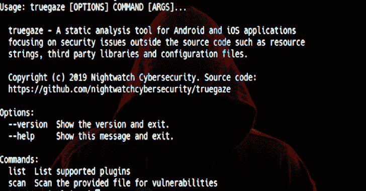

# true gaze:Android/iOS 应用程序的静态分析工具，关注源代码之外的安全问题

> 原文：<https://kalilinuxtutorials.com/truegaze-tool-android-ios-security-issues/>

[](https://1.bp.blogspot.com/-vt83Zu-QN6c/XVwn2unZDJI/AAAAAAAACFA/XiOMaqF974ItBrXPoZo66WUmOELLO9ZiQCLcBGAs/s1600/Truegaze%25281%2529.png)

**Truegaze** 是一款针对 Android 和 iOS 应用的静态分析工具，专注于源代码之外的安全问题，如资源字符串、第三方库和配置文件。

**要求**

Python 3 是必需的，你可以在 **requirements.txt** 文件中找到所有必需的模块。仅在 Python 3.7 上测试过，但应该可以在其他 3.x 版本上运行。目前没有计划支持 2.x。

**又念——[道琼斯之锤:用云的力量保护云(AWS)](https://kalilinuxtutorials.com/dow-jones-hammer/)**

**安装**

您可以通过 PIP 进行安装，如下所示:

**pip 安装 truegaze
truegaze**

要手动下载并运行，请执行以下操作:

git 克隆 https://github.com/nightwatchcybersecurity/truegaze.git**CD true gaze
pip-r requirements . txt
python-m true gaze . CLI**

**怎么用？**

要列出模块:

**真实凝视列表**

要扫描应用程序:

true gaze scan test . apk
true gaze scan test . IPA

**样本输出**

列出模块:

```
user@localhost:~/$ truegaze list
Total active plugins: 1
+----------------+------------------------------------------+---------+------+
|      Name      |               Description                | Android | iOS  |
+----------------+------------------------------------------+---------+------+
| AdobeMobileSdk | Detection of incorrect SSL configuration |  True   | True |
|                |         in the Adobe Mobile SDK          |         |      |
+----------------+------------------------------------------+---------+------+
```

扫描应用程序:

user @ localhost:~/$ true gaze scan ~/test . IPA
通过位于以下位置的清单识别为 iOS 应用程序:Payload/IPA patch-dummy app . app/info . plist
使用“AdobeMobileSdk”插件扫描
—找到 1 个配置文件
—扫描“Payload/IPA patch-dummy app . app/base . lproj/adbmobileconfig . JSON '
———找到:[“分析”][“SSL”]设置为 & c16= & c27=cln，{ A . PrevSessionLength }
——发现:["messages"]["payload"]中的一个" templateurl "不使用 SSL:http://my.43434server.com/?user={user.name}&zip = { user . zip }&C16 = { % SDK ver % }&c27 = cln，{a.PrevSessionLength}
完成！

显示安装的版本:

**user@localhost:~/$ truegaze 版本
当前版本:v0.2**

**结构**

该应用程序是命令行，将由几个模块组成，检查各种漏洞。每个模块做自己的扫描，所有结果打印到命令行。

[**Download**](https://github.com/nightwatchcybersecurity/truegaze)