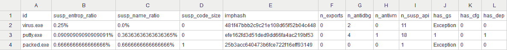
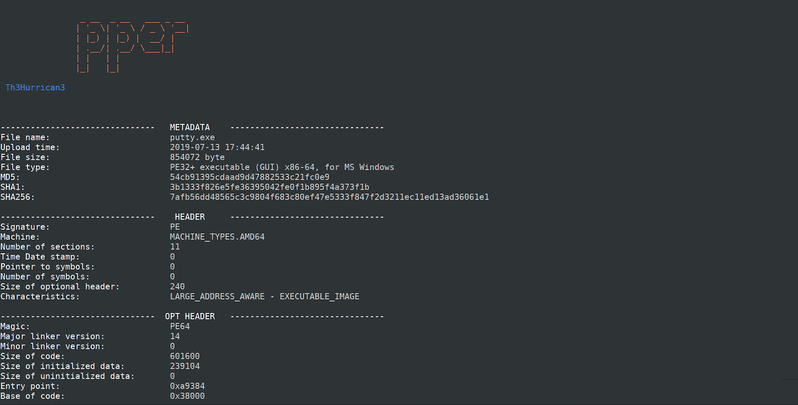
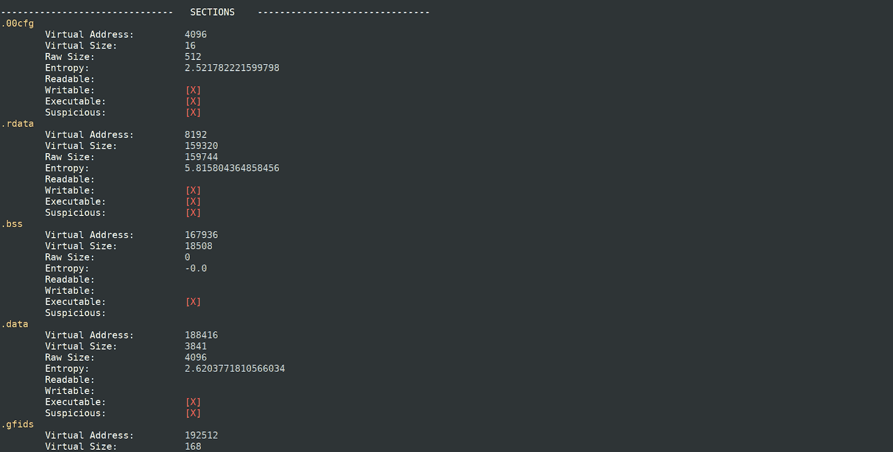
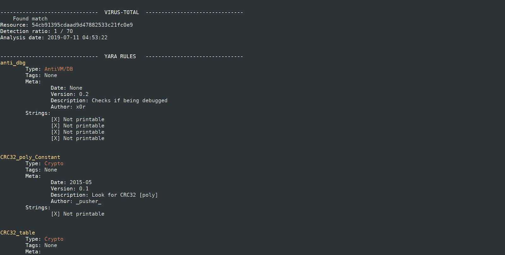
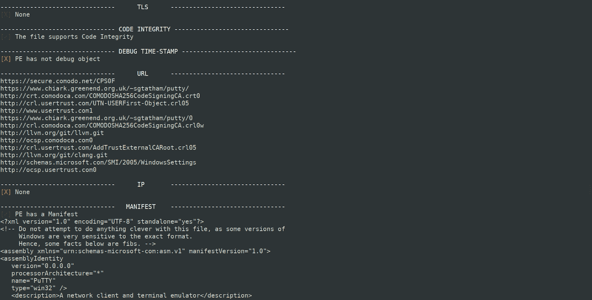

# PEpper:一个在可移植的可执行文件上执行恶意软件静态分析的开源脚本

> 原文：<https://kalilinuxtutorials.com/pepper-malware-analysis-portable-executable/>

**PEpper** 是一款对**P**or table**E**xecutable 进行恶意软件静态分析的开源工具。以下是该工具支持的一些功能；

*   **可疑熵**比率
*   **可疑名称**比率
*   可疑的**代码大小**
*   可疑**调试时间戳**
*   **出口数量**
*   **反调试**调用次数
*   **虚拟机检测**调用次数
*   **个可疑 API** 调用的数量
*   **可疑字符串的数量**
*   YARA 规则匹配的**数量**
*   找到的 **URL** 的数量
*   找到的 **IP** 的数量
*   *栈上的 Cookie*(**GS**)支持
*   *控流保护* ( **CFG** )支持
*   *数据执行阻止*(**)支持**
*   ***地址空间布局随机化*(**)支持****
*   *****结构化异常处理*(**)支持******
*   *******线程本地存储* ( **TLS** )支持******
*   ****存在**清单******
*   ****存在**版本******
*   ****存在**数字证书******
*   ******打包机**检测****
*   ******病毒总数**数据库检测****
*   ******导入哈希******

 ******安装**

eva@paradise:~$ git 克隆 https://github.com/Th3Hurrican3/PEpper/ EVA @ paradise:~ $ CD PEpper
EVA @ paradise:~ $ pi P3 install-r requirements . txt
EVA @ paradise:~ $ python 3 PEpper . py。/恶意软件 _ 目录

**CSV 输出**

和更多列..

**也可阅读-[PwnedOrNot:OSINT 工具，用于查找受损电子邮件地址的密码](https://kalilinuxtutorials.com/pwnedornot-osint-find-passwords-email/)**

**注释**

*   可以在*单个*或*多个* PE 上运行(放在一个目录内)
*   输出将被保存(在 *pepper.py* 的同一个目录中)为 **output.csv**
*   要使用 **VirusTotal scan** ，请在名为“virustotal.py”的模块中添加您的私钥(需要互联网连接)

**截图**

[**Download**](https://github.com/Th3Hurrican3/PEpper)****