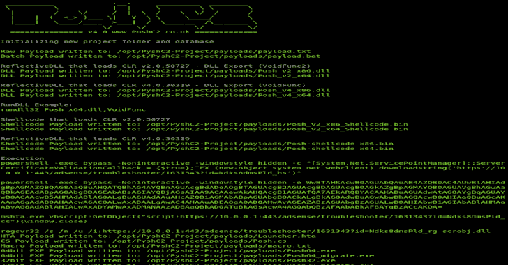

# PoshC2:用于 PoshC2 的 Python 服务器

> 原文：<https://kalilinuxtutorials.com/poshc2-python-server/>

**PoshC2** 是一个代理感知 C2 框架，它利用 Powershell **和/或**等效(System.Management.Automation.dll)来帮助渗透测试人员进行 red 分组、后期开发和横向移动。Powershell 被选为基础植入语言，因为它提供了所有的功能和丰富的特性，而无需向框架引入多个第三方库。

除了 Powershell 植入物，PoshC2 还有一个完全用 Python 编写的基本 dropper，可用于命令和控制基于 Unix 的系统，如 Mac OS 或 Ubuntu。

服务器端组件是用 Python 编写的，为了跨平台的可移植性和速度，Powershell 服务器组件仍然存在，可以使用如下所示的“Windows Install”进行安装，但不会在未来的更新和版本中保留。

**也可阅读-[PEpper:一个对可移植的可执行文件](https://kalilinuxtutorials.com/pepper-malware-analysis-portable-executable/)执行恶意软件静态分析的开源脚本**

**Linux 安装 Python3**

使用 curl & bash 自动安装 Python3

curl-sSL https://raw . githubusercontent . com/nettitude/poshc 2 _ Python/master/install . sh | bash

手动安装 Python3

wget https://raw . githubusercontent . com/nettitude/poshc 2 _ Python/master/install . sh
chmod+x ./install . sh
。/Install.sh

**Linux 安装 python 2——稳定但无人维护**

使用 curl & bash 自动安装 Python2

curl-sSL https://raw . githubusercontent . com/nettitude/poshc 2 _ Python/Python 2/install . sh | bash

手动安装 Python2

wget https://raw . githubusercontent . com/nettitude/poshc 2 _ Python/Python 2/install . sh
chmod+x ./install . sh
。/Install.sh

**Windows 安装**

安装 Git 和 Python(并确保 Python 在路径中)，然后运行:

powershell -exec bypass -c "IEX(新对象系统。Net.WebClient)。download string(' https://raw . githubusercontent . com/nettitude/poshc 2 _ Python/master/install . PS1 ')"

**使用旧版本**

您可以通过引用适当的标记来使用 PoshC2 的旧版本。您可以通过发出以下命令来列出存储库的标记:

git tag –list

或者在网上观看。

然后，您可以使用 install 一行程序，但是用标记替换分支名称:

curl-sSL https://raw.githubusercontent.com/nettitude/PoshC2_Python/<tag name="">/install . sh | bash</tag>

例如:

curl-sSL https://raw . githubusercontent . com/nettitude/poshc 2 _ Python/v 4.8/install . sh | bash

**离线**

如果您有 PoshC2 的本地克隆，您可以通过签出想要使用的版本来更改正在使用的版本:

转到重置-硬<tag name=""></tag>

例如:

git 重置–硬 v4.8

但是请注意，这将覆盖对文件(如 Config.py)的任何本地更改，您可能需要重新运行该版本的安装脚本，或者相应地重新设置环境。

**运行 PoshC2**

1.  通过运行`**posh-config**`编辑配置文件，在$EDITOR 中打开它。如果没有设置这个变量，那么它默认为 vim，或者您可以使用–nano 在 nano 中打开它。
2.  使用`**posh-server**` **或** `**python3 -u C2Server.py | tee -a /var/log/poshc2_server.log**`运行服务器
3.  其他人可以使用`**posh-log**` **或** `**tail -n 5000 -f /var/log/poshc2_server.log**`查看日志
4.  使用处理器与植入物互动，使用`**posh**`或`**python3 ImplantHandler.py**`运行

**安装即服务**

作为服务安装提供了多种好处，例如能够记录到服务日志、使用 journalctl 查看以及在重新启动时自动启动。

*   将文件添加到 systemd 中(这是通过安装脚本自动完成的)

CP poshc 2 . service/lib/systemd/system/poshc 2 . service

*   启动服务

推送服务

*   查看日志:

豪华日志

*   或者可替换地，us journalctl(但是注意这可以是速率受限)

journal CTL-n 20000-u poshc 2 . service-f–输出目录

请注意，重新运行`posh-service`将重启 posh-service。运行`posh-service`将自动开始显示日志，但 Ctrl-C 不会停止服务，只有退出日志，在这种情况下`posh-log`可用于在任何时间点重新查看日志。`posh-stop-service`可用于停止服务。

**问题/常见问题**

如果您在安装或使用 PoshC2 的过程中遇到任何问题，请查看下面的已知问题和 GitHub 中的开放问题跟踪页面。如果此页面没有您要查找的内容，请打开一个新问题，我们将尽快解决该问题。

如果你正在寻找关于 PoshC2 使用和优化的技巧和诀窍，欢迎你加入下面的 slack 频道。

**许可/使用条款**

该软件应仅用于经**授权的**测试活动，不得恶意使用。

下载本软件即表示您接受使用条款和许可协议。

**文档**

我们在[https://poshc2.readthedocs.io/en/latest/](https://poshc2.readthedocs.io/en/latest/)维护 PoshC2 文档

在# Slack-[poshc2.slack.com](https://github.com/nettitude/PoshC2_Python/blob/master/poshc2.slack.com)上找到我们(要请求邀请，请发送电子邮件至[labs@nettitude.com](mailto:labs@nettitude.com))

**已知问题**

**加密值错误:对象类型**

如果您在安装 PoshC2 后得到这个错误，这是由于系统上的 pip 包中的依赖冲突。

尝试用 python 创建一个 virtualenv，并重新安装需求，以便为 PoshC2 使用指定的确切版本。完成此虚拟化后，请务必停用。

例如:

pip 安装 virtualenv
virtualenv/opt/poshc 2 _ Python/
source/opt/poshc 2 _ Python/bin/activate
pip install-r requirements . txt
Python c2server . py

注意，无论何时运行 PoshC2，都必须重新激活虚拟环境并在其中运行。

如果您在*nix 上使用`posh-`脚本，虚拟环境的使用是抽象的。

[**Download**](https://github.com/nettitude/PoshC2_Python)