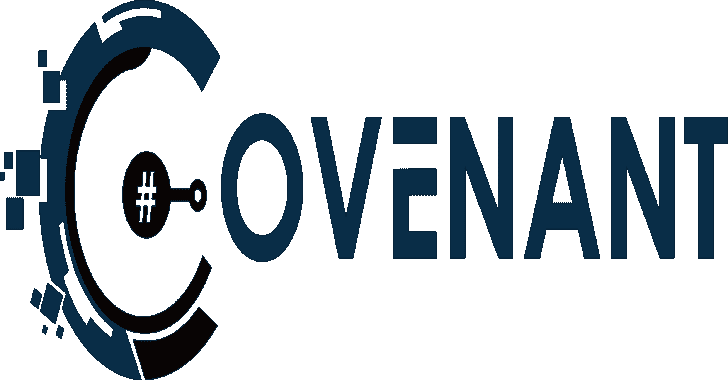
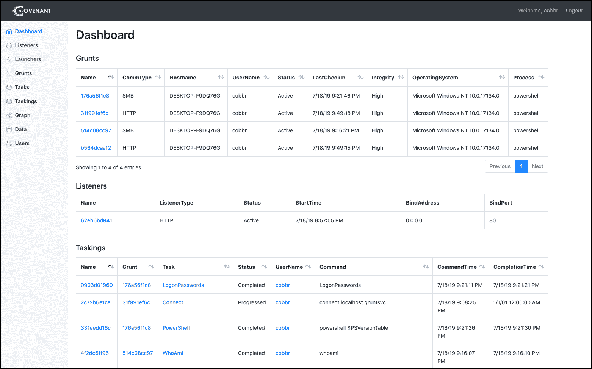
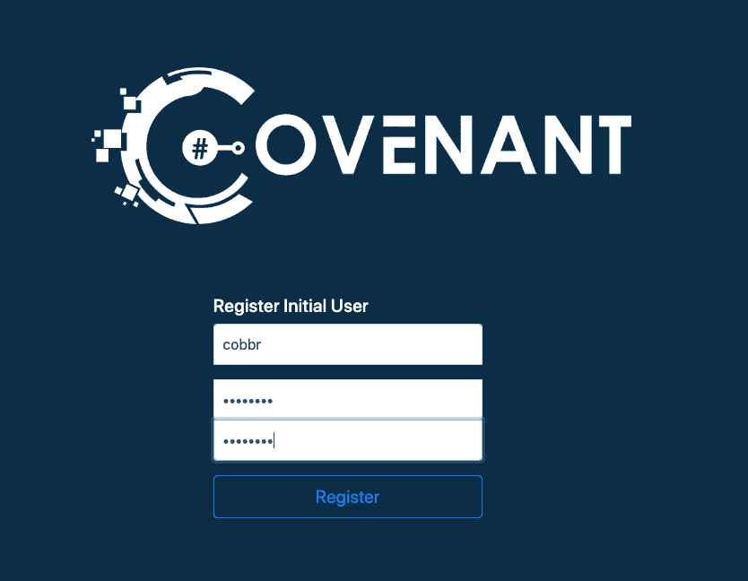

# Covenant:一个旨在突出攻击面的. NET 命令和控制框架

> 原文：<https://kalilinuxtutorials.com/covenant-net-command-control-framework/>

**Covenant** 是一个. NET 命令和控制框架，旨在突出。网，利用进攻。NET tradecraft 更容易，并作为红队队员的协作指挥和控制平台。

Covenant 是一个 ASP.NET 核心的跨平台应用程序，包括一个基于 web 的界面，允许多用户协作。

**也可阅读-[Hacktronian:All in One Hacking Tool for Linux&Android](https://kalilinuxtutorials.com/hacktronian-hacking-tool-linux-android/)**

**安装**

确保递归地克隆契约来初始化 git 子模块:

https://github.com/cobbr/Covenant 的递归子模块

**选项 1–点网核心**

使用 Covenant 最简单的方法是安装 dotnet core。您可以从[这里](https://dotnet.microsoft.com/download)下载适用于您平台的 dotnet core。

一旦您安装了 dotnet core，我们就可以使用 dotnet CLI 构建并运行 Covenant:

$ ~ > git clone–recurse-sub modules https://github.com/cobbr/Covenant
$ ~>CD 圣约/圣约
$ ~/圣约/圣约>dot net build
$ ~/圣约/圣约> dotnet run

**选项 2–码头工人**

Covenant 也可以用 Docker 运行。docker 有几个问题，所以我们只推荐在你熟悉 docker 或者愿意学习微妙问题的情况下使用 Docker。

首先，构建 docker 映像:

$ ~ > git clone–recurse-sub modules https://github.com/cobbr/Covenant
$ ~>CD 圣约/圣约
$ ~/圣约/圣约> docker build -t 圣约

现在，在 Docker 容器中运行 Covenant(一定要用自己的绝对路径替换“”！):

$ ~/Covenant/Covenant > docker run-it-p 7443:7443-p 80:80-p 443:443-name Covenant-v:/app/Data Covenant

`**-it**`参数是一个 Docker 参数，它指示我们应该在交互式 tty 中开始约定，如果您不想附加到 tty，可以将其排除。

`**-p**`参数向 covery Docker 容器公开端口。您必须公开端口 7443 和您想要在其上启动侦听器的任何其他端口。

`**-v**`参数在主机和容器之间创建一个共享数据目录。确保指定数据目录的绝对路径，相对路径无效。

一旦启动了 Covenant，您可以随时通过连续按下`**Ctrl+p**`和`**Ctrl+q**`来断开与交互界面的连接。

要停止容器，您可以运行:

$ ~/Covenant/Covenant > docker 停止契约

要以交互方式重新启动 Covenant(保存所有数据)，您可以运行:

$ ~/Covenant/Covenant > docker start Covenant-ai

或者，要删除所有契约数据并重新启动，您可以删除并再次运行(同样，一定要用您自己的绝对路径替换“”！):

$ ~/Covenant/Covenant > docker RM Covenant
$ ~/Covenant/Covenant>docker run-it-p 7443:7443-p 80:80-p 443:443–name Covenant-v:/app/Data Covenant–username AdminUser–computer name 0 . 0 . 0 . 0

**报名**

启动 Covenant 后，您必须通过 web 界面注册一个初始用户。导航到 web 界面将允许您注册初始用户:

初始用户注册后，开放注册将被关闭，新用户将由管理用户创建。

**特色**

Covenant 有几个关键特性，使其非常有用，并与其他命令和控制框架相区别:

*   **直观的界面**–Covenant 提供了一个直观的 web 应用程序，可轻松运行红队协作操作。
*   **多平台**–圣约人目标。NET Core，也就是多平台。这使得 Covenant 可以在 Linux、MacOS 和 Windows 平台上本地运行。此外，Covenant 支持 docker，允许它在任何安装了 docker 的系统上的容器中运行。
*   **多用户**–Covenant 支持多用户协作。协作能力对于红队的有效运作至关重要。许多用户可以与同一个 Covenant 服务器交互，独立或协作操作。
*   **API 驱动**–Covenant 由支持多用户协作的 API 驱动，并且易于扩展。此外，Covenant 还包括一个 Swagger UI，使开发和调试更加容易和方便。
*   **监听器配置文件**–圣约支持监听器“配置文件”，这些文件控制 Grunt 植入物和圣约监听器之间的网络通信在线路上的外观。
*   加密密钥交换(Encrypted Key Exchange)–除了可选的 SSL 加密之外，Covenant 还在 Grunt 植入物和 Covenant 监听器之间实现了加密密钥交换，这在很大程度上是基于 Empire 项目中的类似交换。这实现了 Grunt 植入之间的前向保密的密码特性。
*   **动态编译**–Covenant 使用 Roslyn API 进行动态 C#编译。每次生成新的 Grunt 或分配新的任务时，相关代码都会被重新编译并使用 ConfuserEx 进行混淆，从而避免完全静态的有效负载。Covenant 重用了 SharpGen 项目中的许多编译代码，我在以前的一篇文章中对此进行了更详细的描述。
*   **内嵌 C#执行**–Covenant 借用了 SharpGen 和 SharpShell 项目的代码和思想，允许操作员在 Grunt 植入物上执行 C#一行程序。这允许类似于 SharpShell 文章中描述的功能，但是允许在远程植入上执行一行程序。
*   **跟踪指示器**–Covenant 在整个操作过程中跟踪“指示器”，并在指示器菜单中对其进行汇总。这使得操作员可以在整个操作过程中执行被跟踪的行动，并在评估期间或评估结束时向蓝队轻松总结这些行动，以达到消除冲突和教育的目的。这项功能仍处于初级阶段，仍有改进的空间。
*   **用 C#开发**–就我个人而言，我喜欢用 C#开发，这对于读过我最新博客或工具的人来说并不奇怪。不是每个人都同意用 C#开发是理想的，但希望每个人都同意用同一种语言编写框架的所有组件是件好事。我发现用同一种语言编写服务器、客户机和植入物非常方便。这可能不是一个真正的“特性”，但希望它允许其他人相当容易地为项目做出贡献。

[**Download**](https://github.com/cobbr/Covenant)