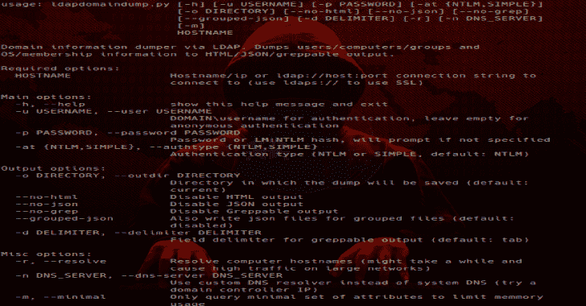

# LdapDomainDump:通过 LDAP 的活动目录信息转储程序

> 原文：<https://kalilinuxtutorials.com/ldapdomaindump-active-directory-ldap/>

**LDAPDomainDump** 是一个通过 LDAP 的活动目录信息转储器。在 Active Directory 域中，任何经过身份验证的用户(或机器)都可以通过 LDAP 检索大量有趣的信息。

这使得 LDAP 成为在内部网络测试的 recon 阶段收集信息的有趣协议。一个问题是，来自 LDAP 的数据通常不是以易于阅读的格式提供的。

ldapdomaindump 是一个旨在解决这个问题的工具，它通过 LDAP 收集和解析可用的信息，并以人类可读的 HTML 格式以及机器可读的 json 和 csv/tsv/greppable 文件输出。

该工具的设计考虑了以下目标:

*   域中所有用户/组/计算机/策略的简单概述
*   与 NTLM 哈希一样，通过用户名和密码进行身份验证(需要 ldap3 >=1.3.1)
*   可以使用到 LDAP 服务的现有认证连接运行该工具，允许与 impackets ntlmrelayx 等中继工具集成

该工具输出几个包含域中对象概述的文件:

*   **域组:**域中的组列表
*   **域 _ 用户:**域中的用户列表
*   **域 _ 计算机:**域中的计算机帐户列表
*   **域策略:**域策略，如密码要求和锁定策略
*   **域信任:**传入和传出域信任及其属性

以及两个分组文件:

*   **域用户按组:**他们所属的每个组的域用户
*   **按操作系统分类的域计算机:**按操作系统分类的域计算机

**也读作-[poshc 2:poshc 2 的 Python 服务器](https://kalilinuxtutorials.com/poshc2-python-server/)**

**依赖&安装**

需要 [ldap3](https://github.com/cannatag/ldap3) > 2.0 和 [dnspython](https://github.com/rthalley/dnspython)

两者都可以安装`**pip install ldap3 dnspython**`

ldapdomaindump 包可以用 git 源代码中的`**python setup.py install**`安装，或者用`**pip install ldapdomaindump**` **安装最新版本。**

**用法**

有 3 种方法可以使用该工具:

*   仅使用源代码，运行`**python ldapdomaindump.py**`
*   安装后，通过运行`**python -m ldapdomaindump**`
*   安装后，通过运行`**ldapdomaindump**`

使用-h 开关可以获得帮助:

用法:ldapdomaindump . py[-h][-u USERNAME][-at { NTLM，简单}]
[-o 目录][–no-html][–no-JSON][–no-grep]
[–grouped-JSON][-d 分隔符] [-r] [-n DNS_SERVER]
[-m]
主机名

通过 LDAP 进行域信息转储。将用户/计算机/组和
操作系统/成员信息转储到 HTML/JSON/greppable 输出。

必需选项:
主机名/ip 或 ldap://host:端口连接字符串到
连接到(使用 ldaps://使用 SSL)

主要选项:
-h，–help 显示此帮助消息并退出
-u USERNAME，–user USERNAME DOMAIN \ USERNAME 进行身份验证，留空进行匿名身份验证
-p PASSWORD，–PASSWORD PASSWORD 或 LM:NTLM 哈希，如果未指定将提示
-at {NTLM，简单 –outdir DIRECTORY 将保存转储的目录(默认:当前)
–no-html 禁用 HTML 输出
–no-json 禁用 JSON 输出
–no-grep 禁用 Greppable 输出
–grouped-JSON 也为分组文件写入 JSON 文件(默认:
禁用)
-d 分隔符，–分隔符分隔符分隔符分隔符字段分隔符用于 greppable 输出(默认:tab)

杂项选项:
-r，–Resolve 解析计算机 –dns-SERVER DNS _ SERVER 使用自定义 DNS 解析器代替系统 DNS(尝试域控制器 IP)
-m，–minimal Only 查询最小的属性集以限制内存使用

**选项**

**认证**

大多数 AD 服务器支持 NTLM 身份验证。在极少数情况下，不需要使用–authtype SIMPLE。

**输出格式**

默认情况下，该工具以 HTML、JSON 和制表符分隔输出(greppable)的形式输出所有文件。为了方便起见，还有两个分组文件(users_by_group 和 computers_by_os)。这些没有可 greppable 输出。默认情况下，分组文件的 JSON 输出是禁用的，因为它会创建非常大的文件，而不包含其他文件中不存在的任何数据。

**DNS 解析**

一个重要的选项是 *-r* 选项，它决定计算机的 DNSHostName 属性是否应该解析为 IPv4 地址。虽然这非常有用，但 DNSHostName 属性不会自动更新。当 AD 域使用子域作为计算机主机名时，DNSHostName 通常会不正确，并且无法解析。还要记住，解析域中的每个主机名可能会导致域控制器上的高负载。

**最小化网络和内存使用**

默认情况下，ldapdomaindump 会尝试将它可以读取的每个属性转储到磁盘的。json 文件。在大型网络中，这会使用大量内存(因为组关系当前是在写入磁盘之前在内存中计算的)。只转储最少的必需属性(默认情况下显示在。html 和。grep 文件)，使用`--minimal`开关。

**用警犬观察群体**

LDAPDomainDump 包括一个实用程序，可用于将 ldapdomaindups`.json`文件转换为适用于 BloodHound 的 CSV 文件。该实用程序名为`ldd2bloodhound`，在安装时会添加到您的路径中。或者，您可以使用`python -m ldapdomaindump.convert`或`python ldapdomaindump/convert.py`来运行它，如果您是从源代码运行它的话。转换工具将获取用户/组/计算机/信任`.json`文件，并将其转换为`group_membership.csv`和`trust.csv`，您可以将它们添加到 BloodHound 中。

[**Download**](https://github.com/dirkjanm/ldapdomaindump)