# AIL 框架:分析信息泄漏框架

> 原文：<https://kalilinuxtutorials.com/ail-framework-analysis-information-leak-framework/>

[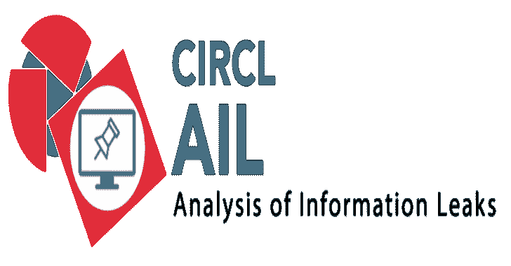](https://1.bp.blogspot.com/-hyOVu7ypkI4/XWT02tF691I/AAAAAAAACNs/Eij6MlJo54InKdLDnlz2gExoT83DNQxTACLcBGAs/s1600/logo-small%25281%2529.png)

**AIL 框架**用于分析信息泄露。AIL 是一个模块化框架，用于分析来自非结构化数据源的潜在信息泄漏，如来自 Pastebin 或类似服务的粘贴或非结构化数据流。

AIL 框架非常灵活，可以扩展以支持其他功能来挖掘或处理敏感信息(例如，防止数据泄漏)。

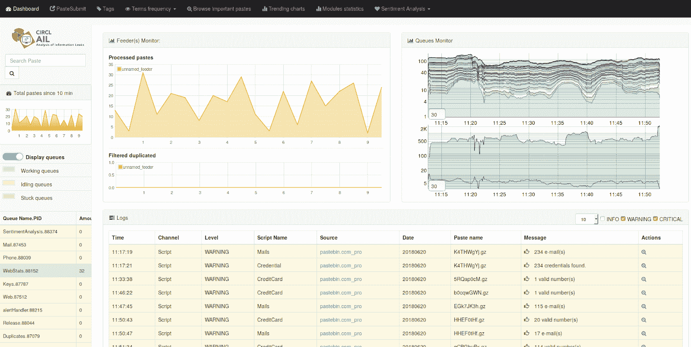

**特性**

*   处理非结构化或结构化信息流的模块化架构
*   对外部 ZMQ 提要的默认支持，例如由 CIRCL 或其他提供者提供的
*   多重进纸支持
*   每个模块可以对 AIL 已经处理过的信息进行处理和再处理
*   检测和提取 URL，包括它们的地理位置(例如 IP 地址位置)
*   提取和验证信用卡号码、凭证等的潜在泄露
*   提取和验证泄露的电子邮件地址，包括 DNS MX 验证
*   用于提取 Tor 的模块。洋葱地址(待进一步处理以供分析)
*   跟踪副本(并区分找到的每个副本)
*   提取和验证潜在的主机名(例如，为被动 DNS 系统提供信息)
*   用于索引非结构化信息的全文索引器模块
*   模块和 web 上的统计
*   终端中的实时模块管理器
*   基于 nltk vader 模块的各提供商全球情感分析
*   术语、术语集和正则表达式跟踪和出现
*   更多的模块提取电话号码，凭证和其他
*   向 [MISP](https://github.com/MISP/MISP) 发出警报，使用 [MISP 标准](https://www.misp-project.org/objects.html#_ail_leak)分享威胁情报平台内发现的漏洞
*   检测和解码编码文件(Base64，十六进制编码或您自己的解码方案)和存储文件
*   检测亚马逊 AWS 和谷歌 API 键
*   检测比特币地址和比特币私钥
*   检测私钥、证书、密钥(包括 SSH、OpenVPN)
*   检测 IBAN 银行帐户
*   带有 [MISP 星系](https://github.com/MISP/misp-galaxy)和 [MISP 分类法](https://github.com/MISP/misp-taxonomies)标签的标签系统
*   UI 粘贴提交
*   在 [MISP](https://github.com/MISP/MISP) 上创建事件，在[蜂巢](https://github.com/TheHive-Project/TheHive)上创建案例
*   在检测到 [MISP](https://github.com/MISP/MISP) (事件)和[蜂巢](https://github.com/TheHive-Project/TheHive)(警报)上的选定标签时自动粘贴导出
*   可以通过日期范围、文件类型(mime 类型)和发现的编码来搜索提取和解码的文件
*   解码文件(哈希)、相似 PGP UIDs 和加密货币地址之间的图形关系
*   Tor 隐藏服务爬行器，用于爬行和解析输出
*   Tor onion 可用性被监控以检测隐藏服务的增加和减少
*   浏览器隐藏服务被截屏并集成到分析输出中，包括模糊截屏界面(以避免特定内容“灼伤”安全分析的眼睛)
*   Tor 隐藏服务是标准框架的一部分，所有的模块对爬行的隐藏服务都是可用的
*   通用网络爬虫触发按需或定期抓取 URL 或隐藏服务

**也读作-[圣约:一个. NET Command &的控制框架，旨在突出攻击面](https://kalilinuxtutorials.com/covenant-net-command-control-framework/)**

**安装**

键入以下命令行进行全自动安装，并启动所有框架:

git 克隆 https://github.com/CIRCL/AIL-framework.git
CD 邮件框架
。/installing _ deps . sh

CD ~/AIL-framework/
CD bin/
。/LAUNCH.sh -l

默认的 [installing_deps.sh](https://github.com/CIRCL/AIL-framework/blob/master/installing_deps.sh) 是针对基于 Debian 和 Ubuntu 的发行版。

还有一个 [Travis 文件](https://github.com/CIRCL/AIL-framework/blob/master/.travis.yml)用于自动安装，可以用来在其他系统上构建和安装 AIL。

**要求**

*   **Python 3.5+**

**安装注意事项**

为了与 **ZFS** 或**非特权 LXC** 结合使用 AIL，需要通过将指令`**use_direct_io_for_flush_and_compaction**`的值更改为`false`来禁用`**$AIL_HOME/configs/6382.conf**`中的直接 I/O。

**首发全部**

**cd bin/
。/LAUNCH -l**

最后，您可以通过以下网址浏览 AIL 框架网站的状态:

**https://localhost:7000/**

web 界面的默认凭证位于`**DEFAULT_PASSWORD**`中。当您更改密码时，此文件将被删除。

**使用 AIL 进行研究**

如果你写学术论文，依靠或使用 AIL，可以用以下 BibTeX 引用:

@inproceedings{mokaddem2018ail，
title = { AIL-一个分析信息泄露框架的设计与实现}，
作者={Mokaddem，Sami 和 Wagener，G{\'e}rard 和 Dulaunoy，Alexandre}，
booktitle={2018 IEEE 大数据国际会议(Big Data)}，
pages = { 5049–5057 }，
年份={2018}，
组织= .

**截图**

**Tor 隐藏服务爬虫**

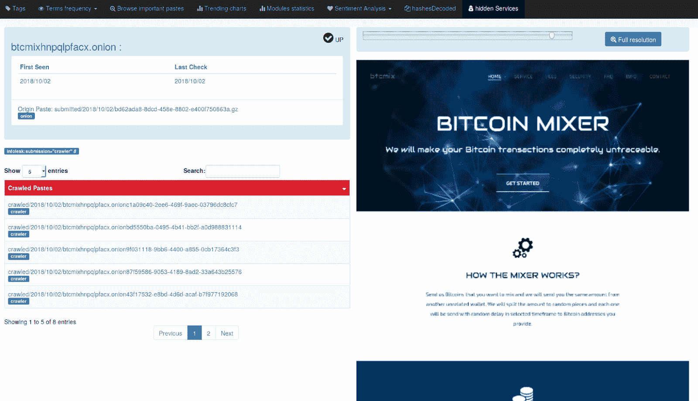

**趋势图**

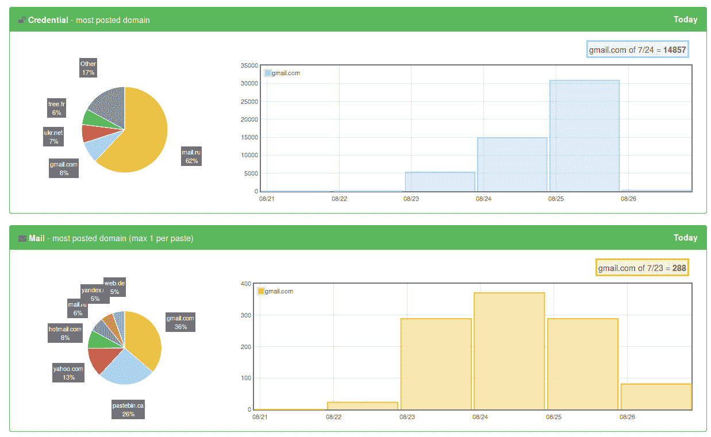

**从粘贴中提取编码文件**

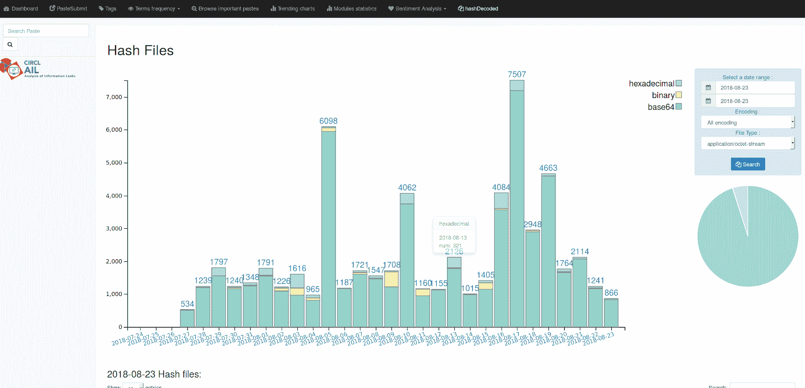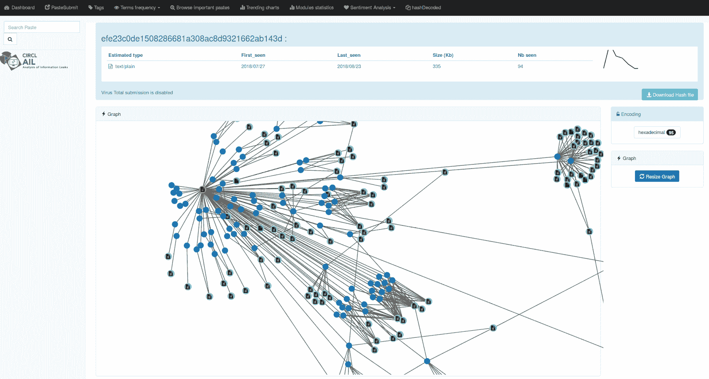

**浏览**

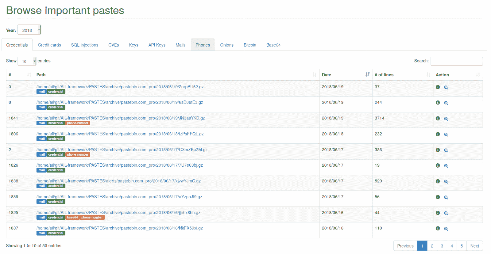

**标签系统**

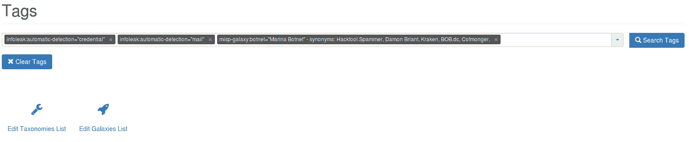

**MISP 和蜂巢，自动事件和警报创建**

**粘贴提交**

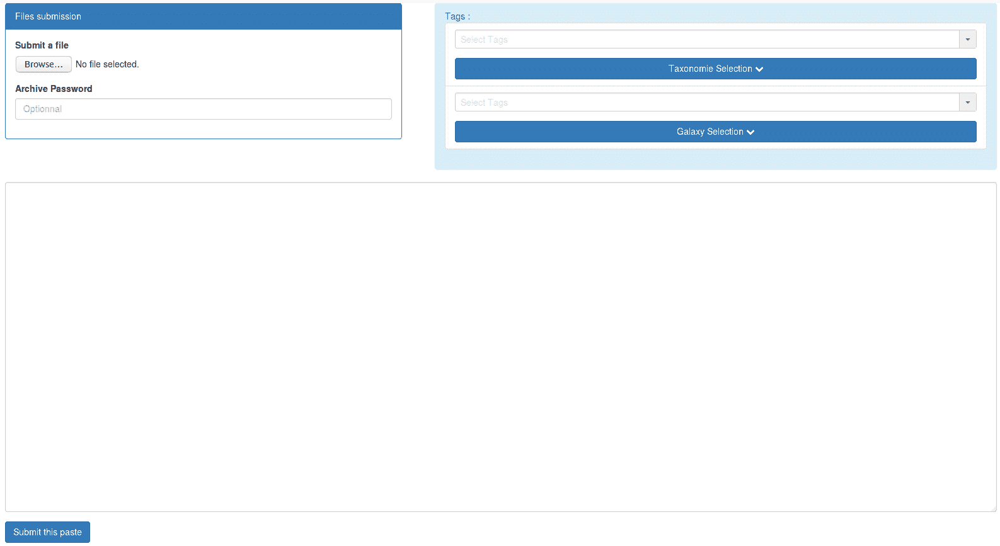

**情感分析**

**术语管理器和事件**

**热门词汇**

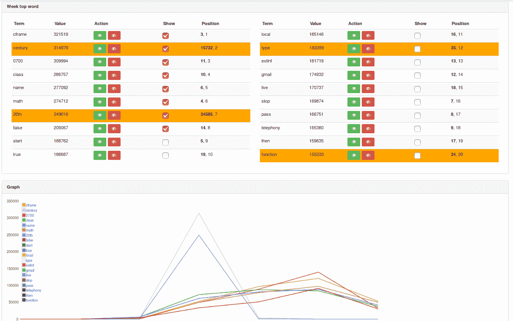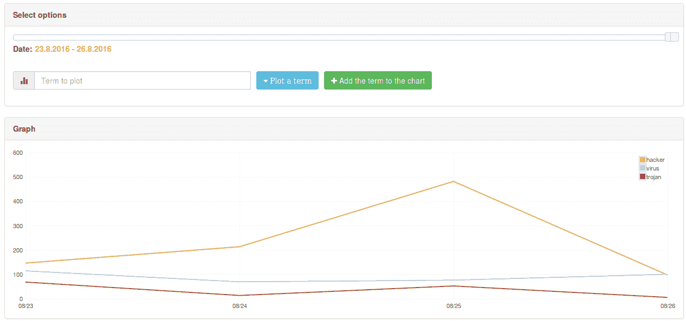

**命令行模块管理器**

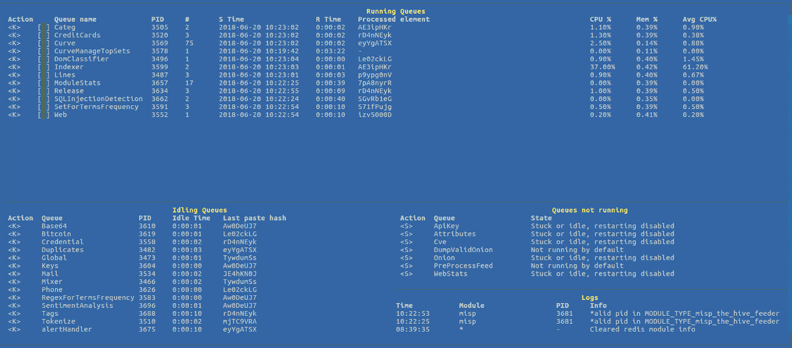[**Download**](https://github.com/CIRCL/AIL-framework)