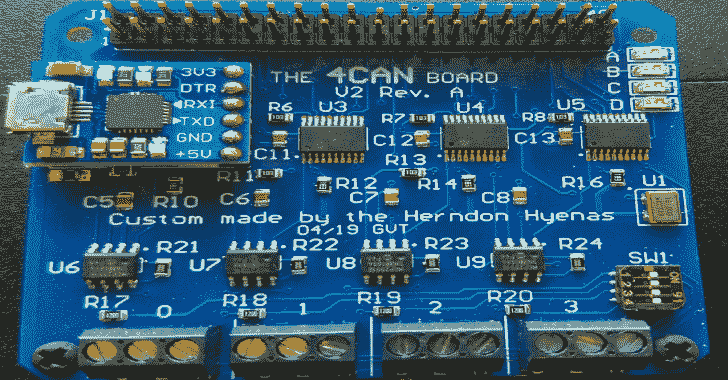
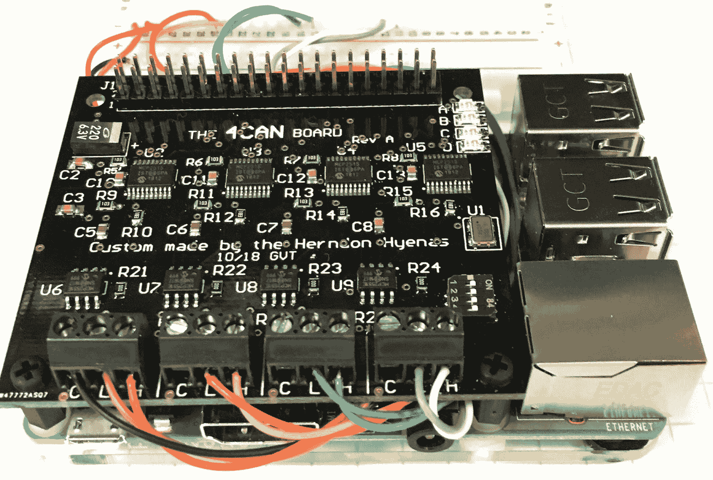
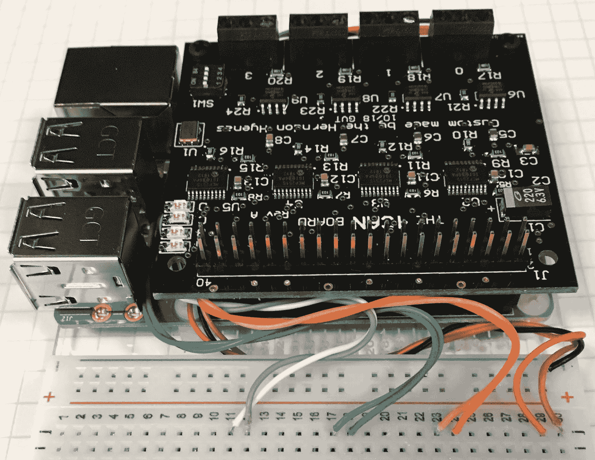

# 4CAN:开源安全工具，用于查找现代汽车中的安全漏洞

> 原文：<https://kalilinuxtutorials.com/4can-security-tool-security-vulnerabilities-cars/>

**4CAN** 是一款开源的安全工具，可以发现现代汽车的安全漏洞。使用 pi3b+对以下 raspbian 图像进行测试

*   【2019 年 4 月(内核 4.14.98-v7+)
*   【2018 年 10 月(内核 4.14.71-v7+)
*   【2018 年 6 月(内核 4.14.50-v7+)

4can 也可以使用 pi0w，但建议至少使用 pi3b。还建议在 pi 上使用散热器，因为 pi 在运行 4 个 can 接口时会有点热。

**安装**

运行 install.sh 脚本(需要 sudo)来自动安装所有东西，然后重启。

安装脚本将执行以下操作:

*   将 4 个 mcp2515-canx.dtbo 文件复制到/boot/overlays

sudo mkdir/boot/overlays/bak
sudo CP/boot/overlays/MCP 2515 */boot/overlays/bak
sudo CP。/dtbo/*。dtbo/引导/覆盖

*   将 config.txt 复制到/boot/config.txt(备份原始的/boot/config.txt 以防万一)

**sudo cp /boot/config.txt /boot/config.txt.bak
sudo cp config.txt /boot/config.txt**

**用途**

在使用 4can 之前，确保 socketcan 内核模块加载了`**sudo modprobe can_dev**`。这是不必要的，因为 pi 会根据设备树加载正确的内核模块，但是检查一下也无妨。

安装完成后，运行 4can.sh 调出 can 接口`./4can.sh`

连接 can 接口，并进行`**candump -acc any**`检查它们是否工作。注意:需要 can-utils 来安装`**sudo apt install can-utils**`

**注意:**有时接口出现故障，重启 pi 应该可以解决问题。否则，您可能需要修改/boot/config.txt。

**也读作-[LDAP domain dump:通过 LDAP](https://kalilinuxtutorials.com/ldapdomaindump-active-directory-ldap/) 的活动目录信息转储器 **

**GPIO**

4can 在 raspberry pi 上使用了许多 GPIO。可供使用的 GPIO 引脚是`**3, 5, 8, 10, 27, 28, 32, 36**`(物理引脚编号)

所有接地引脚都连接在一起，可以用作接地连接。3.3v 和 5v 引脚也可以用来提供电压。

更多细节请参考[示意图](https://github.com/alexdetrano/4CAN/blob/master/4can_sch.pdf)。

**推荐布线**

记住将外部 CAN 接地连接到 4can 接地(螺丝端子上的“C”连接)。这将确保良好的接地完整性，并将 tx/rx 误差降至最低。

将 4can 与 HyenaPlate 一起使用时，can 线可以在 pi 下方布线，并连接到试验板。这主要是为了美观，但其他好处包括不必经常拧紧/拧松螺钉端子来进行新的连接，更容易排除故障，以及更稳定的连接。

为了更加美观，[电阻颜色代码](https://en.wikipedia.org/wiki/Electronic_color_code)可用于给信号分配颜色。例如，在上图中:

| 连接 | CAN-L | CAN-H |
| --- | --- | --- |
| CAN0 | 棕色 | 红色 |
| CAN1 | 橙色的 | 黄色 |
| CAN2 | 蓝色 | 紫罗兰 |
| CAN3 | 绿色的 | 白色 |

黑色可用作地面。

**执照**

**工业浆果**

4can 的灵感来自于用于 Raspberry CanBerry 的 [IndustrialBerry 四 can 总线适配器，并大致基于该适配器。虽然我们修改了设计以适应我们的需要，但我们必须赞扬 IndustrialBerry 所做的出色工作。4CAN 和 IndustrialBerry 都是在知识共享署名共享许可下授权的。](http://www.industrialberry.com/quad-can-bus-adapter-raspberry-canberry/CanBerry)

信用:乔治·塔尔诺夫斯基

[**Download**](https://github.com/alexdetrano/4CAN)